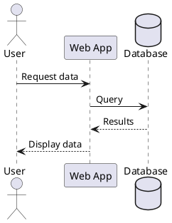
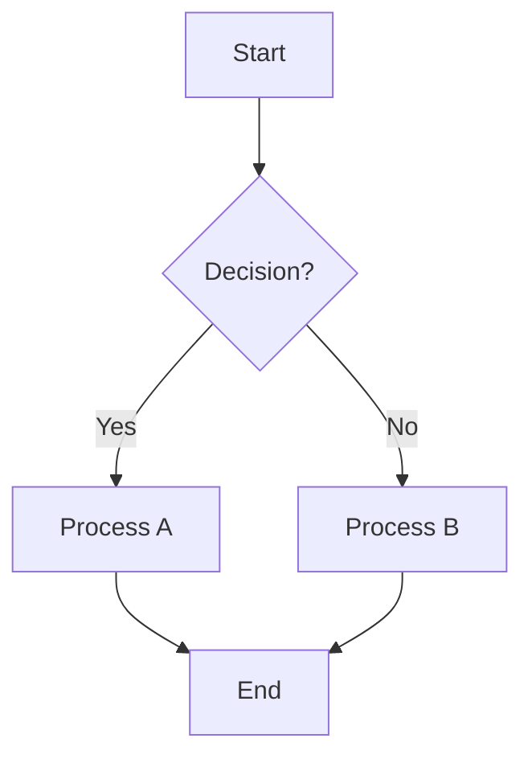
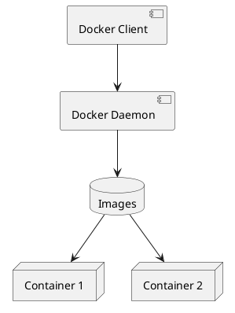

# **PROMPT PER COPILOT: Creazione Slide Reveal.js in MdExplorer**

Quando crei presentazioni slide in MdExplorer, **DEVI SEMPRE** seguire queste regole:

## **1. YAML FRONTMATTER OBBLIGATORIO**

Ogni file slide DEVE iniziare con questo frontmatter YAML:

```yaml
---
author: Nome Autore
document_type: slides
email: autore@example.com
title: Titolo Presentazione
date: gg/mm/aaaa
word_section:
  write_toc: false
  document_header: ''
  template_section:
    inherit_from_template: project
    custom_template: ''
    template_type: inherits
  predefined_pages: ''
---
```

**REGOLA CRITICA:** `document_type: slides` è OBBLIGATORIO - senza questo, MdExplorer NON renderizza la presentazione!

---

## **2. STRUTTURA HTML REVEAL.JS OBBLIGATORIA**

Dopo il frontmatter YAML, il contenuto DEVE seguire questa struttura esatta:

```html
<div class="reveal">
  <div class="slides">

    <!-- Slide titolo -->
    <section>
      <h1>Titolo Presentazione</h1>
      <p>Nome Autore</p>
      <p><small>gg/mm/aaaa</small></p>
    </section>

    <!-- Slide contenuto con markdown -->
    <section data-markdown>
      <textarea data-template>
## Titolo Slide

- Punto 1 <!-- .element: class="fragment" -->
- Punto 2 <!-- .element: class="fragment" -->
- Punto 3 <!-- .element: class="fragment" -->
      </textarea>
    </section>

  </div>
</div>
```

---

## **3. REGOLE XML WELL-FORMED (CRITICHE!)**

MdExplorer usa `XmlDocument.InnerXml` che richiede XML ben formato:

### ✅ **OBBLIGATORIO:**
- Tutti gli attributi con virgolette doppie: `data-markdown=""`
- MAI usare tag auto-chiudenti come `<textarea/>`
- SEMPRE chiudere TUTTI i tag esplicitamente
- Tag validi: `<section data-markdown>...</section>` e `<textarea data-template>...</textarea>`

### ❌ **VIETATO:**
```html
<!-- SBAGLIATO - virgolette singole -->
<section data-markdown=''>

<!-- SBAGLIATO - tag auto-chiudente -->
<textarea data-template/>

<!-- SBAGLIATO - attributo senza virgolette -->
<section data-markdown>
```

---

## **4. TIPI DI SLIDE**

### **Slide con Elenchi Puntati (con animazione)**
```html
<section data-markdown>
  <textarea data-template>
## Caratteristiche Chiave

- **Responsive**: Funziona su qualsiasi dispositivo <!-- .element: class="fragment" -->
- **Markdown**: Scrivi slide in markdown <!-- .element: class="fragment" -->
- **Highlight**: Sintassi evidenziata per codice <!-- .element: class="fragment" -->
  </textarea>
</section>
```

**Nota:** `<!-- .element: class="fragment" -->` rende gli elementi animati (appaiono uno alla volta)

---

### **Slide con Codice**
```html
<section data-markdown>
  <textarea data-template>
## Esempio JavaScript

```javascript
function greet(name) {
  console.log(`Hello, ${name}!`);
  return `Welcome to Reveal.js`;
}
```
  </textarea>
</section>
```

**Nota:** NON usare `fragment` per blocchi di codice!

---

### **Slide con Diagrammi PlantUML**
```html
<section data-markdown>
  <textarea data-template>
## Diagramma di Sequenza


  </textarea>
</section>
```

---

### **Slide con Diagrammi Mermaid**
```html
<section data-markdown>
  <textarea data-template>
## Diagramma di Flusso


  </textarea>
</section>
```

---

### **Slide con Tabelle**
```html
<section data-markdown>
  <textarea data-template>
## Tabella Funzionalità

| Feature | Status | Priority |
|---------|--------|----------|
| Markdown | ✅ Done | High |
| Diagrams | ✅ Done | High |
| Themes | ✅ Done | Medium |
| Export | 🔄 WIP | Low |
  </textarea>
</section>
```

---

### **Slide Verticali (Nested)**
```html
<section>
  <section data-markdown>
    <textarea data-template>
## Slide Principale

Premi ↓ per vedere contenuto nested.
    </textarea>
  </section>

  <section data-markdown>
    <textarea data-template>
### Slide Nested 1

- Dettaglio A
- Dettaglio B
    </textarea>
  </section>

  <section data-markdown>
    <textarea data-template>
### Slide Nested 2

Usa → e ← per navigazione orizzontale
Usa ↑ e ↓ per navigazione verticale
    </textarea>
  </section>
</section>
```

---

## **5. BEST PRACTICES PER CONTENUTO**

### **Regole d'Oro:**
- **1 idea per slide**
- **3-5 punti elenco** per slide (non di più)
- **1 blocco di codice** per slide (non mescolarlo con troppo testo)
- Usa `fragment` per elenchi, NON per codice
- Mantieni testo minimo: le slide sono supporti visivi, non saggi

### **Struttura Tipica Presentazione:**
1. Slide titolo (auto-generata)
2. 5-7 slide di contenuto
3. Slide conclusiva ("Thank you" / "Domande?")

---

## **6. NAVIGAZIONE KEYBOARD**

MdExplorer/Reveal.js supporta questi comandi:

| Tasto | Azione |
|-------|--------|
| → | Slide successiva |
| ← | Slide precedente |
| ↓ | Down (slide verticali) |
| ↑ | Up (slide verticali) |
| Space | Slide successiva |
| Esc | Modalità overview |
| F | Fullscreen |
| S | Speaker notes |

---

## **7. TEMI DISPONIBILI**

MdExplorer supporta questi temi reveal.js (specificabili via CSS):

- **black** (default) - Sfondo scuro
- **white** - Sfondo chiaro
- **league** - Grigio professionale
- **beige** - Toni beige
- **sky** - Gradiente blu
- **night** - Scuro con accenti arancioni
- **serif** - Font serif
- **simple** - Design minimale
- **solarized** - Colori solarized

---

## **8. ANIMAZIONI FRAGMENT**

Classi CSS disponibili per animazioni:

```html
<!-- Fade up -->
- Punto 1 <!-- .element: class="fragment fade-up" -->

<!-- Fade down -->
- Punto 2 <!-- .element: class="fragment fade-down" -->

<!-- Highlight (colora al click) -->
- Punto 3 <!-- .element: class="fragment highlight-red" -->

<!-- Grow (ingrandisce) -->
- Punto 4 <!-- .element: class="fragment grow" -->
```

---

## **9. ESEMPIO COMPLETO**

Ecco un esempio completo di file slide funzionante:

```markdown
---
author: MdExplorer AI
document_type: slides
title: Docker Introduction
date: 27/10/2025
word_section:
  write_toc: false
  document_header: ''
  template_section:
    inherit_from_template: project
    custom_template: ''
    template_type: inherits
  predefined_pages: ''
---
<div class="reveal">
  <div class="slides">

    <section>
      <h1>Docker Introduction</h1>
      <p>MdExplorer AI</p>
      <p><small>27/10/2025</small></p>
    </section>

    <section data-markdown>
      <textarea data-template>
## What is Docker?

- Platform for containerization <!-- .element: class="fragment" -->
- Lightweight virtualization <!-- .element: class="fragment" -->
- Consistent environments <!-- .element: class="fragment" -->
- Fast deployment <!-- .element: class="fragment" -->
      </textarea>
    </section>

    <section data-markdown>
      <textarea data-template>
## Docker Architecture


      </textarea>
    </section>

    <section data-markdown>
      <textarea data-template>
## Basic Commands

```bash
# Run container
docker run -d nginx

# List containers
docker ps

# Stop container
docker stop <container_id>

# Remove container
docker rm <container_id>
```
      </textarea>
    </section>

    <section>
      <h2>Thank You!</h2>
      <p>Questions?</p>
      <p><small>Created with MdExplorer & Reveal.js</small></p>
    </section>

  </div>
</div>
```

---

## **10. CHECKLIST PRIMA DI SALVARE**

Prima di salvare una presentazione, verifica:

- ✅ YAML frontmatter presente con `document_type: slides`
- ✅ Struttura `<div class="reveal"><div class="slides">...</div></div>`
- ✅ Tutti i tag chiusi esplicitamente (no `<textarea/>`)
- ✅ Attributi con virgolette doppie (`data-markdown=""`)
- ✅ Slide titolo presente
- ✅ Ogni slide in `<section data-markdown><textarea data-template>...</textarea></section>`
- ✅ `fragment` usato per elenchi, NON per codice
- ✅ 3-5 punti per slide (non troppi)
- ✅ Slide conclusiva presente

---

## **ERRORI COMUNI DA EVITARE**

❌ **Dimenticare `document_type: slides`** → MdExplorer renderizza come documento normale
❌ **Usare markdown puro** → Serve struttura HTML reveal.js
❌ **Tag auto-chiudenti** → `<textarea/>` causa errori XML
❌ **Virgolette singole** → Usare sempre doppie `""`
❌ **Troppo testo per slide** → Max 3-5 punti
❌ **Fragment su codice** → Usare solo su elenchi

---

## **RIFERIMENTI INTERNI CODICE**

Questa guida è basata sull'analisi del codice MdExplorer:

- **Detection logic**: `MdExplorerController.cs:247-254`
- **YAML generation**: `ToolExecutor.cs:669-684`
- **AI guidance**: `ToolGuidanceBuilder.cs` (RULE 6 e 7)
- **Template example**: `slides-example.md`
- **Processing**: `ProcessAsSlideTypeDocument` in `MdExplorerController.cs:334-388`

---

**RICORDA:** Questa è la UNICA struttura che MdExplorer accetta per le slide. Non inventare varianti!
