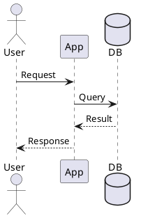

# Test Clean PlantUML

Questo file ha un code block PlantUML pulito.

```plantuml
@startuml
actor User
participant App
database DB

User -> App : Request
App -> DB : Query
DB --> App : Result
App --> User : Response
@enduml
```

Prova a digitare qui sopra nel code block.

## Altro testo

Testo normale sotto.
