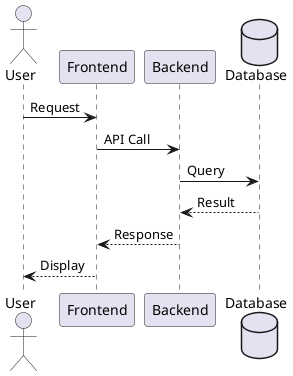
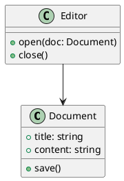

# Hello from DocsPilot

This is a test markdown content.

## Code Block Example

```javascript
function hello() {
  console.log("Hello World!");
}
```

## PlantUML Diagram



## Another PlantUML


