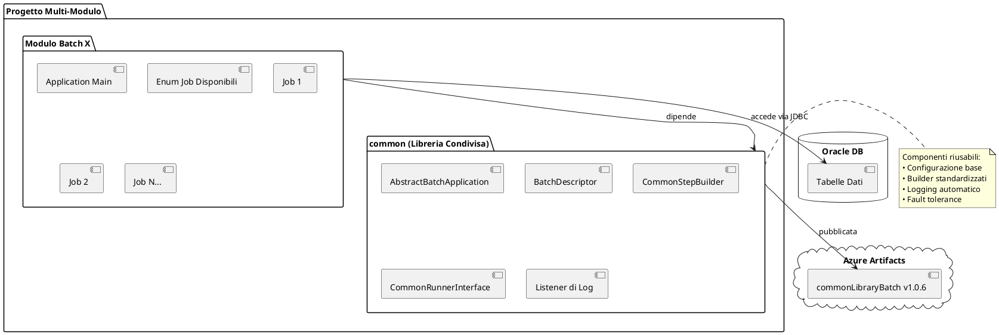
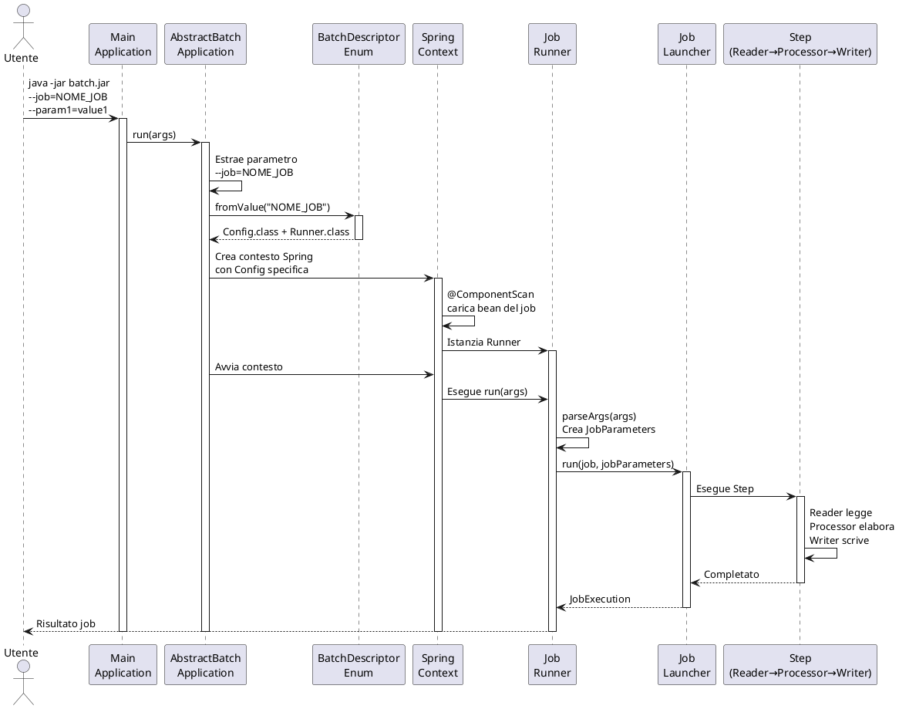
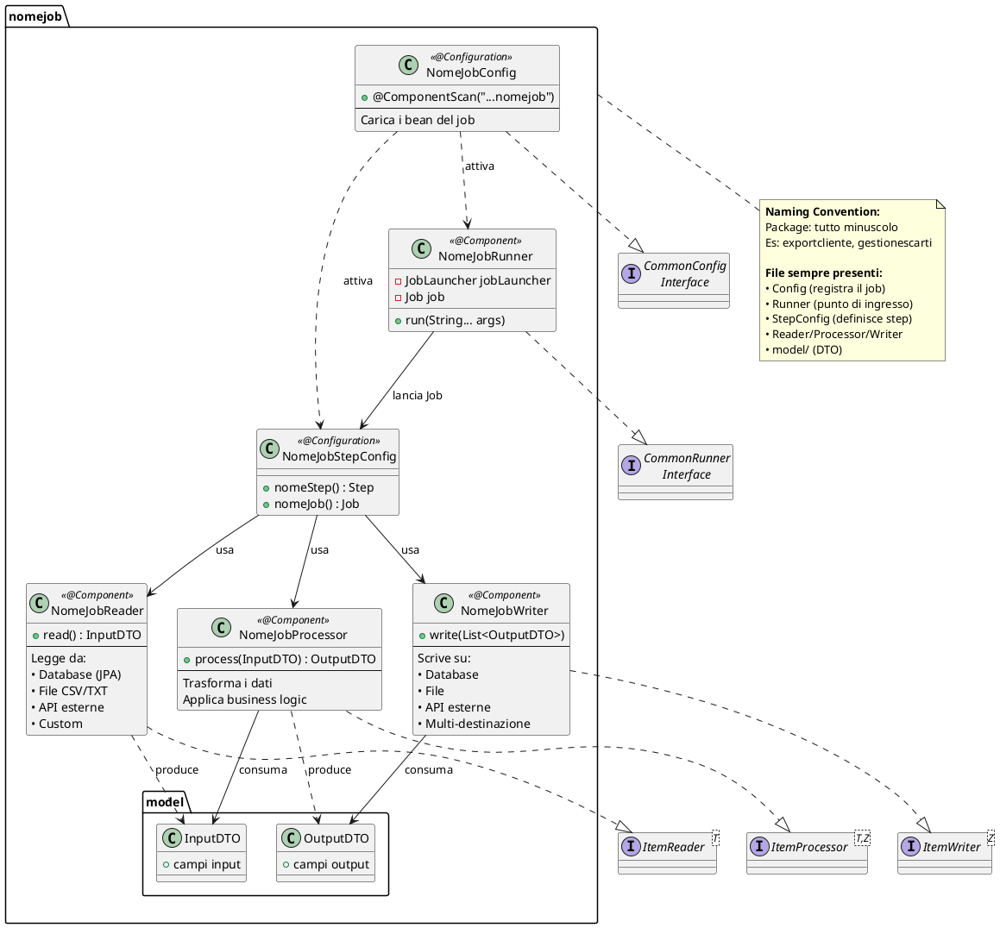
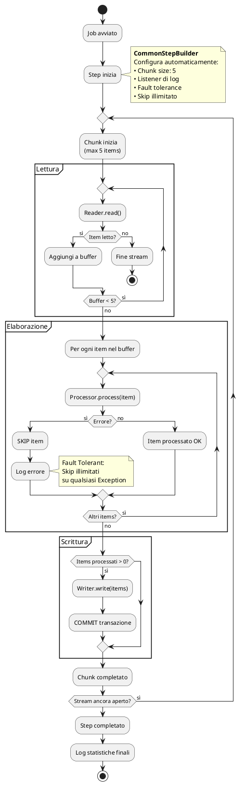
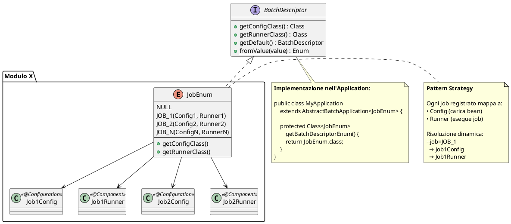
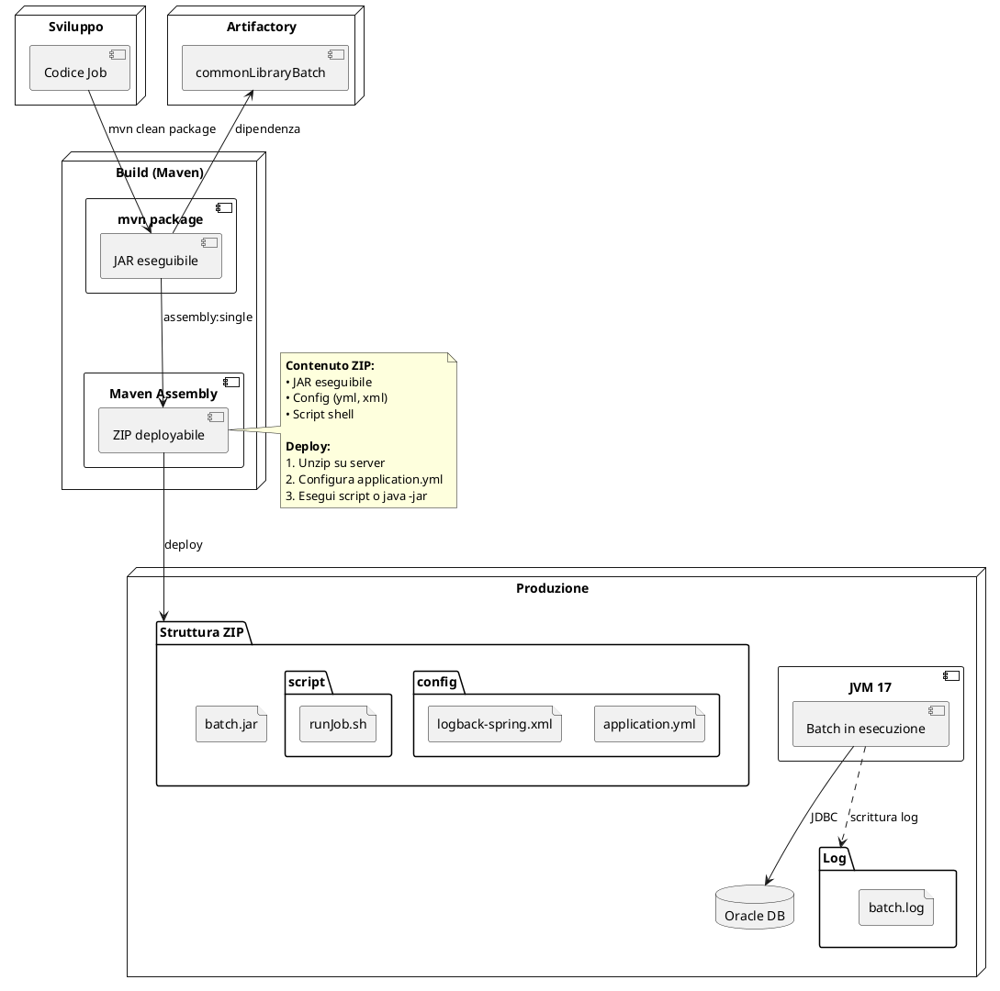

# Guida Architetturale - Creazione Nuovi Job Spring Batch

## Panoramica Progetto

Sistema multi-modulo Maven basato su **Spring Batch** per job batch aziendali.

### Struttura Moduli
- **batchProjectMaster** (root POM): Parent Maven
- **common**: Libreria condivisa `commonLibraryBatch` (v1.0.6)
- **anagrafeTributaria**: Modulo batch specifico
- **estrazioniAnagrafiche**: Modulo batch specifico



---

## Stack Tecnologico

- **Spring Boot**: 3.5.5 / 3.5.7
- **Java**: 17
- **Spring Batch**: Framework job/step
- **JPA/Hibernate**: Persistenza Oracle
- **Lombok**: 1.18.34
- **MapStruct**: 1.6.3

---

## Architettura Base - Come Funziona

### Flusso di Esecuzione Completo



**Punti Chiave:**
1. Un comando esegue il jar con `--job=NOME_JOB`
2. L'applicazione risolve dinamicamente Config e Runner dal nome job
3. Spring carica **solo i bean necessari** per quel job
4. Il Runner prepara i parametri e lancia il job
5. Il job esegue gli step (Reader → Processor → Writer)

---

## Struttura Standard di un Job

### Anatomia di un Job Package



---

## Pattern: Ciclo di Vita dello Step

### Come Funziona l'Elaborazione Chunk-Based



**Concetti Chiave:**
- **Chunk**: Gruppo di 5 item elaborati insieme
- **Transazione**: Una per chunk (commit alla fine)
- **Fault Tolerance**: Gli errori NON bloccano il job
- **Logging**: Automatico su ogni fase

---

## Componenti Comuni (Libreria)

### CommonStepBuilder - Il Cuore della Configurazione

```plantuml
@startuml

class "CommonStepBuilder<T,Z>" as builder {
    +CommonStepBuilder(name, jobRepository)
    +settaStepComponents(...)
    +listener(customListener)
    +build() : Step
}

package "Listener Automatici" {
    class "LogStepListener" as step {
        +beforeStep()
        +afterStep()
        --
        Log inizio/fine step
    }
    
    class "LogChunkListener" as chunk {
        +beforeChunk()
        +afterChunk()
        --
        Log ogni chunk
    }
    
    class "LogReaderListener" as readl {
        +beforeRead()
        +afterRead()
        --
        Log letture
    }
    
    class "LogProcessListener" as procl {
        +beforeProcess()
        +afterProcess()
        --
        Log elaborazioni
    }
    
    class "LogWriterListener" as writel {
        +beforeWrite()
        +afterWrite()
        --
        Log scritture
    }
}

interface "ItemReader<T>" as reader
interface "ItemProcessor<T,Z>" as processor
interface "ItemWriter<Z>" as writer

builder --> reader : configura
builder --> processor : configura
builder --> writer : configura

builder ..> step : aggiunge auto
builder ..> chunk : aggiunge auto
builder ..> readl : aggiunge auto
builder ..> procl : aggiunge auto
builder ..> writel : aggiunge auto

note right of builder
    **Uso nel StepConfig:**
    
    return new CommonStepBuilder<Input, Output>
            ("stepName", jobRepository)
            .settaStepComponents(
                transactionManager,
                reader,
                processor,
                writer
            )
            .build();
            
    **Configurazioni automatiche:**
    • Chunk size = 5
    • Tutti i listener di log
    • Skip illimitato su Throwable
    • Prevent restart job
end note

@enduml
```



### Pattern BatchDescriptor - Registrazione Job



---

## Guida Step-by-Step: Creare un Nuovo Job

### Step 1: Registrare il Job nell'Enum

Modifica l'enum BatchDescriptor del modulo:

```
enum AnagrafeWebBatchNameEnum implements BatchDescriptor {
    NULL(null, null),
    NUOVO_JOB(NuovoJobConfig.class, NuovoJobRunner.class);  // ← Aggiungi qui
    
    // ... resto dell'enum
}
```

### Step 2: Creare la Struttura del Package

```
nuovojob/
├── NuovoJobConfig.java           # Configura Spring
├── NuovoJobRunner.java           # Entry point
├── NuovoJobStepConfig.java       # Definisce Step e Job
├── NuovoJobReader.java           # Legge dati
├── NuovoJobProcessor.java        # Elabora dati
├── NuovoJobWriter.java           # Scrive risultati
└── model/
    ├── InputDTO.java
    └── OutputDTO.java
```

### Step 3: Template dei Componenti

```plantuml
@startuml

participant "Config" as config
participant "Runner" as runner
participant "StepConfig" as stepconf
participant "Reader" as reader
participant "Processor" as processor
participant "Writer" as writer

note over config
    **@Configuration**
    @ComponentScan("...nuovojob")
    implements CommonConfigInterface
    
    Scopo:
    Attiva il caricamento
    dei bean del job
end note

note over runner
    **@Component**
    implements CommonRunnerInterface
    
    Responsabilità:
    • Parse argomenti
    • Crea JobParameters
    • Lancia il job
    
    Metodi:
    • run(String... args)
    • parseArgs(args) → Map
end note

note over stepconf
    **@Configuration**
    
    Responsabilità:
    • Bean Step (con CommonStepBuilder)
    • Bean Job (con JobBuilder)
    
    Metodi:
    • nomeStep() : Step
    • nomeJob() : Job
end note

note over reader
    **@Component**
    implements ItemReader<InputDTO>
    
    Responsabilità:
    Leggere dati dalla fonte
    
    Tipi comuni:
    • JpaPagingItemReader (DB)
    • FlatFileItemReader (CSV)
    • Custom reader
    
    Metodi:
    • read() : InputDTO
end note

note over processor
    **@Component**
    implements ItemProcessor<Input,Output>
    
    Responsabilità:
    Trasformare i dati
    
    Metodi:
    • process(InputDTO) : OutputDTO
    
    Logica:
    • Validazioni
    • Mappature
    • Business rules
    • Arricchimento dati
end note

note over writer
    **@Component**
    implements ItemWriter<OutputDTO>
    
    Responsabilità:
    Scrivere i risultati
    
    Tipi comuni:
    • JpaItemWriter (DB)
    • FlatFileItemWriter (File)
    • Custom writer
    
    Metodi:
    • write(List<OutputDTO>)
end note

runner -> stepconf : inietta Job
stepconf -> reader : inietta
stepconf -> processor : inietta
stepconf -> writer : inietta

@enduml
```



### Step 4: Flow Implementativo

```plantuml
@startuml
start

:Crea enum entry nel BatchDescriptor;

:Crea package nuovojob/;

partition "Config" {
    :Crea NuovoJobConfig;
    :Aggiungi @Configuration;
    :Aggiungi @ComponentScan;
    :Implements CommonConfigInterface;
}

partition "Runner" {
    :Crea NuovoJobRunner;
    :Aggiungi @Component;
    :Implements CommonRunnerInterface;
    :Inietta JobLauncher e Job;
    :Implementa run(args);
    note right
        Map<String, String> params = parseArgs(args);
        JobParameters jobParams = 
            new JobParametersBuilder()
                .addString("param1", params.get("param1"))
                .toJobParameters();
        jobLauncher.run(job, jobParams);
    end note
}

partition "StepConfig" {
    :Crea NuovoJobStepConfig;
    :Aggiungi @Configuration;
    
    :Bean Step con CommonStepBuilder;
    note right
        new CommonStepBuilder<Input, Output>
            ("stepName", jobRepository)
            .settaStepComponents(
                transactionManager,
                reader, processor, writer)
            .build();
    end note
    
    :Bean Job con JobBuilder;
    note right
        new JobBuilder("jobName", jobRepository)
            .preventRestart()
            .start(step)
            .build();
    end note
}

partition "Reader/Processor/Writer" {
    :Crea NuovoJobReader;
    :Implementa ItemReader<InputDTO>;
    
    :Crea NuovoJobProcessor;
    :Implementa ItemProcessor<Input,Output>;
    
    :Crea NuovoJobWriter;
    :Implementa ItemWriter<OutputDTO>;
}

partition "Model" {
    :Crea InputDTO;
    :Crea OutputDTO;
}

:Build e Test;

stop

@enduml
```



---

## Best Practices

### 1. Naming Conventions
- **Package**: tutto minuscolo, una parola (es: `exportcliente`, `gestionescarti`)
- **Classi**: PascalCase con suffisso ruolo (es: `ExportClienteReader`, `ExportClienteProcessor`)
- **File**: Un componente per file

### 2. Configurazione
- Usa sempre `CommonStepBuilder` per uniformità
- Chunk size = 5 (standard del progetto)
- `preventRestart()` nei Job
- `@StepScope` per accedere a JobParameters nei bean

### 3. Error Handling
- Skip illimitati configurati automaticamente
- Log dettagliati tramite listener
- Non bloccare il job per errori singoli
- Validare input nel Processor

### 4. Testing
- Usa `spring-batch-test` per test unitari
- H2 in-memory per test database
- Mock dei Reader/Writer per test Processor

### 5. Logging
- Usa `UtilityLog` per messaggi strutturati
- Listener automatici già configurati
- Log level ERROR per Spring Batch (riduce verbosità)

### 6. Performance
- Chunk size ottimizzato (5)
- Paginazione per query grandi (JpaPagingItemReader)
- Pool connessioni HikariCP (max 10)
- Query timeout 29s

---

## Configurazione Application

```yaml
spring:
  main:
    web-application-type: none       # No web server
  batch:
    job:
      enabled: false                  # No auto-start
    jdbc:
      initialize-schema: never        # No Spring Batch tables
  datasource:
    driver-class-name: oracle.jdbc.OracleDriver
    hikari:
      maximum-pool-size: 10
      minimum-idle: 5
  jpa:
    hibernate:
      ddl-auto: none

logging:
  myPath: nomeModulo\log
  level:
    org.springframework.batch: ERROR
    org.hibernate: ERROR
```

---

## Esecuzione

### Comando Standard
```bash
java -jar nomeModulo.jar --job=NOME_JOB --param1=value1 --param2=value2
```

### Esempi
```bash
# Job con parametri semplici
java -jar batch.jar --job=EXPORT_CLIENTE --dataInizio=2025-01-01

# Job con file input/output
java -jar batch.jar --job=ELABORA_FILE --fileInput=/path/input.csv --fileOutput=/path/output.csv

# Job con parametri multipli
java -jar batch.jar --job=SINCRONIZZA --fromDate=2025-01-01 --toDate=2025-12-31 --compagnia=001
```

---

## Deployment



---

## Checklist Nuovo Job

- [ ] Enum: Aggiunto valore nel `BatchDescriptor`
- [ ] Package: Creato `nomejob/` in minuscolo
- [ ] Config: Classe con `@Configuration` e `@ComponentScan`
- [ ] Runner: Classe con `@Component` e `CommandLineRunner`
- [ ] StepConfig: Bean Step con `CommonStepBuilder` + Bean Job
- [ ] Reader: Implementa `ItemReader<InputDTO>`
- [ ] Processor: Implementa `ItemProcessor<Input,Output>`
- [ ] Writer: Implementa `ItemWriter<OutputDTO>`
- [ ] Model: DTO in package `model/`
- [ ] Test: Unit test con `spring-batch-test`
- [ ] Doc: Aggiornato README con parametri job
- [ ] Build: `mvn clean package` OK
- [ ] Deploy: Creato ZIP con assembly

---

## Risorse e Dipendenze

### Dipendenze Comuni
- **commonLibraryBatch** v1.0.6: Componenti riusabili
- **ApiAnagrafeBE** v1.0.7: Entity JPA e configurazioni DB
- **Spring Boot Starter Batch**: Framework base
- **Oracle JDBC Driver**: Connessione database

### Repository
- **Azure Artifacts**: `oracolo-lib-feed`

### Tool Necessari
- Java 17
- Maven 3.6+
- Oracle Client (per test locali)

