---
author: GAMBA ARMANDO
document_type: Document
email: armando.gamba@esternibisp.com
title: 
date: 01/12/2025
word_section:
  write_toc: false
  document_header: ''
  template_section:
    inherit_from_template: ''
    custom_template: ''
    template_type: default
  predefined_pages: 
---
# Guida Architetturale - Creazione Nuovi Job Spring Batch

## Panoramica Progetto

Sistema multi-modulo Maven basato su **Spring Batch** per job batch aziendali.

### Struttura Moduli
- **batchProjectMaster** (root POM): Parent Maven
- **common**: Libreria condivisa `commonLibraryBatch` (v1.0.6)
- **anagrafeTributaria**: Modulo batch specifico
- **estrazioniAnagrafiche**: Modulo batch specifico

```plantuml
@startuml
package "Progetto Multi-Modulo" {
    
    package "common (Libreria Condivisa)" {
        [AbstractBatchApplication]
        [BatchDescriptor]
        [CommonStepBuilder]
        [CommonRunnerInterface]
        [Listener di Log]
    }
    
    package "Modulo Batch X" {
        [Application Main]
        [Enum Job Disponibili]
        [Job 1]
        [Job 2]
        [Job N...]
    }
}

cloud "Azure Artifacts" {
    [commonLibraryBatch v1.0.6]
}

database "Oracle DB" {
    [Tabelle Dati]
}

[common (Libreria Condivisa)] --> [commonLibraryBatch v1.0.6] : pubblicata
[Modulo Batch X] --> [common (Libreria Condivisa)] : dipende
[Modulo Batch X] --> [Tabelle Dati] : accede via JDBC

note right of "common (Libreria Condivisa)"
    Componenti riusabili:
    • Configurazione base
    • Builder standardizzati
    • Logging automatico
    • Fault tolerance
end note

@enduml
```



---

## Stack Tecnologico

- **Spring Boot**: 3.5.5 / 3.5.7
- **Java**: 17
- **Spring Batch**: Framework job/step
- **JPA/Hibernate**: Persistenza Oracle
- **Lombok**: 1.18.34
- **MapStruct**: 1.6.3

---

## Architettura Base - Come Funziona

### Flusso di Esecuzione Completo

```plantuml
@startuml
actor "Utente" as user
participant "Main\nApplication" as main
participant "AbstractBatch\nApplication" as app
participant "BatchDescriptor\nEnum" as enum
participant "Spring\nContext" as spring
participant "Job\nRunner" as runner
participant "Job\nLauncher" as launcher
participant "Step\n(Reader→Processor→Writer)" as step

user -> main : java -jar batch.jar\n--job=NOME_JOB\n--param1=value1
