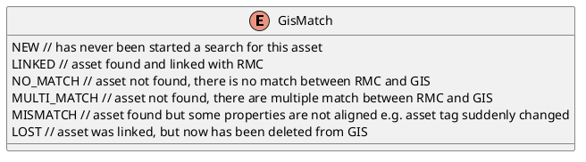
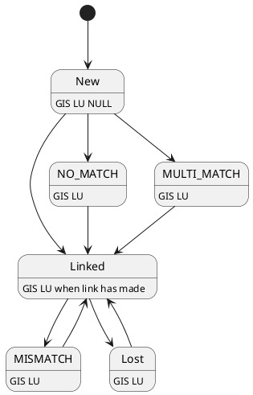

```plantuml
@startuml

enum GisMatch {
NEW // has never been started a search for this asset
LINKED // asset found and linked with RMC
NO_MATCH // asset not found, there is no match between RMC and GIS
MULTI_MATCH // asset not found, there are multiple match between RMC and GIS
MISMATCH // asset found but some properties are not aligned e.g. asset tag suddenly changed
LOST // asset was linked, but now has been deleted from GIS
}

@enduml
```

```plantuml
@startuml
New:GIS LU NULL
Linked:GIS LU when link has made
NO_MATCH:GIS LU
MULTI_MATCH:GIS LU
MISMATCH:GIS LU
Lost:GIS LU
[*]--> New 
New-->Linked
New-->NO_MATCH
New-->MULTI_MATCH
Linked-->MISMATCH
Linked-->Lost
MULTI_MATCH-->Linked
NO_MATCH-->Linked
Lost-->Linked
MISMATCH-->Linked
@enduml
```