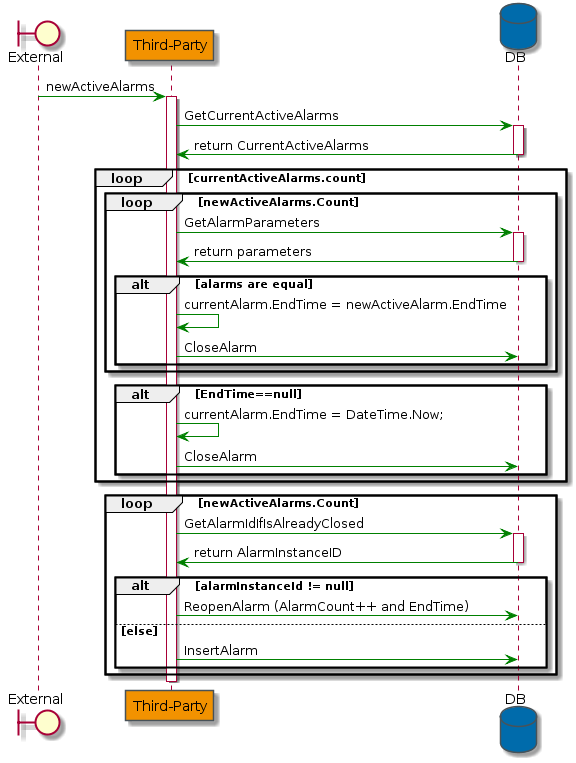
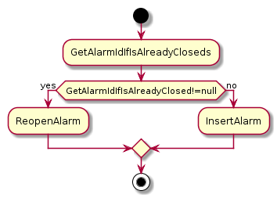
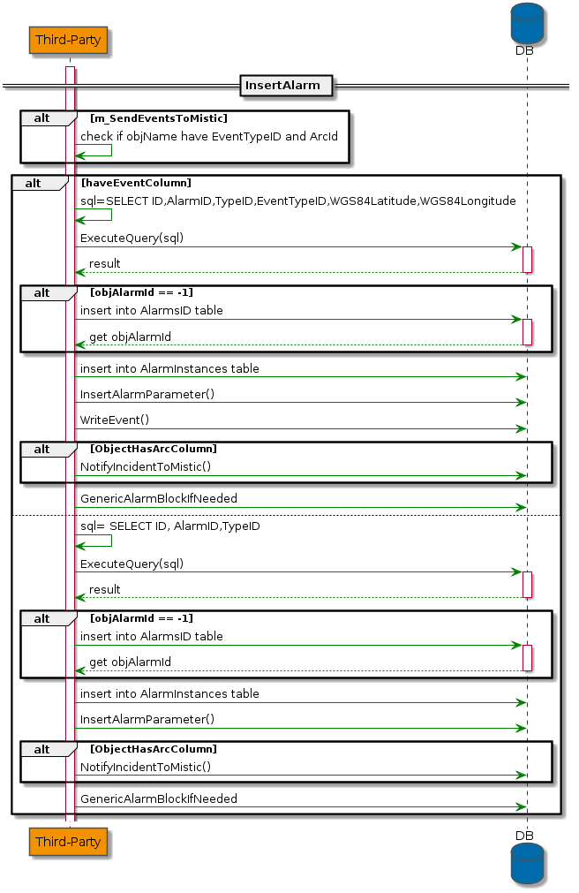
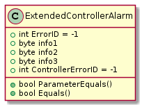
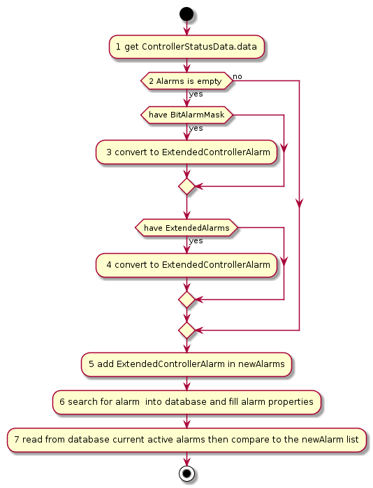
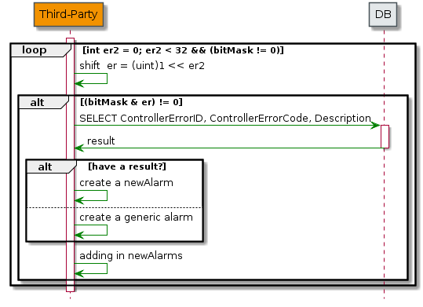
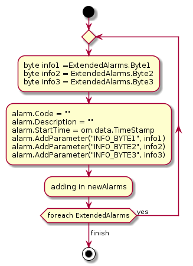
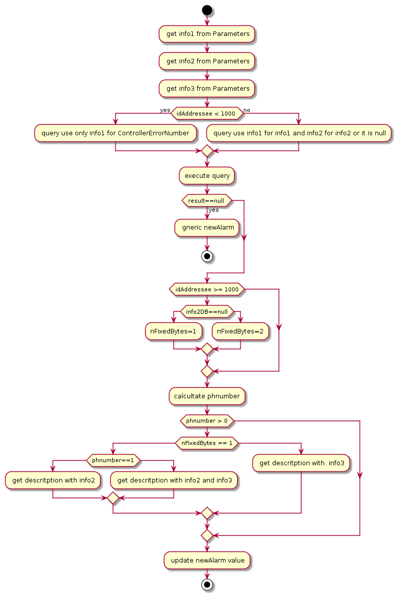
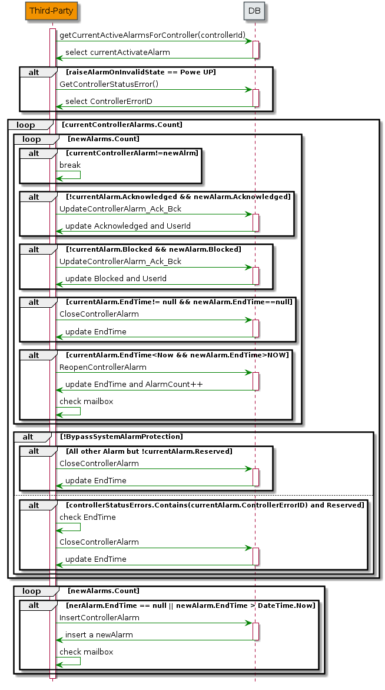
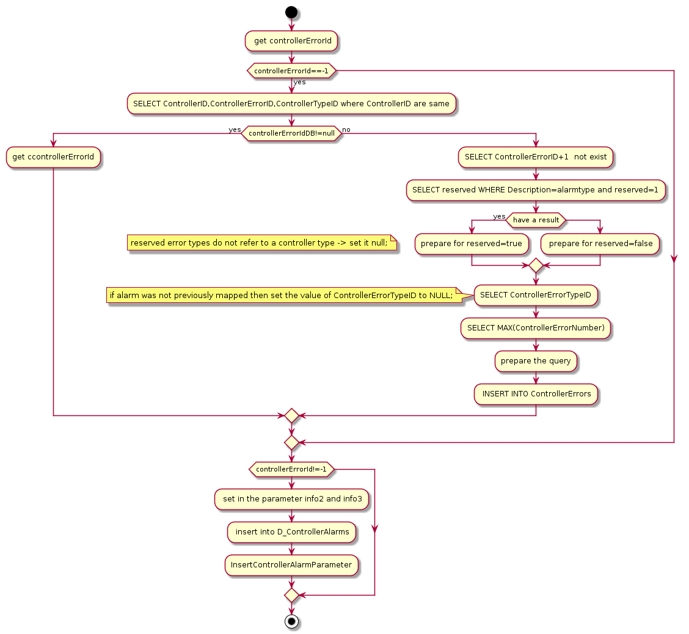

 # AlarmService


## OnObjAlarm  

OnObjAlarm is a method that you can find in OmniaAllarmService.
Used to manage Alarms: to check that it is active, remove or add a new one.

This method has an argument, OmniaMsgGenericAlarm is a class and extends OmniaMsgHeader

#### OmniaMsgHeader 
It has three properties:
- Alarms is a list of GenericAllarms
- ObjType Name is a string indicating the type
- The GUID GUID type is a struct that contains several ways to create and manage a GUID


#### Variables for OnObjAlarm
- newActiveAlarms is a GenericAllarm list filled from the list found in OmniaMsgHeader
- currentActiveAlarms is a GenericAllarm list filled with a function, GetCurrentActiveAlarms

#### GetCurrentActiveAlarms
this function has two arguments:
- GUID used for the query
- ObjTypeName a string which is the name of the table in the database

Create a query to alert the database, the query result creates a GenericAllarm list and returns it.

### Business Logic



Describes an alarm within OnObjAlarm:

At the beginning the method takes the alarms from GetCurrentActiveAlarms then compares each alarm with the alarms it receives as arguments,
if the alarms are the same, update the end time.
Furthermore, for each alarm check if endTime is null, then update the end time in the database.
End this part the method calls a function (GetAlarmIdIfIsAlreadyClosed) returns AlarmInstanceID, if this ID is equal to null, inserts it into the database, otherwise updates AlarmCount and EndTime.

the logic of the method is divided into two parts:

#### First part
Reads the list of active alarms (currentActiveAlarms) for that object in order to close those that are no longer "present"

Check inside the list two if they have the same alarm with the same parameters (GetAlarmParameters)
if the alarms are the same
is removed from the list (newActiveAlarms) because it is already managed and assigned a new EndTime.

If the alarm (currentActiveAlarms) has endTime = null and is not already activated:
Assigned a new EndTime and calls CloseAlarm.


#####  GetAlarmParameters
It's more or less like GetCurrentActiveAlarms but the difference is that this function gets the parameters

##### CloseAlarm
It has three arguements:
- alarmInstanceId the Id table
- endTime the new date to updates in the database
- objName the table name.
  
This function is used for  update the endTime.

#### Second part

check if the alarm should be inserted as new or closed. (within a time window) reopen and update the count

For all the alarms contained within OmniaMsgHeader call GetAlarmIdIfIsAlreadyClosed



##### GetAlarmIdIfIsAlreadyClosed
Select an Alarm has the same alarmCode and alarmDescription also AlarmEndTime> EndTime.
this returns an integer that is AlarmInstanceID.

##### ReopenAlarm
 It recives a AlarmInstanceId update the AlarmCount and  AlarmEndTime.

 ##### InsertAlarm

Insert an Allarm on the database



also calls:
- **InsertAlarmParameter**
- **WriteEvent** called only if it has the Event column.(event type table)
- **NotifyIncidentToMistic** is used only if it has to send an event to mistic it also checks if the ObjNane table has ArcId, then ArcColumn, if it has, call this method. the same happens for the Event column but don't call this method.
- **GenericAlarmBlockIfNeeded**: check if a row exists in the database({objBlockedAlarms}) if it is successful, update the row

note right :miss the specialcase for objName.Equals("Area")


## OnControllerAlarm

OnControllerAlarm is a method for manage only the alarm of controller
This method has an argument, OmniaMsgContrAlarm is a class and extends OmniaMsgHeader

### OmniaMsgContrAlarm
It has three properties:
- ControllerStatusData  is a class used for manage all information about the controller
- AdapterIdentity contains information about the adapter
- BypassSystemAlarmProtection boolean
  
### Main variables for OnControllerAlarm
newAlarms is a list of ExtendedControllerAlarm filled in different ways that will be explained to you in these chapters.

#### ExtendedControllerAlarm
It is a class extends ControllerAlarm



###  Business Logic
this method can be divided into 5 parts:
- 1 check if exists new alarms 
- 2 convert basic alarm to new alarm
- 3 convert extended alarm to new alarm
- 4 search for alarm into database, if not found then raise a generic alarm
- 5 read from database current active alarms then compare to the newAlarm list



the method to get newAlarm has three option:
- found ready in the list  in ControllerStatusData.ControllerAlarm
- convert basic alarm to new alarm
- convert extended alarm to new alarm


#### convert BitAlarmMask to ExtendedControllerAlarm
In this case the information is a bit mask, so it is necessary to transform it into a Newalarms but first you need to get ControllerErrorNuber:
for each bit must make a shift to the left, then a logical AND between the result and the bit mask, check for non-zero, and finally a query on ControlErrorNumber.
In this way you have a Newalarms.



#### convert ExtendedControllerAlarm to ExtendedControllerAlarm
this part is very simple because it is necessary to convert from the final extended alarm to a new alarm, since each alarm contains a list ControllerStatusData.ExtendedControllerAlarm
in this way:



#### search for alarm  into database and fill alarm properties

For each new alarm:
First, the method takes info1, info2 and info3 from newAlarm.Parameters. Parameters is a list where the information are saved in this way:
```c#
string name
object vale
```
idAddressee is the controller type up to 1000 used for OMNIVUE and 1000 up to 3000 to UTOPIA + STCIP should be < 3000 but we use this rule for others.

If idAddressee <1000 makes a query otherwise a different query. the difference between the two query is the first use info1 for ControllerErrorNumber, the second use info1(in the table) for info1 taken in Parameters, and it checks info2 in the table is null or it is equals to info2 taken in Parameters.
 So calculate nFixedBytes, the value can be one, two or less one, this is important because it indicates the number of argument.
Another important value for knowing the description is phnumber, this variable used for the number of placeholder.

After all this a new alarm has:
```c#
newAlarm.ErrorID = controllerErrorID;
newAlarm.nFixedBytes = nFixedBytes;
newAlarm.info1 = info1;
newAlarm.info2 = info2;
newAlarm.info3 = info3;
```
If nothing is found in the database newAllarm will be updated as a generic controller, in this way:
```c#
newAlarm.Code = "AS01.1";
newAlarm.Description = "Generic warning";
newAlarm.nFixedBytes = 0;
newAlarm.info1 = info1;
newAlarm.info2 = info2;
newAlarm.info3 = info3;
```
In case of error the newAlarm is removed from the list.




#### read from database current active alarms then compare to the newAlarm 

First the method gets currentControlAlarms from GetCurrentActiveAlarmsForController ().
After verifying that m_raiseAlarmOnInvalidState is equal to two, this is a very important integer because each number indicates a state.
```
ControllerStatusID	Description
  0	                  No Info
  1	                  On
  2	                  Power Up
  3	                  Dark
  4	                  Flash
  5	                  Partial Flash
  6	                  All Red
  7	                  Failure Mode (dark)
  8	                  Failure Mode (flash)
  9	                  Partial Dark
```
table in the database ControllerStatusList.

In this method checks this variable only for PowerUp, if it is this state it updates the ControllerStatusErrors list  from GetControllerStatusError().

This a diagram about all this part:



##### GetCurrentActiveAlarmsForController 
It is a method recives a controllerId and select in the databse, all controller alarm for that controllerId where the endTime is null or more than actual date then fill a list of ExtendedControllerAlarm and return that.

##### GetControllerStatusError
select in the databse, ControllerErrorID, where ControllerErrorTypeID are in reserved state.
the rerult fill in a list of integer and return that.

##### UpdateControllerAlarm_Ack_Bck
This method is used for update the Acknowledged or Blocked both are bit  but also to update the UserID,, for that ControllerAlarmID.

table D_ControllerAlarms
##### CloseControllerAlarm
This method is used for update the endTime where it is null, for that ControllerAlarmID.

table D_ControllerAlarms
##### ReopenControllerAlarm
This method is used for update the endTime and the count of AlarmCount, for that ControllerAlarmID.

table D_ControllerAlarms
##### InsertControllerAlarm
this method attempts to insert a new alarm into the database.
the argument is an alarm, a controllerId and a controllerTypeId.
the whole method is based on alarm.ErrorID (controllerErrorId)

can be summarized in:



##### the reserved is a flag in which  the control alarm remains open for supervision of the user.

##### Acknowledged is a flag used for determine  if the user has seen the alarm.

##### Blocked is a flag used used for type alarm or single alarm.

##### mailbox is a Queue  in which it saves all  unread  messages.
