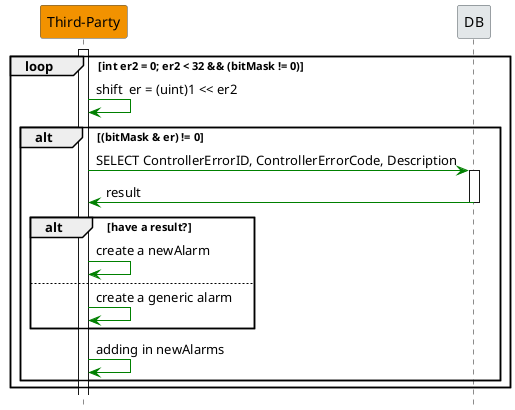

```plantuml
@startuml
hide footbox
skinparam ArrowColor green
skinparam LifeLineBorderColor black
skinparam LifeLineBackgroundColor black
skinparam BackgroundColor white
skinparam NoteBackgroundColor whitesmoke
skinparam ParticipantBackgroundColor #E3E7E9
skinparam ActorBackgroundColor #F29200
skinparam DatabaseBackgroundColor #006BAB
skinparam CollectionsBackgroundColor #E3E7E9
skinparam ActorBorderColor #485258
skinparam ParticipantBorderColor #485258
skinparam CollectionsBorderColor #485258
skinparam DatabaseBorderColor #485258


participant "Third-Party" as LOM #F29200
participant "DB" as OMNIA

  activate LOM
  loop int er2 = 0; er2 < 32 && (bitMask != 0)
    LOM->LOM: shift  er = (uint)1 << er2
    alt (bitMask & er) != 0
      LOM-> OMNIA : SELECT ControllerErrorID, ControllerErrorCode, Description
      activate OMNIA
      OMNIA->LOM: result
      deactivate OMNIA
      alt have a result?
        LOM->LOM: create a newAlarm
      else
        LOM->LOM: create a generic alarm
      end
      LOM->LOM: adding in newAlarms
    end
 end
@enduml
```