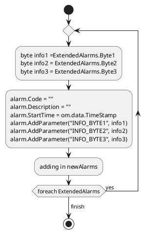

```plantuml
@startuml
start
repeat
  :byte info1 =ExtendedAlarms.Byte1
	byte info2 = ExtendedAlarms.Byte2
	byte info3 = ExtendedAlarms.Byte3;
  :alarm.Code = ""
	alarm.Description = ""
	alarm.StartTime = om.data.TimeStamp
	alarm.AddParameter("INFO_BYTE1", info1)
	alarm.AddParameter("INFO_BYTE2", info2)
	alarm.AddParameter("INFO_BYTE3", info3);
  :adding in newAlarms;
repeat while (foreach ExtendedAlarms) is (yes)
->finish;
stop
@enduml
```