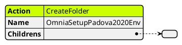
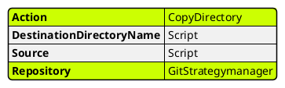
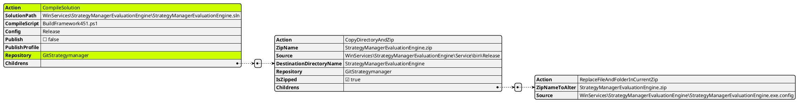
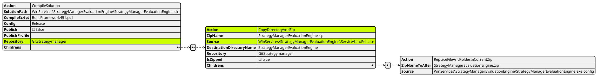
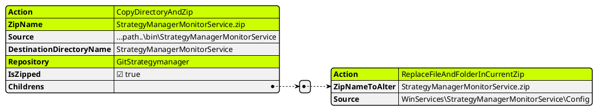

# Actions For Deploy in Strategy Manager

### Createfolder
Utilizzato per creare l'alberatura dei folder. Tutto quello che avviene dentro l'array **Childrens** viene creato dentro il folder stesso

### Copy directory

### Compile Solution
diversamente dal deploy dei microservices, qui è stato implementata una libreria che è effettivamente
in grado di compilare i sorgenti. Non deve essere fatto esternamente come nell'altro caso

### CopyDirectoryAndZip
Tipicamente questa azione avviene DOPO che è stato compilato con successo una solution

### Replace Files and Folder in current zip
In questo caso viene inserito/sostituito il contenuto di una directory config dentro lo zip StrategyManagerMonitorService.zip

