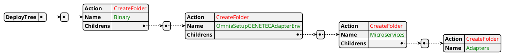
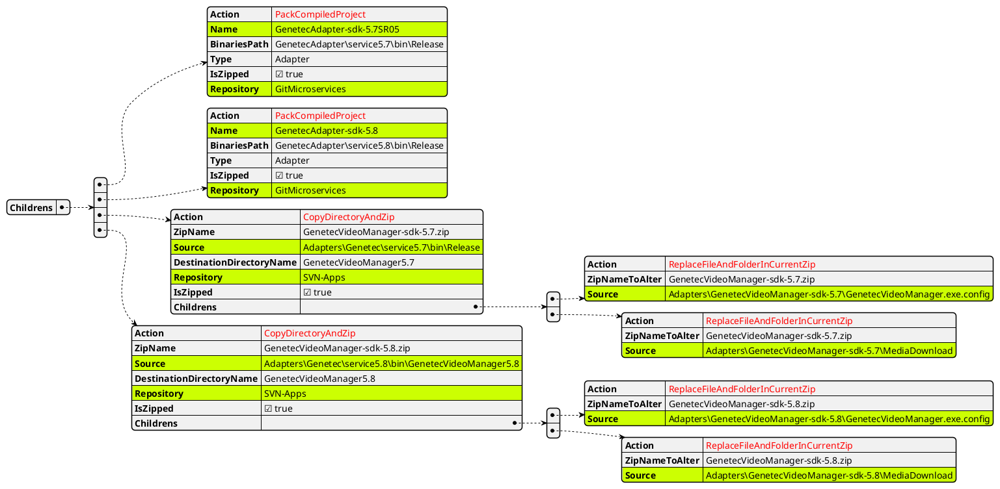

# Pacchettizzazione GenetecAdapter

### Creazione della alberatura delle directory

```plantuml
@startjson
{
"DeployTree": [
        {
            "Action": "<color:red>CreateFolder",
            "Name": "<color:green>Binary",
            "Childrens": [
                {
                    "Action": "<color:red>CreateFolder",
                    "Name": "<color:green>OmniaSetupGENETECAdapterEnv",
                    "Childrens": [
                        {
                            "Action": "<color:red>CreateFolder",
                            "Name": "<color:green>Microservices",
                            "Childrens": [
                                {
                                    "Action": "<color:red>CreateFolder",
                                    "Name": "<color:green>Adapters"
                                    
                                }
                            ]
                        }
                    ]
                }
            ]
        }
    ]
    }

    
@endjson
```

### Attività di pacchettizzazione 
- in zip, 
- assegnazione nomi agli zip, 
- sostituzione deo file
  

```plantuml
@startjson
#highlight "Childrens"/"0"/"Name"
#highlight "Childrens"/"0"/"Repository"
#highlight "Childrens"/"1"/"Name"
#highlight "Childrens"/"1"/"Repository"
#highlight "Childrens"/"2"/"Source"
#highlight "Childrens"/"2"/"Repository"
#highlight "Childrens"/"2"/"Childrens"/"0"/"Source"
#highlight "Childrens"/"2"/"Childrens"/"1"/"Source"
#highlight "Childrens"/"3"/"Source"
#highlight "Childrens"/"3"/"Repository"
#highlight "Childrens"/"3"/"Childrens"/"0"/"Source"
#highlight "Childrens"/"3"/"Childrens"/"1"/"Source"
{
    "Childrens": [
        {
            "Action": "<color:red>PackCompiledProject",
            "Name": "GenetecAdapter-sdk-5.7SR05",
            "BinariesPath": "GenetecAdapter\\service5.7\\bin\\Release",
            "Type": "Adapter",
            "IsZipped": true,
            "Repository": "GitMicroservices"
        },
        {
            "Action": "<color:red>PackCompiledProject",
            "Name": "GenetecAdapter-sdk-5.8",
            "BinariesPath": "GenetecAdapter\\service5.8\\bin\\Release",
            "Type": "Adapter",
            "IsZipped": true,
            "Repository": "GitMicroservices"
        },
        {
            "Action": "<color:red>CopyDirectoryAndZip",
            "ZipName": "GenetecVideoManager-sdk-5.7.zip",
            "Source": "Adapters\\Genetec\\service5.7\\bin\\Release",
            "DestinationDirectoryName":"GenetecVideoManager5.7",                                            
            "Repository": "SVN-Apps",
            "IsZipped": true,
            "Childrens": [
                {
                    "Action": "<color:red>ReplaceFileAndFolderInCurrentZip",
                    "ZipNameToAlter": "GenetecVideoManager-sdk-5.7.zip",
                    "Source": "Adapters\\GenetecVideoManager-sdk-5.7\\GenetecVideoManager.exe.config"
                },
                {
                    "Action": "<color:red>ReplaceFileAndFolderInCurrentZip",
                    "ZipNameToAlter": "GenetecVideoManager-sdk-5.7.zip",
                    "Source": "Adapters\\GenetecVideoManager-sdk-5.7\\MediaDownload"
                }
            ]
        },
        {
            "Action": "<color:red>CopyDirectoryAndZip",
            "ZipName": "GenetecVideoManager-sdk-5.8.zip",
            "Source": "Adapters\\Genetec\\service5.8\\bin\\GenetecVideoManager5.8",
            "DestinationDirectoryName":"GenetecVideoManager5.8",
            "Repository": "SVN-Apps",
            "IsZipped": true,
            "Childrens": [
                {
                    "Action": "<color:red>ReplaceFileAndFolderInCurrentZip",
                    "ZipNameToAlter": "GenetecVideoManager-sdk-5.8.zip",
                    "Source": "Adapters\\GenetecVideoManager-sdk-5.8\\GenetecVideoManager.exe.config"
                },
                {
                    "Action": "<color:red>ReplaceFileAndFolderInCurrentZip",
                    "ZipNameToAlter": "GenetecVideoManager-sdk-5.8.zip",
                    "Source": "Adapters\\GenetecVideoManager-sdk-5.8\\MediaDownload"
                }
            ]
        }
    ]
}
@endjson
```