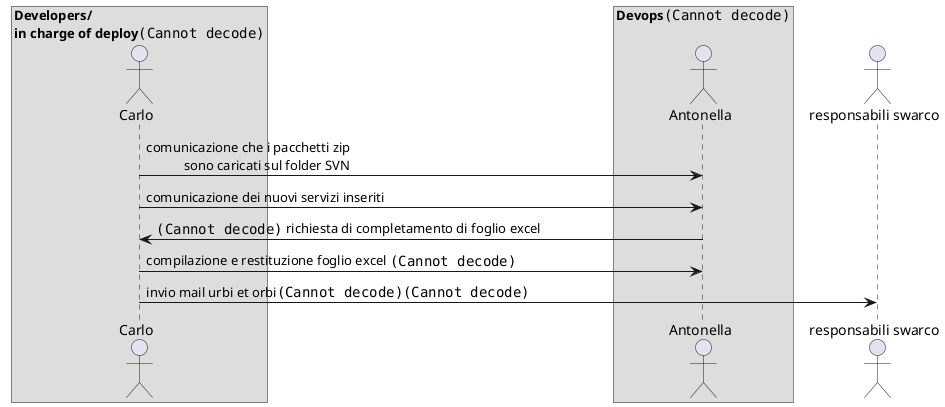

# Processo decisionale creazione nuova Release

Fogli excel di interazione con Antonella

[OmniaPackagesDesign_Ver3_24](../assets/OmniaPackagesDesign_Ver3_24.xlsx)
[NOTE_Progetto_OMNIA_RiferimentiArtifatti_v1](../assets/NOTE_Progetto_OMNIA_RiferimentiArtifatti_v1.0.xlsx)

