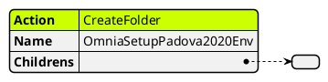
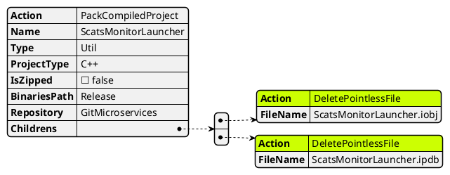
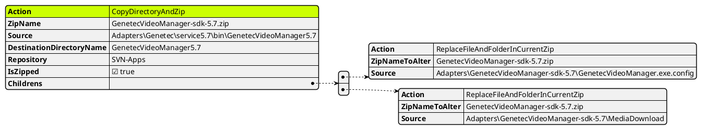
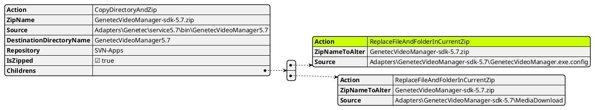

# Description of available actions

Available actions

### Createfolder
Utilizzato per creare l'alberatura dei folder. Tutto quello che avviene dentro l'array **Childrens** viene creato dentro il folder stesso

- CopyFileFromSource
- 
- CopyDirectoryFromSource
### DeletePointlessFile
Utilizzato per cancellare file inutili provenienti dalla compilazione

### CopyDirectoryAndZip
copia una directory inserita dentro source, gli da il nome ZipName, imposta la destinazione della directory.  

### ReplaceFileAndFolderInCurrentZip
Unzippa il file zip che prende da **ZipNameToAlter** e sostituisce/aggiunge il file indicato in **Source**
