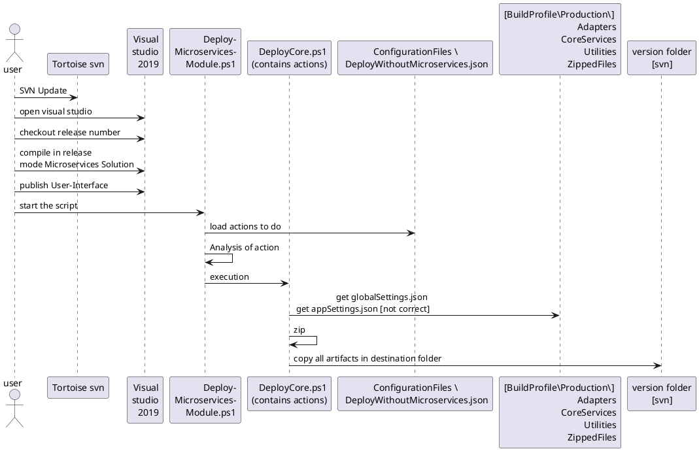
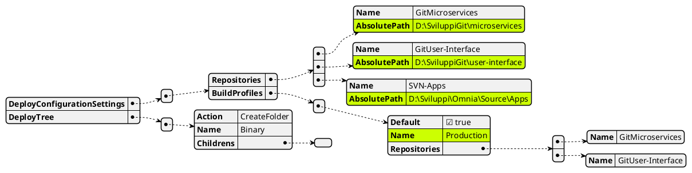
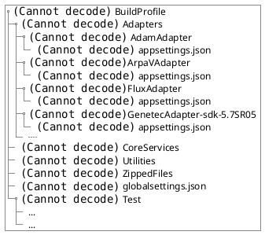

# HOW TO COMPILE UTILITIES PROJECTS IN MICROSERVICES

### List of Projects not included in TeamCity compilation:

#### Repository SVN
- OmniaServer [-/Omnia/Source/Apps/OmniaServer]
- OmniaWCM [-/Omnia/Source/Apps/OmniaWCMService]
- QMDAdapter [-\Omnia\source\Apps\Adapters\QMD\Service]
- GenetecVideoManager [-/Omnia/Source/Apps/Adapters/Genetec]

#### Repository GIT
- User-Interface
- Microservices
  

## Installed Prerequisite
- Developer Powershell (community edition/professional edition) 
you should change the ps1 to adept to wich type you are using
- Visual studio 2019 last version
- Tortoise SVN
- GIT

We are referencing to projects still not compiled in TeamCity
- All projects that are under folder Utilities

## Description
below we are representing the sequence diagram of compiling and delivery

## Schema

# Main json structure of ConfigurationFiles

- DeployConfigurationSettings
  - Repositories
    - name  -------------[Specifies the name of repository]
    - AbsolutePath ------[Specities the path on the filesystem where the root of repository start]
- BuildProfiles
  - Name ----------------[Name of folder where to search for appSettings.json and globalSettings.json]
  - Repositories
    - name --------------[Name of repositories of application where to search external files]
- DeployTree ------------[Node containing actions to do]

### Production Folder structure
