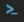
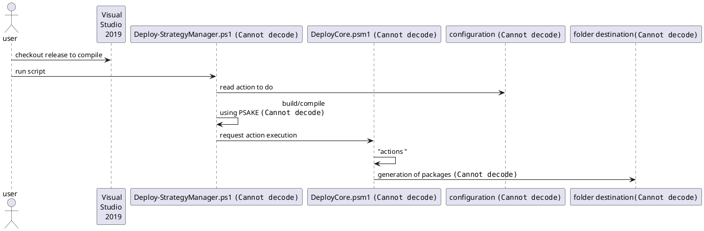

# Workflow deploy Strategy Manager 

```plantuml
@startuml

actor user
participant "Visual\rStudio\r2019" as vs
participant "Deploy-StrategyManager.ps1 <img:Images/ps1.png>" as sm1
participant "DeployCore.psm1 <img:Images/ps1.png>" as sm2
participant "configuration <img:Images/json.png>" as confJson
participant "folder destination<img:Images/folder2.png>" as folder

user->vs : checkout release to compile
user->sm1: run script
sm1->confJson : read action to do
sm1->sm1 : build/compile\rusing PSAKE <img:Images/psake.png>
sm1->sm2 : request action execution
sm2->sm2 : "actions "
sm2->folder: generation of packages <img:Images/files.png>


@enduml
```