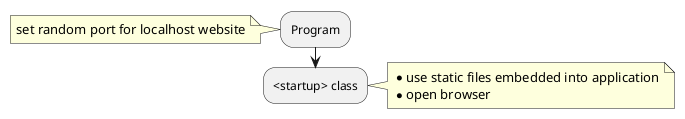

# Main information about MDExplorer

## Initialization Flow chart from author's point of view 

```plantuml
@startuml
:Program;
note left: set random port for localhost website
:<startup> class;
note right
* use static files embedded into application
* open browser 
end note

@enduml
```

<table> 
<tr>
<td>

</td>
<td>
olla testiamo
</td>
</tr>
</table>