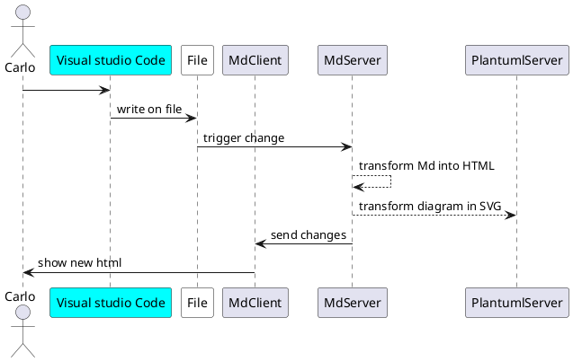

# Configurazione del server plantuml m↓Branch()
m↓Contributors()

l'ideale sarebbe quello di installare WSL 2
e poi eseguire le linee di codice
- sudo dockerd
- docker run -d -p 8080:8080 plantuml/plantuml-server:jetty

e poi lasciare i processi aperti, che ti diano il server per generare i file



```c#
#if DEBUG
            lifetime.ApplicationStarted.Register(
          () =>
          {
              var meraviglia = services.GetService<ICommandFactory>();
              var addressFeature = app.ServerFeatures.Get<IServerAddressesFeature>();
              var enumAddress = addressFeature.Addresses.GetEnumerator();
              enumAddress.MoveNext();
              meraviglia.ServerAddress = enumAddress.Current;
          });
#endif
```
