# OMNIA REST API
This document provides the latest class diagrams for the following objects:
+ Camera
+ Detection Unit
+ Detector
+ Lpr Unit
+ Measure
+ Status
+ Traffic Light Controller
+ Variable Message Sign
+ Vbid Unit
+ Sitation Pubblication
+ Network state

Provides also the following sequence diagrams:
+ Object list
+ Object Status
+ Measurement
+ Events
+ Network State

# Camera class diagram

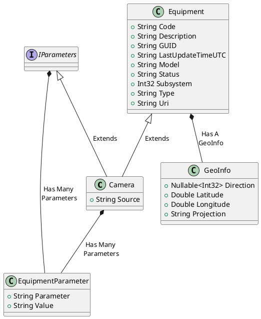

# Detection Unit class diagram

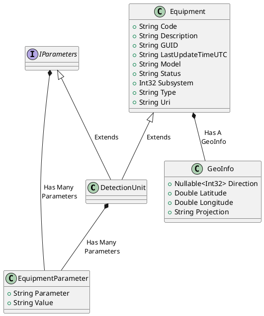

# Detector class diagram

# Lpr Unit class diagram
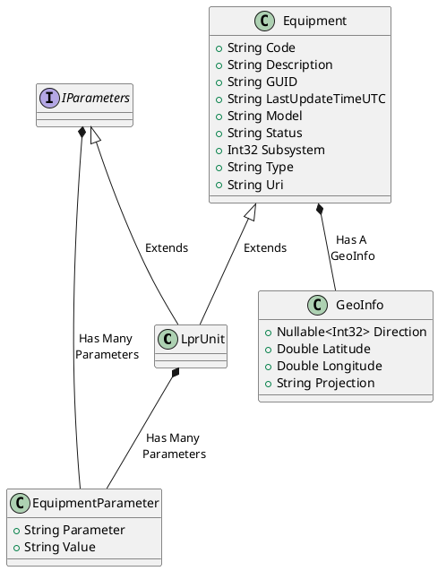

# Measure class diagram

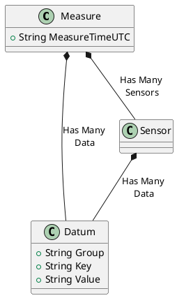

# Status class diagram

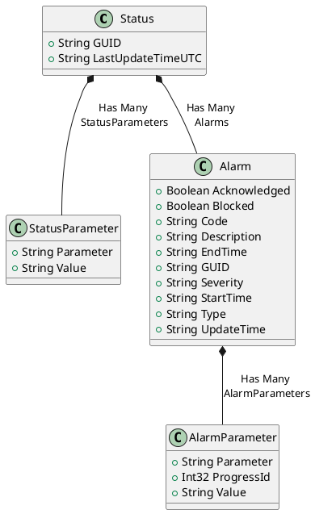

# Traffic Light Controller class diagram

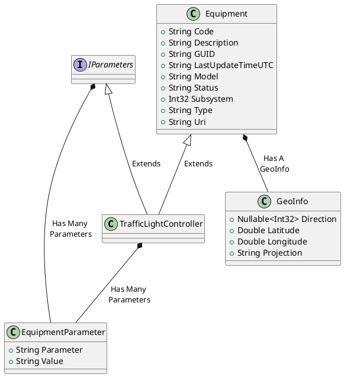

# Variable Message Sign class diagram

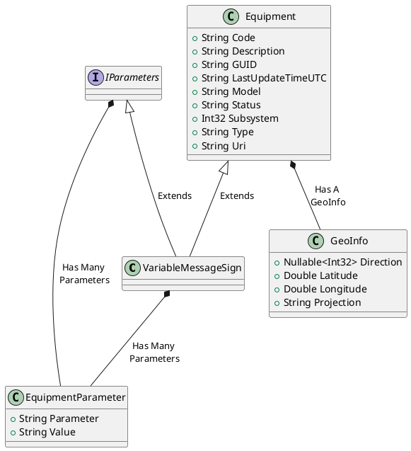

# Vbid Unit class diagram

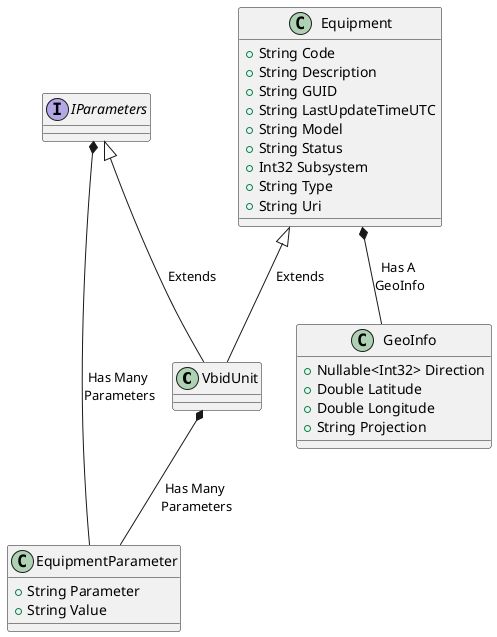

# Situation Pubblication class diagram
See [DATEX II version 2.3](http://d2docs.ndwcloud.nu/_static/umlmodel/v2.3/index.htm?goto=4:6:1:659) for further informations.

# Network State class diagram
-- TODO spostare legenda mappa Omnia su DB

Custom thresholds are defined into **misticui.xml** on the MISTIC conf's directory. This configuration will be moved to the MISTIC DB, in this way the configuration is available for both application (MISTIC and OMNIA). \
Nowadays the Omnia Map's legend displays only the default measure's type, it needs to support also the customizations.

**MISTIC**: The Supported Measures are managed on **NetState.class.php** on row **1047**.

**OMNIA**: Needs to be managed also into OMNIA, the Omnia Default Supported Measures are available on **GenericOmniaMap.js** on row **84** (*setNetworkNavigation*).

In the following list, I display the supported customizable measure's types:

+ speed
+ density
+ flow
+ flowLane
+ travelTime
+ admitEquiv
+ admitLocal
+ ctrInd
+ anomLvl
+ congLvl
+ srvcLvl
+ severity
+ mortality
+ injury
+ accidents_est

The following schema displays the structure on DB and as returned on Omnia Server Rest API:

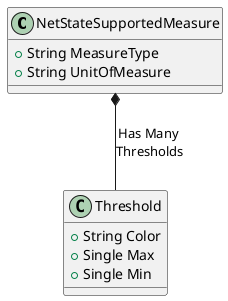

# Third-Party Authentication sequence diagram
The following sequence diagram shows how to get access to OMNIA REST API resources from a Third-Party application.
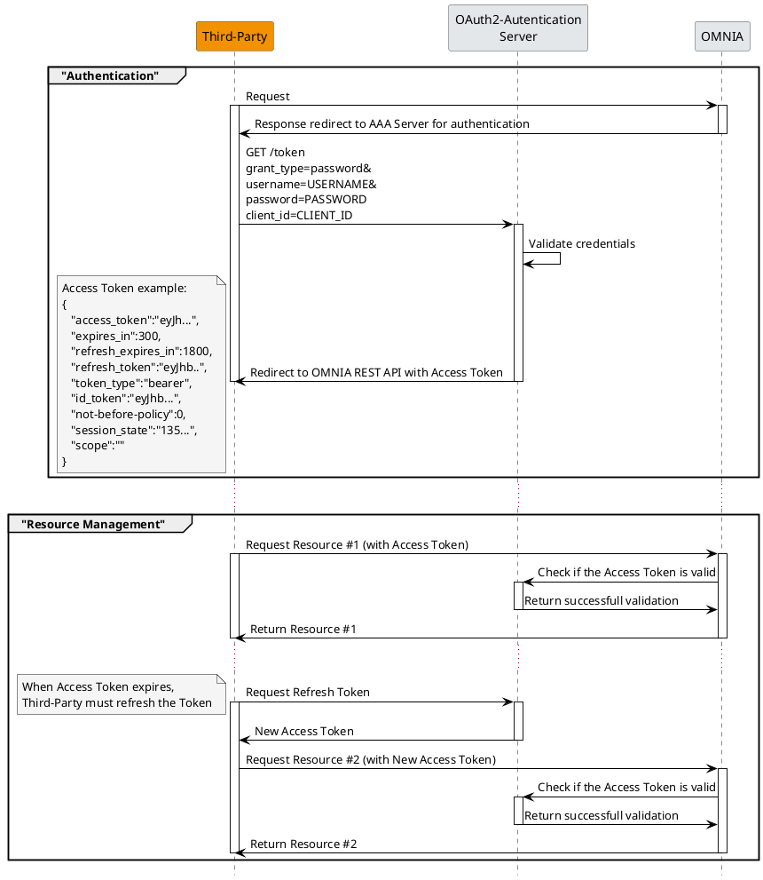

# Object list sequence diagram

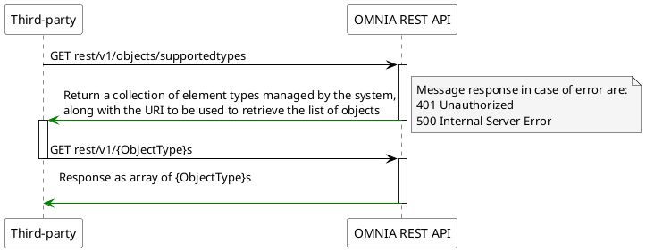
Example:
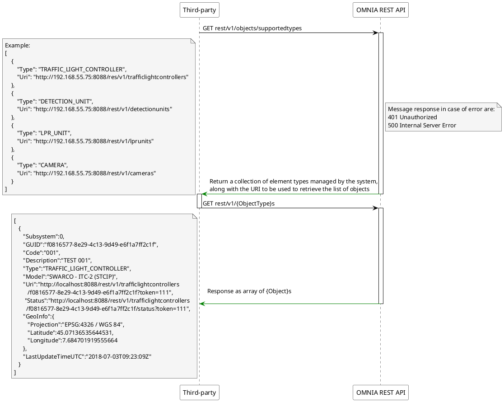

# Object status sequence diagram

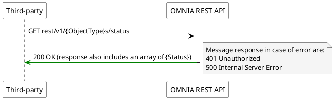

Example:
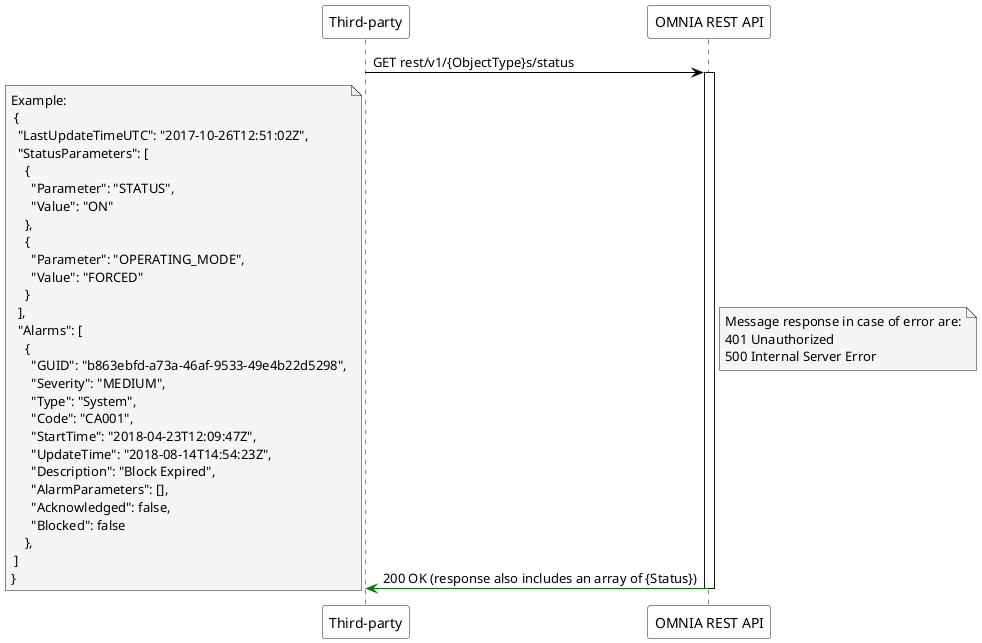

# Measurement sequence diagram

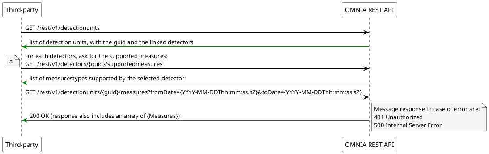

# Events sequence diagram

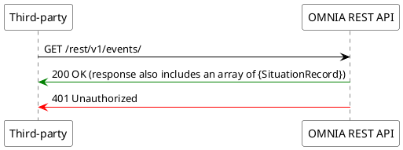

# Network state sequence diagram

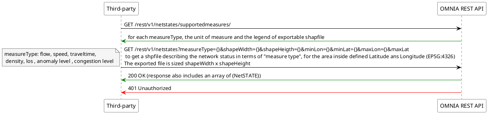