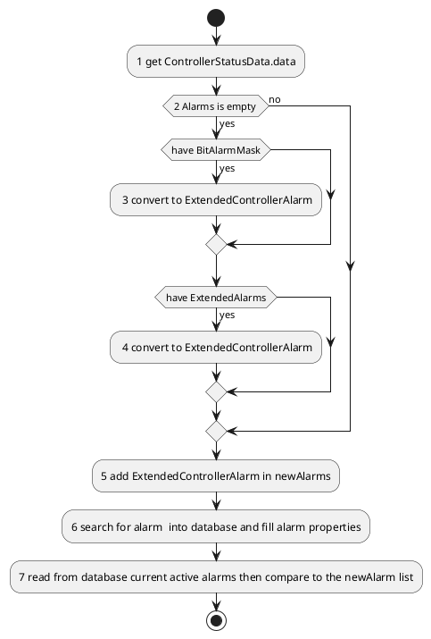

```plantuml
@startuml
start

:1 get ControllerStatusData.data; 

if (2 Alarms is empty ) then (no)
else (yes)
  if(have BitAlarmMask) then (yes)
    : 3 convert to ExtendedControllerAlarm;
  endif
  if(have ExtendedAlarms)then(yes)  
    : 4 convert to ExtendedControllerAlarm;
  endif
endif

:5 add ExtendedControllerAlarm in newAlarms;
:6 search for alarm  into database and fill alarm properties;
:7 read from database current active alarms then compare to the newAlarm list;
stop
@enduml
```