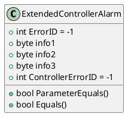

```plantuml
@startuml

class ExtendedControllerAlarm {
  +int ErrorID = -1
  +byte info1
  +byte info2
  +byte info3
  +int ControllerErrorID = -1
  +bool ParameterEquals()
  +bool Equals()
}
@enduml
```