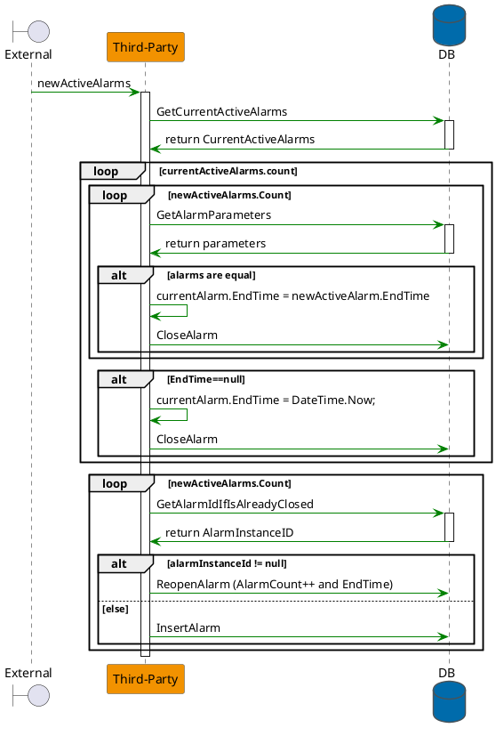

```plantuml
@startuml

skinparam ArrowColor green
skinparam LifeLineBorderColor black
skinparam LifeLineBackgroundColor black
skinparam BackgroundColor white
skinparam NoteBackgroundColor whitesmoke
skinparam ParticipantBackgroundColor #E3E7E9
skinparam ActorBackgroundColor #F29200
skinparam DatabaseBackgroundColor #006BAB
skinparam CollectionsBackgroundColor #E3E7E9
skinparam ActorBorderColor #485258
skinparam ParticipantBorderColor #485258
skinparam CollectionsBorderColor #485258
skinparam DatabaseBorderColor #485258


boundary "External" as Ext
participant "Third-Party" as LOM #F29200
database "DB" as OMNIA

Ext -> LOM: newActiveAlarms
activate LOM
LOM -> OMNIA: GetCurrentActiveAlarms
activate OMNIA
OMNIA -> LOM: return CurrentActiveAlarms
deactivate OMNIA
loop currentActiveAlarms.count

	      loop newActiveAlarms.Count
          LOM -> OMNIA: GetAlarmParameters
          activate OMNIA
          OMNIA -> LOM: return parameters
          deactivate OMNIA
          alt alarms are equal
	          LOM -> LOM: currentAlarm.EndTime = newActiveAlarm.EndTime
            LOM -> OMNIA:		CloseAlarm
          end
	      end

        alt EndTime==null 
        LOM -> LOM: currentAlarm.EndTime = DateTime.Now;
				LOM -> OMNIA:		CloseAlarm
        end
end
loop newActiveAlarms.Count  
    LOM->OMNIA: GetAlarmIdIfIsAlreadyClosed
    activate OMNIA
    OMNIA -> LOM: return AlarmInstanceID
    deactivate OMNIA
    alt alarmInstanceId != null
	    LOM -> OMNIA: ReopenAlarm (AlarmCount++ and EndTime)
    else else
        LOM -> OMNIA: InsertAlarm
    end
end    
deactivate LOM

@enduml
```