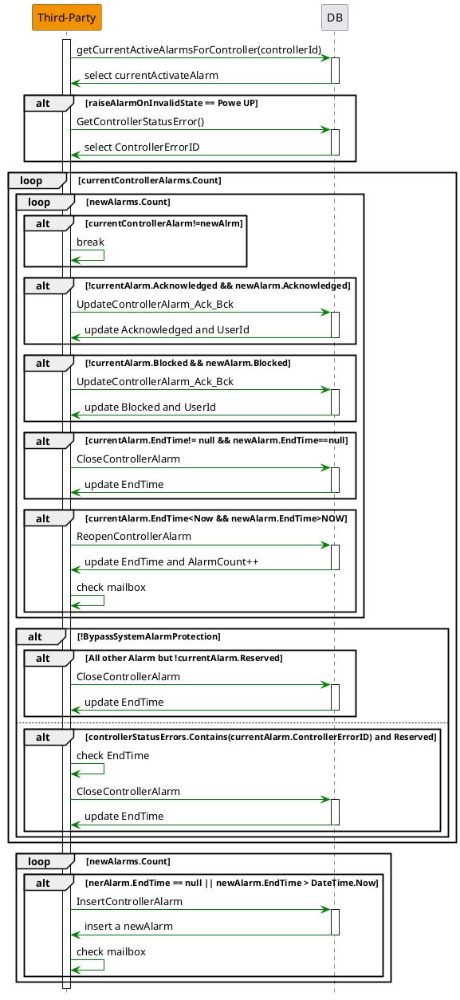

```plantuml
@startuml
hide footbox
skinparam ArrowColor green
skinparam LifeLineBorderColor black
skinparam LifeLineBackgroundColor black
skinparam BackgroundColor white
skinparam NoteBackgroundColor whitesmoke
skinparam ParticipantBackgroundColor #E3E7E9
skinparam ActorBackgroundColor #F29200
skinparam DatabaseBackgroundColor #006BAB
skinparam CollectionsBackgroundColor #E3E7E9
skinparam ActorBorderColor #485258
skinparam ParticipantBorderColor #485258
skinparam CollectionsBorderColor #485258
skinparam DatabaseBorderColor #485258


participant "Third-Party" as LOM #F29200
participant "DB" as OMNIA


  activate LOM
  LOM-> OMNIA : getCurrentActiveAlarmsForController(controllerId)
  activate OMNIA
  OMNIA->LOM: select currentActivateAlarm
  deactivate OMNIA
  alt raiseAlarmOnInvalidState == Powe UP
    LOM-> OMNIA : GetControllerStatusError()
    activate OMNIA
    OMNIA->LOM: select ControllerErrorID
    deactivate OMNIA
  end
  loop currentControllerAlarms.Count
    loop  newAlarms.Count
      alt currentControllerAlarm!=newAlrm
        LOM->LOM: break
      end
      alt !currentAlarm.Acknowledged && newAlarm.Acknowledged
        LOM->OMNIA: UpdateControllerAlarm_Ack_Bck
        activate OMNIA
        OMNIA->LOM: update Acknowledged and UserId
        deactivate OMNIA
      end
      alt !currentAlarm.Blocked && newAlarm.Blocked
        LOM->OMNIA: UpdateControllerAlarm_Ack_Bck
        activate OMNIA
        OMNIA->LOM: update Blocked and UserId
        deactivate OMNIA
      end
      alt currentAlarm.EndTime!= null && newAlarm.EndTime==null
        LOM->OMNIA: CloseControllerAlarm
        activate OMNIA
        OMNIA->LOM: update EndTime
        deactivate OMNIA
      end
      alt currentAlarm.EndTime<Now && newAlarm.EndTime>NOW
        LOM->OMNIA: ReopenControllerAlarm
        activate OMNIA
        OMNIA->LOM: update EndTime and AlarmCount++
        deactivate OMNIA
        LOM->LOM: check mailbox
      end
    end
       alt !BypassSystemAlarmProtection
        alt All other Alarm but !currentAlarm.Reserved
          LOM->OMNIA: CloseControllerAlarm
          activate OMNIA
          OMNIA->LOM: update EndTime
          deactivate OMNIA
        end
      else
        alt controllerStatusErrors.Contains(currentAlarm.ControllerErrorID) and Reserved
          LOM->LOM: check EndTime
          LOM->OMNIA: CloseControllerAlarm
          activate OMNIA
          OMNIA->LOM: update EndTime
          deactivate OMNIA
        end  
      end
  end
  loop newAlarms.Count
    alt nerAlarm.EndTime == null || newAlarm.EndTime > DateTime.Now
      LOM->OMNIA: InsertControllerAlarm
      activate OMNIA
      OMNIA->LOM: insert a newAlarm
      deactivate OMNIA
      LOM->LOM: check mailbox
    end
  end
  @enduml
```