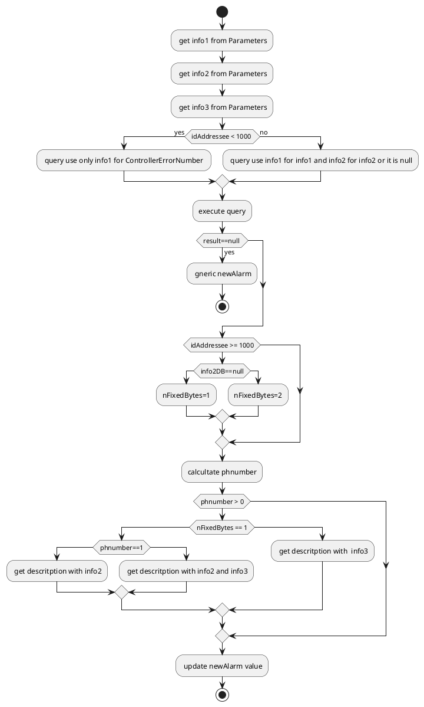

```plantuml
@startuml
start
: get info1 from Parameters;
: get info2 from Parameters;
: get info3 from Parameters;
if (idAddressee < 1000 ) then (yes)
  : query use only info1 for ControllerErrorNumber ;
else (no)
  : query use info1 for info1 and info2 for info2 or it is null;
endif
:execute query;
if (result==null ) then (yes)
  : gneric newAlarm;
  stop
  endif
if (idAddressee >= 1000)
   if (info2DB==null)
    :nFixedBytes=1;
  else
     :nFixedBytes=2;
  endif     
endif
:calcultate phnumber;
if(phnumber > 0)
  if (nFixedBytes == 1)
   if(phnumber==1)
     : get descritption with info2;
  else
    : get descritption with info2 and info3;
  endif
  else
    : get descritption with  info3;
  endif  
endif
: update newAlarm value;
stop
@enduml
```