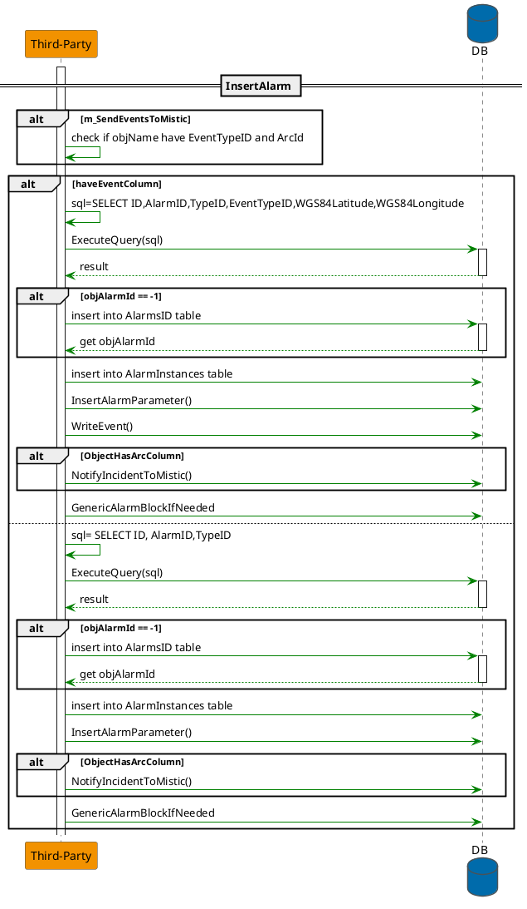

```plantuml
@startuml

skinparam ArrowColor green
skinparam LifeLineBorderColor black
skinparam LifeLineBackgroundColor black
skinparam BackgroundColor white
skinparam NoteBackgroundColor whitesmoke
skinparam ParticipantBackgroundColor #E3E7E9
skinparam ActorBackgroundColor #F29200
skinparam DatabaseBackgroundColor #006BAB
skinparam CollectionsBackgroundColor #E3E7E9
skinparam ActorBorderColor #485258
skinparam ParticipantBorderColor #485258
skinparam CollectionsBorderColor #485258
skinparam DatabaseBorderColor #485258


participant "Third-Party" as LOM #F29200
database "DB" as OMNIA

== InsertAlarm ==

  activate LOM
  alt m_SendEventsToMistic
    LOM->LOM: check if objName have EventTypeID and ArcId
  end
  alt haveEventColumn
    LOM->LOM: sql=SELECT ID,AlarmID,TypeID,EventTypeID,WGS84Latitude,WGS84Longitude

    LOM->OMNIA ++: ExecuteQuery(sql)
    return result

    alt objAlarmId == -1
      LOM->OMNIA ++: insert into AlarmsID table
      return get objAlarmId
    end

    LOM->OMNIA: insert into AlarmInstances table
    LOM->OMNIA: InsertAlarmParameter()
    LOM->OMNIA: WriteEvent()
    alt ObjectHasArcColumn
      LOM->OMNIA: NotifyIncidentToMistic()
    end
    LOM->OMNIA: GenericAlarmBlockIfNeeded
  else
    LOM->LOM:sql= SELECT ID, AlarmID,TypeID 

    LOM->OMNIA ++: ExecuteQuery(sql)
    return result 

    alt objAlarmId == -1
      LOM->OMNIA ++: insert into AlarmsID table
      return get objAlarmId
    end

    LOM->OMNIA: insert into AlarmInstances table
    LOM->OMNIA: InsertAlarmParameter()
    alt ObjectHasArcColumn
      LOM->OMNIA: NotifyIncidentToMistic()
    end
    LOM->OMNIA: GenericAlarmBlockIfNeeded
  end
  
@enduml
```