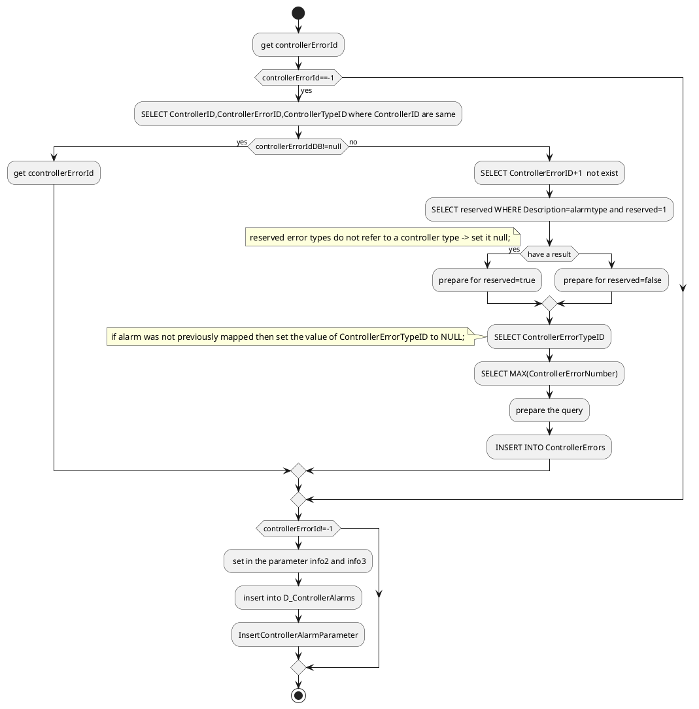

```plantuml
@startuml
start
: get controllerErrorId;
if(controllerErrorId==-1)then (yes)
  :SELECT ControllerID,ControllerErrorID,ControllerTypeID where ControllerID are same;
  if(controllerErrorIdDB!=null)then(yes)
    :get ccontrollerErrorId;
  else(no)
    :SELECT ControllerErrorID+1  not exist;
    :SELECT reserved WHERE Description=alarmtype and reserved=1;
    if(have a result) then (yes)
      note: reserved error types do not refer to a controller type -> set it null;
      :prepare for reserved=true;
    else
      : prepare for reserved=false;  
    endif
    :SELECT ControllerErrorTypeID;
        note: if alarm was not previously mapped then set the value of ControllerErrorTypeID to NULL;
    :SELECT MAX(ControllerErrorNumber);
    :prepare the query;
    : INSERT INTO ControllerErrors; 
  endif
endif
if(controllerErrorId!=-1)
: set in the parameter info2 and info3;
: insert into D_ControllerAlarms;
:InsertControllerAlarmParameter;
endif
stop
@enduml
```