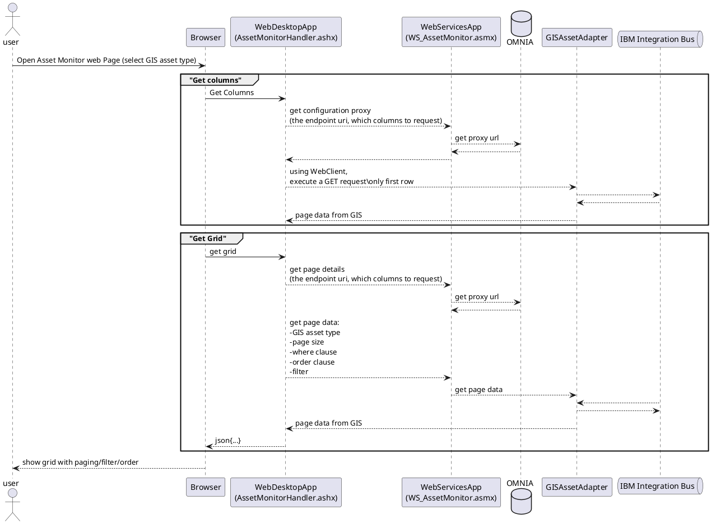

```plantuml
@startuml

actor user
participant Browser AS browser
participant "WebDesktopApp\n(AssetMonitorHandler.ashx)" as WDA
participant "WebServicesApp\n(WS_AssetMonitor.asmx)" as WSA
database OMNIA 
participant "GISAssetAdapter" as GisAssetAdatper
queue "IBM Integration Bus" as IBM

user->browser: Open Asset Monitor web Page (select GIS asset type)
group "Get columns"
    browser -> WDA: Get Columns
    WDA --> WSA: get configuration proxy\n(the endpoint uri, which columns to request)
    WSA --> OMNIA: get proxy url
    OMNIA --> WSA
    WSA --> WDA
    WDA --> GisAssetAdatper: using WebClient,\nexecute a GET request\only first row
    GisAssetAdatper --> IBM
    IBM --> GisAssetAdatper
    GisAssetAdatper --> WDA: page data from GIS
end
group "Get Grid"
    browser->WDA: get grid
    WDA --> WSA: get page details\n(the endpoint uri, which columns to request)
    WSA --> OMNIA: get proxy url
    OMNIA --> WSA
    WDA --> WSA: get page data:\n-GIS asset type\n-page size\n-where clause\n-order clause\n-filter
    WSA --> GisAssetAdatper: get page data
    IBM --> GisAssetAdatper
    GisAssetAdatper --> IBM
    GisAssetAdatper --> WDA: page data from GIS
    WDA-->browser: json{...}
end

browser--> user:show grid with paging/filter/order


@enduml
```