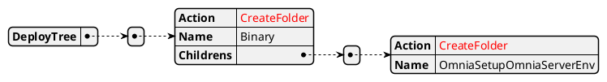
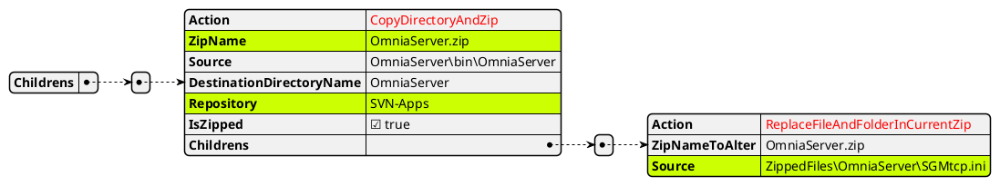

# Pacchettizzazione OmniaServer

Attività di creazione alberatura

```plantuml
@startjson
{
"DeployTree": [
        {
            "Action": "<color:red>CreateFolder",
            "Name": "Binary",
            "Childrens": [
                {
                    "Action": "<color:red>CreateFolder",
                    "Name": "OmniaSetupOmniaServerEnv"
                }
            ]
        }

]
}
@endjson
```

Attività di deployment

```plantuml
@startjson
#highlight "Childrens"/"0"/"ZipName"
#highlight "Childrens"/"0"/"Repository"
#highlight "Childrens"/"0"/"Childrens"/"0"/"Source"
{
    "Childrens": [
        {
            "Action": "<color:red>CopyDirectoryAndZip",
            "ZipName": "OmniaServer.zip",
            "Source": "OmniaServer\\bin\\OmniaServer",
            "DestinationDirectoryName":"OmniaServer",
            "Repository": "SVN-Apps",
            "IsZipped": true,
            "Childrens": [
                {
                    "Action": "<color:red>ReplaceFileAndFolderInCurrentZip",
                    "ZipNameToAlter": "OmniaServer.zip",
                    "Source": "ZippedFiles\\OmniaServer\\SGMtcp.ini"
                }
            ]
        }
    ]
}
@endjson
```
