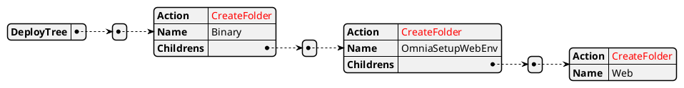
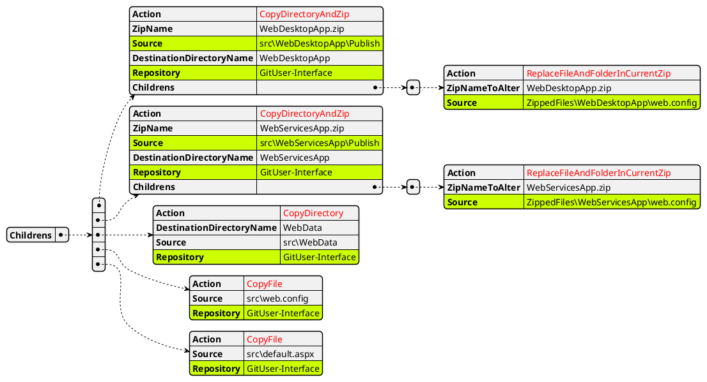

# Pacchettizzazione OmniaWeb

Attenzione è molto imoportante che la compilazione e la publish sia di
- WebDesktopApp
- WebServicesApp
  si trovi rispettivamente in 
- sia dentro il folder src\WebDesktopApp\Publish
- sia dentro il folder src\WebServicesApp\Publish

### Creazione dei folder

### Action per pacchettizare OmniaWeb
