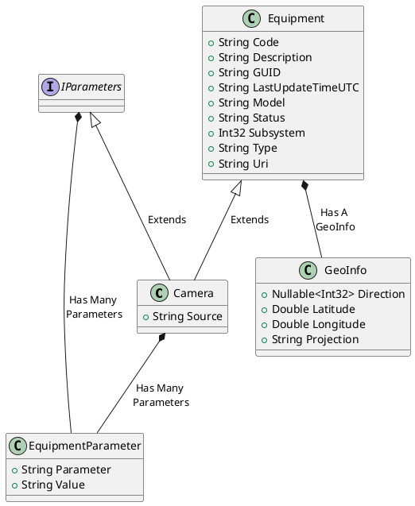
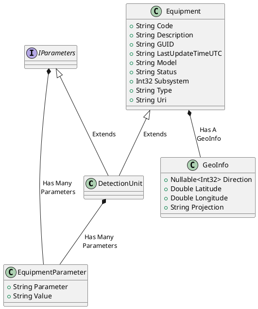

# OMNIA REST API
This document provides the latest class diagrams for the following objects:
+ Camera
+ Detection Unit
+ Detector
+ Lpr Unit
+ Measure
+ Status
+ Traffic Light Controller
+ Variable Message Sign
+ Vbid Unit
+ Sitation Pubblication
+ Network state

Provides also the following sequence diagrams:
+ Object list
+ Object Status
+ Measurement
+ Events
+ Network State

# Camera class diagram

# Detection Unit class diagram

