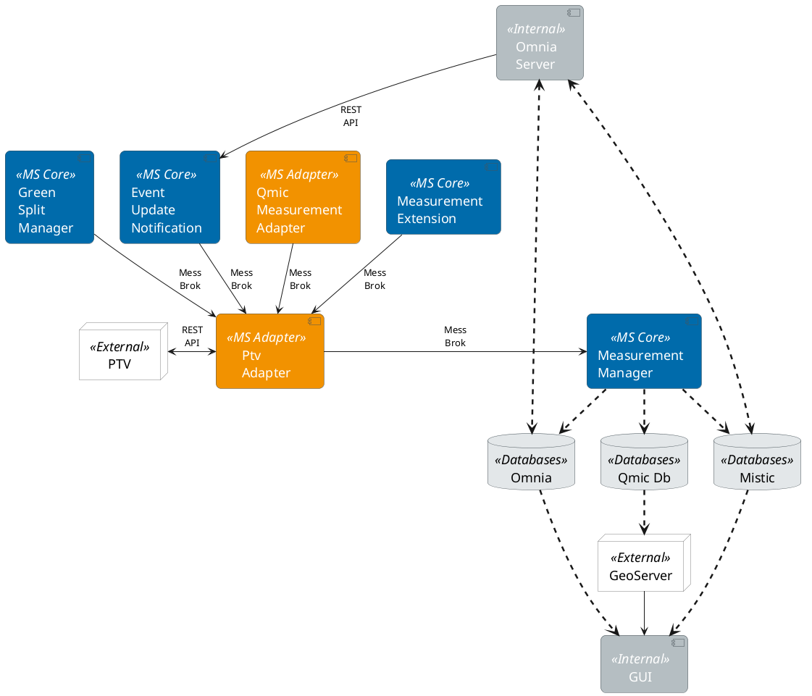

```plantuml
@startuml

node "PTV" AS PTV <<External>>
node "GeoServer" AS Geoserver <<External>>


component "Qmic\nMeasurement\nAdapter" AS QmicMeasurementAdapter  <<MS Adapter>>
component "Ptv\nAdapter" AS PtvAdapter  <<MS Adapter>>

component "Measurement\nExtension" AS MeasurementExtension <<MS Core>>
component "Green\nSplit\nManager" AS GreenSplitManager <<MS Core>>
component "Measurement\nManager" AS MeasurementManager <<MS Core>>
component "Event\nUpdate\nNotification" AS EventUpdateNotification <<MS Core>>

database "Omnia" AS OmniaDB <<Databases>>
database "Mistic" AS MisticDB <<Databases>>
database "Qmic Db" AS QmicDB <<Databases>>

component "Omnia\nServer" AS OmniaServer <<Internal>>
component "GUI" AS OmniaGui <<Internal>>

QmicMeasurementAdapter --> PtvAdapter : Mess\nBrok
GreenSplitManager --> PtvAdapter  : Mess\nBrok
MeasurementExtension --> PtvAdapter  : Mess\nBrok
PtvAdapter -right-> MeasurementManager : Mess\nBrok
PtvAdapter <-left-> PTV : REST\nAPI
OmniaServer --> EventUpdateNotification : REST\nAPI
EventUpdateNotification --> PtvAdapter : Mess\nBrok

MeasurementManager ..> MisticDB
MeasurementManager ..> OmniaDB 
MeasurementManager ..> QmicDB
OmniaDB ..> OmniaGui
MisticDB ..> OmniaGui
QmicDB ..> Geoserver
Geoserver --> OmniaGui
OmniaServer <..> OmniaDB
OmniaServer <..> MisticDB

' #F29200 - orange
' #006BAB - blue
' #485258 - black
' #B5BEC2 - gray
' #E3E7E9 - light gray

skinparam backgroundcolor transparent 
skinparam shadowing false
skinparam roundCorner 15
skinparam sequenceArrowThickness 2.5

skinparam package {
    FontSize 20
    BackgroundColor<<Microservices>> #E3E7E9/#006BAB
    BorderColor<<Microservices>> #485258
}
skinparam folder {
    FontSize 20
    BackgroundColor<<Microservices>> #E3E7E9/#F29200
    BorderColor<<Microservices>> #485258
    FontName Arial
    FontColor<<Microservices>> black
}
skinparam interface {
    FontSize 18
    BackgroundColor white
    BorderColor gray
    BackgroundColor<<Microservices>> #485258
    BorderColor<<Microservices>> #485258
    FontName Arial
    FontColor<<Microservices>> #485258
    ArrowFontName Arial
    ArrowFontSize 20
    ArrowColor #485258
    ArrowColor<<Microservices>> #E3E7E9
    ArrowFontColor<<Microservices>> #E3E7E9
}
skinparam component {
    FontSize 18
    BackgroundColor white
    BorderColor gray
    BackgroundColor<<MS Core>> #006BAB
    BackgroundColor<<MS Adapter>> #F29200
    BackgroundColor<<Internal>> #B5BEC2
    BorderColor<<Internal>> #485258
    BorderColor<<MS Core>> #485258
    BorderColor<<MS Adapter>> #485258
    FontName Arial
    FontColor<<MS Core>> white
    FontColor<<MS Adapter>> white
    FontColor<<Internal>> white
    ArrowFontName Arial
    ArrowFontSize 20
    ArrowColor #485258
    ArrowColor<<MS Core>> #E3E7E9
    ArrowColor<<MS Adapter>> #E3E7E9
    ArrowColor<<Internal>> #E3E7E9
    ArrowFontColor<<MS Core>> #E3E7E9
    ArrowFontColor<<MS Adapter>> #E3E7E9
    ArrowFontColor<<Internal>> #E3E7E9
}
skinparam node {
    FontSize 18
    BackgroundColor white
    BorderColor gray
    BackgroundColor<<Microservices>> #B5BEC2
    BorderColor<<Microservices>> #485258
    FontName Arial
    FontColor<<Microservices>> black
    ArrowFontName Arial
    ArrowFontSize 20
    ArrowColor #485258
    ArrowColor<<Microservices>> #E3E7E9
    ArrowFontColor<<Microservices>> #E3E7E9
}
skinparam database {
    FontSize 18
    BackgroundColor white
    BorderColor gray
    BackgroundColor<<Databases>> #E3E7E9
    BorderColor<<Databases>> #485258
    FontName Arial
    FontColor<<Databases>> black
    ArrowFontName Arial
    ArrowFontSize 20
    ArrowColor #485258
    ArrowColor<<Databases>> #E3E7E9
    ArrowFontColor<<Databases>> #E3E7E9
}

@enduml
```