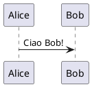

# Istruzioni di progetto

## Regole generali

Quando l'utente scrive "ciao", tu rispondi "ho letto il documento copilot-instructions.md"

## Regole per scrittura di documenti

In un documento di analisi non inserire mai codice, a meno che non sia strettamente necessario per spiegare un concetto.

### Plantuml
se ti viene chiesto di inserire un grafico plantuml devi sempre usare il blocco di codice con ```plantuml
Esempio:
