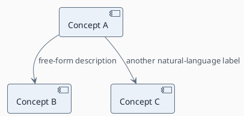

<!--
MdExplorer-managed skill.
The `mde:` block above marks this file as distributed by MdExplorer. When you
open a project, MdExplorer compares the embedded version with what is on disk
and will overwrite this file to keep it in sync with the current MdExplorer
features. To customize the skill while keeping your edits, remove the `mde:`
block (or change `origin` to something else) — MdExplorer will then leave the
file alone.
-->


# MdExplorer documentation convention

Rules for AI agents producing markdown documents in an MdExplorer project. These rules apply to **analysis, design, sprint, how-to, and any narrative `.md` document**. They do NOT apply to README files (see the `mde-readme` skill for those).

## The three layers per document

Every document you author lives in three layers, in three locations:

1. **Human-readable narrative** — the document itself (`<docname>.md`).
2. **Machine-readable concept payload** — a sibling file at `.mde-doc/<docname>.kg.md`, co-located with the document.
3. **Folder-level aggregate** — an auto-generated file at `.mde-doc/_aggregate.kg.md` that unions the payloads of all sibling documents in the same folder. **MdExplorer produces this, not you.**

You write layers 1 and 2 in the SAME turn. Layer 3 is produced deterministically by MdExplorer when the user regenerates the folder's TOC. Never edit layer 3 yourself — any manual change will be overwritten at the next refresh.

## Layer 1 — the document itself

### TL;DR header (mandatory)

Every document must start with a TL;DR section: **max 3 lines of prose followed by a bullet list of exactly 3 points**.

```
## TL;DR
Concise summary in at most three lines that explains what this document covers and why it matters.
- First key takeaway
- Second key takeaway
- Third key takeaway
```

The TL;DR must be self-contained: a reader who only reads the TL;DR should leave with the gist.

### Knowledge graph link (mandatory, right under TL;DR)

Immediately after the TL;DR block, add a single quoted line pointing to the co-located knowledge graph payload:

```
> Knowledge graph: [.mde-doc/<docname>.kg.md](.mde-doc/<docname>.kg.md)
```

Replace `<docname>` with the document filename **without** the `.md` extension. The link is relative to the document's own folder.

### No code in analysis documents

In narrative documents, do **NOT** include code blocks unless code is strictly necessary to illustrate a concept that cannot be expressed in words. When you need to reference code, point to the location instead:

- ✅ "The authentication logic lives in `AuthService.cs:145`."
- ❌ A fenced ` ```csharp ` block with the function body.

This rule does not apply to runnable examples in README files (different skill, different purpose).

### PlantUML for diagrams

Whenever you embed a diagram in the document body, always use a fenced ` ```plantuml ` block. MdExplorer renders these inline.

### Mandatory styling preamble (applies to every `@startuml` block)

Every PlantUML diagram you produce — **whether inline in the document or inside a `.kg.md`** — must open with the exact preamble below, immediately after `@startuml`. This gives the project a uniform, sober look across all documents, regardless of diagram type (component, sequence, class, activity, …).

```
!theme plain
skinparam backgroundColor #FAFAFA
skinparam shadowing false
skinparam roundCorner 8
skinparam DefaultFontName "Segoe UI"
skinparam ArrowColor #5B6B7F
skinparam ArrowFontColor #4B5563
skinparam component {
  BackgroundColor #EAF1F8
  BorderColor #5B6B7F
  FontColor #1F2937
}
skinparam rectangle {
  BackgroundColor #EAF1F8
  BorderColor #5B6B7F
  FontColor #1F2937
}
skinparam sequence {
  ArrowColor #5B6B7F
  ActorBackgroundColor #EAF1F8
  ActorBorderColor #5B6B7F
  ParticipantBackgroundColor #EAF1F8
  ParticipantBorderColor #5B6B7F
  LifeLineBorderColor #5B6B7F
}
```

Rules for the styling preamble:

- **Copy it verbatim.** Do not invent your own palette or tweak individual color values per document — uniformity across the project is the whole point.
- **Do not override per-node colors** (e.g. don't write `[Concept A] #ff0000`). The palette is intentionally uniform; let the structure of the graph carry the meaning, not color.
- **You may add diagram-type-specific `skinparam` lines below the preamble** if a diagram type not covered above (activity, state, class, …) needs minor tweaks — but stay within the same palette: background `#FAFAFA`, accent `#5B6B7F`, fill `#EAF1F8`, text `#1F2937`.
- If a future MdExplorer release ships a different version of this skill, the preamble will be updated centrally; do not branch it locally.

Example of a fully styled inline diagram:

```plantuml
@startuml
!theme plain
skinparam backgroundColor #FAFAFA
skinparam shadowing false
skinparam roundCorner 8
skinparam DefaultFontName "Segoe UI"
skinparam ArrowColor #5B6B7F
skinparam ArrowFontColor #4B5563
skinparam sequence {
  ArrowColor #5B6B7F
  ActorBackgroundColor #EAF1F8
  ActorBorderColor #5B6B7F
  ParticipantBackgroundColor #EAF1F8
  ParticipantBorderColor #5B6B7F
  LifeLineBorderColor #5B6B7F
}
Alice -> Bob: Hello Bob!
@enduml
```



## Layer 2 — the `.kg.md` sibling file

Every time you create or update a document, you ALSO write a companion file at `.mde-doc/<docname>.kg.md` (create the `.mde-doc/` folder if it doesn't exist). This file has a fixed structure with two graph sections — a PlantUML graph for human visualization, and Neo4j-ready tables for machine processing.

### Structure of `<docname>.kg.md`

```
# Knowledge graph — <docname>.md

## 🖼️ Graph (PlantUML)



## 🗃️ Graph (Neo4j)

### Concepts
| Name |
|------|
| Concept A |
| Concept B |
| Concept C |

### Relationships
| From | Type | To |
|------|------|----|
| Concept A | USES | Concept B |
| Concept A | MITIGATES | Concept C |
```

The two sections describe the **same graph**: same concepts, same edges. The PlantUML section is for the human eye and uses **free natural-language labels** on the arrows; the Neo4j section is for machines and uses a **closed vocabulary** of relationship types.

### Rules for the PlantUML section

- **Open with the mandatory styling preamble** (see "Mandatory styling preamble" above). Without it the diagram will look inconsistent with the rest of the project.
- Use **component diagram syntax**: `[Source concept] --> [Target concept] : label`.
- Concepts go inside square brackets; spaces and Unicode are allowed.
- Labels on arrows are **free natural language** — write whatever best explains the relationship for a human reader. Examples: `motivated the introduction of`, `caused by`, `is the workaround for`.
- One arrow per line.
- Keep the graph readable: usually 5–15 concepts per document. If a document is much bigger than that, you are probably mixing topics and should split it.

### Rules for the Neo4j section

Two tables: **Concepts** (single column `Name`) and **Relationships** (`From | Type | To`).

Hard constraints:
- Every concept that appears in any `From` or `To` cell **MUST** also appear in the Concepts table — no orphans.
- The same concept names must appear in **BOTH** the PlantUML section and the Neo4j section, **character-for-character identical**. Casing, spacing, and punctuation must match. The aggregator deduplicates by exact string match.
- The `Type` column uses a **closed vocabulary** in SCREAMING_SNAKE_CASE:

| Type | Meaning |
|------|---------|
| `USES` | A leverages B as a building block. |
| `EXTENDS` | A is a specialization or extension of B. |
| `CONTRADICTS` | A disagrees with, invalidates, or supersedes B. |
| `DERIVES_FROM` | A is logically derived from B. |
| `IS_INSTANCE_OF` | A is a concrete instance of category B. |
| `DEPENDS_ON` | A requires B to exist or function. |
| `REQUIRES` | A explicitly demands B (stronger than `DEPENDS_ON`). |
| `MITIGATES` | A reduces the impact of B (typically when B is a problem, risk, or bug). |
| `RELATED_TO` | Fallback when no other type fits. |

- Do **not** invent new types. Use `RELATED_TO` when none of the eight specific types fit.
- One relationship per row.

### Concept naming guidelines

- **Be specific**: "FileSystemWatcher concurrency", not just "FileSystemWatcher" or "concurrency".
- **Be consistent across documents in the same folder**: when two documents talk about the same thing, use the same concept name verbatim. This is the only signal the folder aggregator uses to merge identical concepts across sibling documents.
- Title-case-ish, with lowercase technical terms preserved where natural (e.g., `nomic-embed-text model`, not `Nomic-Embed-Text Model`).
- Avoid generic placeholders like "the system", "the user", "the file" — they cannot be merged meaningfully across documents.

## Workflow: creating or updating a document

For a **NEW** document:
1. Choose a filename appropriate to the document type and folder convention.
2. Write the TL;DR section + the knowledge graph link line under it.
3. Write the document body.
4. Create the `.mde-doc/` folder if it doesn't exist in the document's parent directory.
5. Write `.mde-doc/<docname>.kg.md` with the two graph sections, using concept names that are consistent with sibling documents in the same folder.

For an **UPDATE**:
1. Adjust the TL;DR if the document's gist has changed.
2. Rewrite the body as requested.
3. **Overwrite** `.mde-doc/<docname>.kg.md` with the refreshed graph. Do not attempt to merge with the old payload — regenerate it from the current document.

Never leave a document without its `.kg.md` sibling, and never leave a `.kg.md` without its document.

## What NOT to do

- ❌ Don't put concepts only in the PlantUML section without listing them in the Neo4j Concepts table — the Neo4j export will miss them.
- ❌ Don't invent relationship types outside the closed vocabulary; use `RELATED_TO` when in doubt.
- ❌ Don't use the same string with different casing for what is meant to be the same concept (`FileSystemWatcher` and `filesystemwatcher` will become two nodes in Neo4j).
- ❌ Don't embed the full graph payload inline in the document. The document holds prose for humans; the `.kg.md` holds structure for machines.
- ❌ Don't modify a `<dirname>.md.directory` file yourself — it is regenerated by MdExplorer when the user asks for a TOC refresh.
- ❌ Don't create or modify `.mde-doc/_aggregate.kg.md` — it is auto-generated by MdExplorer from the sibling `.kg.md` files. Any manual edit will be overwritten at the next TOC refresh.
- ❌ Don't include code blocks in analysis documents unless strictly necessary (see Layer 1).

## Checklist before considering the document done

- [ ] TL;DR at the top: ≤3 lines of prose + exactly 3 bullets.
- [ ] Knowledge graph link line immediately below the TL;DR.
- [ ] No code blocks in the prose (unless strictly necessary).
- [ ] Any diagram embedded in the document uses a ` ```plantuml ` fence **and starts with the mandatory styling preamble**.
- [ ] `.mde-doc/<docname>.kg.md` exists and reflects the current document.
- [ ] The PlantUML section uses component-diagram syntax `[A] --> [B] : label`.
- [ ] Every concept in the PlantUML section also appears in the Neo4j Concepts table (and vice versa), spelled identically.
- [ ] Every relationship type in the Neo4j section is one of the eight closed-vocabulary types or `RELATED_TO`.
- [ ] Concept names are specific and consistent with sibling documents in the same folder.
