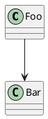

<!--
MdExplorer-managed skill.
The `mde:` block above marks this file as distributed by MdExplorer. When you
open a project, MdExplorer compares the embedded version with what is on disk
and will overwrite this file to keep it in sync with the current MdExplorer
features. To customize the skill while keeping your edits, remove the `mde:`
block (or change `origin` to something else) — MdExplorer will then leave the
file alone.
-->

# MdExplorer markdown extensions

This skill documents the **markdown rendering features unique to MdExplorer**. When you write markdown inside an MDE project, you can leverage these features to produce richer documents than plain CommonMark allows. A standard Markdig renderer ignores them; MDE turns them into interactive UI.

Use this reference whenever you author or edit `.md` files in an MDE project and want to:

- Embed the contents of another file (source code, data, config) inline
- Show HTML with a live preview side-by-side with its source
- Make shell scripts runnable from the document with a click
- Draw architecture, sequence, or class diagrams

## Quick reference

| Syntax | Effect | When to use |
|---|---|---|
| `\`\`\`text(path)` | Loads a text file from disk, shows it with syntax highlighting + copy-path + fullscreen buttons | Documenting code, configs, data files where the content lives in a separate file. Avoids copy-drift. |
| `\`\`\`html(path)` | Loads an HTML file, shows it in a tabbed UI: live Preview iframe + Source tab | Mockups, demo pages, design specs where seeing the rendered HTML helps comprehension |
| `\`\`\`html` (inline content, no path) | Same tabbed UI but for HTML written inline in the markdown | One-off small HTML snippets, e.g. a fragment of UI in a design note |
| `\`\`\`bash` / `sh` / `shell` / `pwsh` / `powershell` / `ps1` / `cmd` / `bat` / `batch` | Adds a ▶ Run button — the script can be executed from the document, output streamed below | Documenting setup/troubleshooting steps where executing is faster than copy-pasting elsewhere |
| `\`\`\`plantuml` | Renders the PlantUML source as an interactive SVG (click nodes to highlight relations) | Architecture diagrams, class diagrams, sequence diagrams, ER, mind maps |
| `\`\`\`plantuml(@json, path)` / `(@yaml, path)` | Renders an external .json/.yaml file AS a PlantUML tree diagram — the data stays in its own file | Config, payloads, ontology fixtures: the document shows the diagram, the file stays the single source of truth |

The rest of this skill goes feature by feature with details, examples, and caveats.

---

## 1. `text(path)` — embed a file as syntax-highlighted source

### Syntax

````
```text(./relative/path/to/file.ext)
```
````

The **parentheses with the path are mandatory**. A plain `\`\`\`text` block without parens is treated by Markdig as a regular plain-text code block — there is no collision with this feature.

### Path resolution

- `./foo.txt` or `./sub/foo.txt` — relative to the `.md` file being rendered
- `../foo.txt` — parent directory
- `/foo.txt` — absolute from the **project root** (NOT filesystem root)
- `foo.txt` — same as `./foo.txt`

Paths that escape the project root are rejected (security). Files larger than 500 KB are rejected (performance).

### Rendering

A bordered panel with:
- A header showing the file name + buttons (📋 copy full path to clipboard, ⛶ enter fullscreen)
- The file content, rendered with Prism syntax highlighting

Language is **deduced from the file extension**. Built-in mapping includes:

| Extension | Language | Extension | Language |
|---|---|---|---|
| `.ttl`, `.nt`, `.n3`, `.nq` | turtle | `.cs` | csharp |
| `.json`, `.jsonld` | json | `.ts` | typescript |
| `.yaml`, `.yml` | yaml | `.js` | javascript |
| `.xml`, `.xsd`, `.xslt` | markup | `.java` | java |
| `.rdf`, `.owl` | markup | `.py` | python |
| `.sql` | sql | `.sh`, `.bash` | bash |
| `.cypher` | cypher | `.ps1` | powershell |
| `.sparql` | sparql | `.css`, `.scss` | css/scss |
| `.md` | markdown | `.cob`, `.cbl`, `.cpy` | cobol |

Unknown extensions render without highlighting (plain `<pre><code>`) — content is still shown.

### When to use

- Documenting code where the file already exists separately — `\`\`\`text(./Service.cs)` keeps the doc in sync with the file automatically
- Showing configuration files (`.json`, `.yaml`) referenced by surrounding prose
- Including data samples (`.ttl`, `.csv`) without copy-pasting them into the markdown
- Any case where the content lives in its own file and copy-paste would cause drift

### When NOT to use

- For inline snippets that don't have their own file — use a normal fenced code block
- For very large files — split the documentation into multiple files or include only a key excerpt as inline code

### Example

```markdown
Carlo conosce Anna. La rappresentazione in Turtle del nostro mini-grafo è
questa, dalla cartella `examples/`:

\`\`\`text(./examples/persone.ttl)
\`\`\`

Validalo con `riot --validate examples/persone.ttl`.
```

---

## 2. `html(path)` and `html` inline — HTML preview with source

### Syntax

````
```html(./relative/path/to/file.html)
```
````

Or, with inline content:

````
```html
<div>any HTML markup here</div>
```
````

For `html(path)`, the parentheses are optional but recommended when you want to reference a separate file. Without parens, the content between the fences is treated as inline HTML.

### Rendering

A tabbed panel with:
- **Preview** tab — sandboxed iframe (`sandbox="allow-scripts allow-same-origin"`) rendering the HTML
- **Source** tab — the HTML source highlighted as markup
- Toolbar with: Copy Path (when external file), Zip & Copy (when external file), Reload (re-render iframe), Fullscreen

### When to use

- Showing UI mockups where seeing the rendered HTML adds value
- Demoing static pages or design fragments
- Documents about HTML/CSS examples themselves

### When NOT to use

- For pure documentation in plain markdown — don't reach for HTML if Markdown can express it
- For complex apps with external dependencies — the iframe is sandboxed and won't have network access to the host project

### Example

```markdown
La struttura della pagina di login finale è questa:

\`\`\`html(./mockups/login.html)
\`\`\`

Click su "Preview" per vederla renderizzata, su "Source" per leggere il markup.
```

---

## 3. Runnable code blocks — `bash` / `sh` / `pwsh` / `cmd`

### Syntax

````
```bash
echo "hello"
ls -la
```
````

Same for `sh`, `shell`, `pwsh`, `powershell`, `ps1`, `cmd`, `bat`, `batch`. They map to two shells:
- `bash`, `sh`, `shell` → bash (Git Bash on Windows)
- `powershell`, `pwsh`, `ps1` → PowerShell
- `cmd`, `bat`, `batch` → cmd.exe

No `()` syntax — the language identifier is enough.

### Rendering

A normal code block + a **▶ Run** button. When clicked:
- The script is executed in the project root directory
- Output (stdout + stderr) streams into a panel below the code, with ANSI color support
- A red **■ Stop** button can interrupt the process

### Trust model

Execution is **per-project trust**. The first time the user clicks Run in a project, MDE asks for confirmation. The trust flag is stored in the user DB (`Project.ExecutionTrusted`). AI agents writing scripts in markdown should be aware: the user will be prompted before the first execution.

### When to use

- Setup instructions where running is faster than copy-pasting
- Smoke tests / validators (`dotnet test`, `riot --validate file.ttl`)
- "Run this to see the effect" examples in tutorials
- Idempotent operations the reader can re-run safely

### When NOT to use

- Destructive operations without obvious safeguards (`rm -rf`, `DROP TABLE`, force pushes)
- Long-running processes (>1 minute) without a clear stop condition
- Anything that depends on absolute paths or machine-specific state

### Example

```markdown
Per validare il file Turtle prodotto:

\`\`\`bash
cd formazione
riot --validate hello.ttl
\`\`\`

Se è ok, il comando esce in silenzio.
```

---

## 4. `plantuml` — interactive SVG diagrams

### Syntax

````

````

### Rendering

The PlantUML source is rendered to SVG. The SVG is **interactive**:
- Click a class/entity to highlight all its connections
- Hover to see tooltips with qualified names
- Works for class diagrams, sequence diagrams, mind maps, YAML diagrams

### Caveats / conservative syntax

- **No backticks inside a `plantuml` block** — the block ends at the first backtick and the diagram silently disappears
- **Avoid escaped quotes** inside labels (`"\"...\""`) — PlantUML does not unescape them: the backslashes are drawn literally
- **`#fill;line:color` works on `class`, `entity` and `rectangle`, but NOT on a sequence `participant`**: there it fails with "No such color" — color a participant's border through a stereotype
- **Keep `\`\`\`plantuml` minimal**: simple `-->` arrows, basic shapes (`rectangle`, `class`, `usecase`), and color only what carries meaning
- **In dark theme MdExplorer inverts the SVG** (`invert(0.88) hue-rotate(180deg)`): hue survives, lightness flips — encode meaning in hue, never use `#FFFFFF`

**Colors, palette, per-diagram conventions and mind maps**: see the **`mde-plantuml`** skill. It holds the palette already computed against the dark theme, the color syntax verified per diagram type, the `<style>` block for mind maps, and the `CheckPlantuml` MCP tool to validate a diagram before writing it.

### When to use

- Architecture diagrams (component, deployment)
- Class diagrams in design docs
- Sequence diagrams for flows
- ER-style schemas

### When NOT to use

- Trivial relationships that a markdown table expresses better
- Diagrams so complex that the SVG becomes unreadable — split them

### Example

```markdown
Il flusso di sincronizzazione del KG è questo:

\`\`\`plantuml
@startuml
!theme plain
skinparam ParticipantBackgroundColor #F1F3F4
skinparam ParticipantBorderColor #5F6368

actor User
participant Controller
participant Orchestrator
database Neo4j

User -> Controller : POST /sync
Controller -> Orchestrator : SyncFolder
Orchestrator -> Neo4j : MERGE nodes
Neo4j --> Orchestrator : ack
Orchestrator --> Controller : outcome
Controller --> User : 200 OK
@enduml
\`\`\`
```

---

## 4-bis. `plantuml(@json, path)` / `plantuml(@yaml, path)` — an external data file AS a diagram

Same idea as `text(path)`, but the file is not shown as source: it is **rendered as a PlantUML
tree diagram**. The data lives in its own `.json`/`.yaml` file — versioned, diffable, used by the
code — and the document shows the picture, always in sync.

### Syntax

````
```plantuml(@json, ./config/servizi.json)
```
````

The block may carry a body, which is injected into the diagram **before** the data. That is where
the reading of the data belongs — highlights, styles, title — so the file stays pure data:

````
```plantuml(@json, ./config/servizi.json)
#highlight "servizi" / "db"
<style>
  jsonDiagram { node { BackGroundColor lightblue } }
</style>
```
````

becomes, before rendering:

```
@startjson
#highlight "servizi" / "db"
<style>
  jsonDiagram { node { BackGroundColor lightblue } }
</style>
{ ...content of servizi.json... }
@endjson
```

`@yaml` works the same way through `@startyaml`.

### Path resolution

Identical to `text(path)`: `./file.json` and `file.json` relative to the `.md`, `../file.json` the
parent folder, `/file.json` from the **project root**. Paths escaping the project are refused, and
so are files above 500 KB.

### Rendering

An ordinary interactive PlantUML diagram: click a box to highlight the boxes upstream (red) and
downstream (green) with their connections (orange), Ctrl+wheel to zoom, drag to pan, collapse and
expand of the sub-trees. The SVG cache is keyed on the diagram source, which now includes the file
content: **change the .json, and the diagram is regenerated on its own.**

### When it does NOT render

The block never stays as it is: when something is wrong you get a bordered message saying what,
instead of a broken diagram —  file not found (with the path that was looked up), path outside the
project, file too large, unknown directive, invalid JSON (with the parser message), or content
holding a backtick (which would close the fence early).

### When to use

- A config, a payload, an API response you already keep as a file and want to *show* the shape of
- Ontology/dataset fixtures next to the document that describes them
- Anything where copying the JSON into the document would drift from the real file

### When NOT to use

- The file is huge: a 500-node tree renders as an unreadable wall. Extract the interesting part
  into a smaller file
- You want to READ the data, not see its shape — that is `text(path)`

### Example

```markdown
La configurazione dei servizi, letta direttamente dal file che usa il deploy:

\`\`\`plantuml(@json, ./deploy/servizi.json)
#highlight "servizi" / "db"
\`\`\`
```

---

## 5. Standard syntax highlighting

For non-MDE-specific fenced code blocks, MdExplorer uses **Prism.js** with the following languages bundled:

`java`, `csharp`, `javascript`, `python`, `sql`, `markup` (HTML/XML), `turtle`, `json`, `yaml`

Use the standard fenced-block syntax:

````
```turtle
@prefix ex: <http://example.org/> .
ex:foo a ex:Bar .
```
````

If you need a language not in the list above, the code block still renders without highlighting — content is preserved.

---

## Common patterns

### Documenting a code file with prose and showing the file

```markdown
Il servizio `KgIngestService` carica i file `.kg.cypher` in Neo4j una transazione
per file. La firma è semplice:

\`\`\`text(./MdExplorer.bll/Services/KnowledgeGraph/IKgIngestService.cs)
\`\`\`

Nota la separazione tra ingest singolo (`IngestKgFileAsync`) e batch
(`IngestKgFilesAsync`) per failure isolation.
```

### Tutorial step with prose, code to write, and a verification script

```markdown
## Step 3 — Validare il file

Salva il file e poi esegui il validatore:

\`\`\`bash
riot --validate examples/persone.ttl
\`\`\`

Se vedi output di errore, controlla che hai messo il `.` finale dopo ogni
statement Turtle.
```

### Architecture overview with diagram + linked files

```markdown
La pipeline TOC ha tre attori principali:

\`\`\`plantuml
@startuml
!theme plain
participant Service
participant Engine
participant Storage
Service -> Engine : Generate(args)
Engine -> Storage : Persist(toc)
Storage --> Engine : ack
Engine --> Service : result
@enduml
\`\`\`

Il contratto del servizio:

\`\`\`text(./MdExplorer.bll/Services/TocGenerationService.cs)
\`\`\`
```

---

## Do / Don't summary

**Do**:
- Use `text(path)` whenever the content already lives in a file — avoids copy-drift
- Use `\`\`\`bash` runnable blocks for verification/setup steps
- Combine PlantUML diagrams + `text(path)` excerpts for architecture documents
- Keep PlantUML conservative (simple shapes, soft colors, no extensions)

**Don't**:
- Don't paste a 200-line file into a fenced code block when `text(path)` would work
- Don't use `html(path)` for a feature that pure markdown can express
- Don't put destructive shell commands in runnable blocks without warning
- Don't use the `;line:#color` PlantUML extension — it breaks across versions
