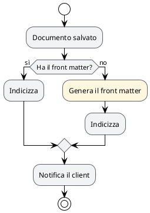
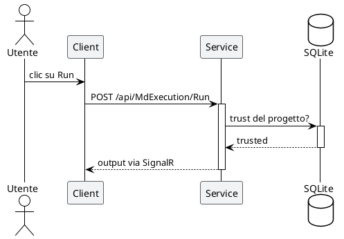
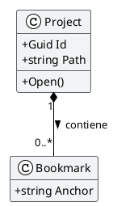
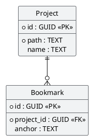

<!--
MdExplorer-managed skill.
The `mde:` block above marks this file as distributed by MdExplorer. When you
open a project, MdExplorer compares the embedded version with what is on disk
and will overwrite this file to keep it in sync with the current MdExplorer
features. To customize the skill while keeping your edits, remove the `mde:`
block (or change `origin` to something else) — MdExplorer will then leave the
file alone.
-->

# Diagrammi PlantUML in MdExplorer

Un diagramma serve a far capire **una cosa sola**. Se dopo averlo disegnato non sai dire qual è, non è pronto: non aggiungere colore, togli elementi.

## Due vincoli di MdExplorer, prima dell'estetica

### 1. Dentro un blocco plantuml non ci va nessun backtick

MdExplorer riconosce i blocchi con un'espressione regolare che cattura il corpo con una classe di caratteri **negata sul backtick**. Il blocco quindi finisce al primo backtick che incontra, non alla chiusura del fence: basta un nome di metodo scritto fra backtick dentro una nota e il diagramma smette di comparire, senza nessun messaggio di errore.

(Questa regola vale anche per un documento che *parla* di PlantUML: scrivere per esteso la riga che apre un blocco, dentro un esempio, fa partire un rendering indesiderato lì dove non te lo aspetti.)

Per evidenziare un identificatore dentro il diagramma usa il **corsivo** di PlantUML (`//testo//`) o le doppie virgolette, mai i backtick.

### 2. In tema scuro il diagramma viene ribaltato

Se il tema è scuro e il progetto non ha attivato *Mantieni i colori originali*, MdExplorer applica all'SVG:

    filter: invert(0.88) hue-rotate(180deg)

Non è un dettaglio cosmetico, cambia come si progetta. Ecco cosa succede davvero ai colori (valori calcolati, non stimati):

| colore che scrivi | diventa in tema scuro | resta leggibile? |
|---|---|---|
| `#1A73E8` blu | `#5599F2` | sì, ancora blu |
| `#D93025` rosso | `#FF867E` | sì, ancora rosso |
| `#188038` verde | `#5AA972` | sì, ancora verde |
| `#F1F3F4` grigio pallido | `#272829` | sì, riempimento discreto |
| `#FFFFFF` bianco puro | `#1F1F1F` | **no**, sparisce nello sfondo |
| `#808080` grigio medio | `#7F7F7F` | invariato |

La regola che ne discende è una sola:

> **La tinta sopravvive, la luminosità si ribalta.** Codifica il significato nel *colore*, mai nel *chiaro/scuro*.

Un diagramma con "grigio chiaro = fatto, grigio scuro = da fare" si legge al contrario in tema scuro. Gli stessi due stati distinti come verde e ambra si leggono uguali in entrambi i temi.

## Colore: una regola sola

**Il colore è un'informazione, non una decorazione.** Se togliendo tutti i colori il diagramma dice ancora la stessa cosa, quei colori erano rumore.

- **Massimo tre colori con significato** in un diagramma. Oltre, nessuno se li ricorda mentre legge.
- Il **percorso normale non si colora**. Si colora l'eccezione: l'errore, il ramo che costa, il punto dove serve una decisione umana.
- **Riempimenti pallidi, tratti saturi.** Il riempimento è lo sfondo di una parola, non un evidenziatore.
- Non fidarti dei colori di default di PlantUML: apri con `!theme plain` e decidi tu.

Palette di lavoro, già verificata contro il tema scuro:

| ruolo | riempimento | tratto |
|---|---|---|
| neutro, la maggioranza degli elementi | `#F1F3F4` | `#5F6368` |
| esito positivo, percorso felice | `#E6F4EA` | `#188038` |
| attenzione, decisione, costo | `#FEF7E0` | `#F29900` |
| errore, percorso di fallimento | `#FCE8E6` | `#D93025` |
| elemento in evidenza, il soggetto del diagramma | `#E8F0FE` | `#1A73E8` |

## Workflow (activity diagram)

Regole:

1. **Un solo `start` e, se possibile, un solo `stop`.** Più uscite significano quasi sempre due diagrammi.
2. **Le condizioni si scrivono come domande** e i rami portano la *risposta*, non un generico sì/no fuori contesto: `if (Ha il front matter?) then (sì)`.
3. **Il ramo normale scende dritto**, quello eccezionale devia. Chi legge segue la colonna centrale.
4. **Colora solo il ramo eccezionale.** Un activity tutto colorato non ha più un percorso principale.
5. Ogni azione è un **verbo all'imperativo o all'infinito**, non un sostantivo: «Genera il front matter», non «Generazione front matter».

## Sequence diagram

Regole:

1. **Le barre di attivazione non sono facoltative**: `++` e `--` mostrano chi ha il controllo in quel momento, che è metà del significato del diagramma.
2. **La risposta si scrive con `return`**, non con una freccia tratteggiata a mano: si allinea da sola all'attivazione giusta.
3. **Freccia piena per la chiamata, tratteggiata per la risposta.** È l'unica convenzione che tutti leggono senza legenda.
4. **Da tre a sette partecipanti.** Oltre, il diagramma diventa un muro: spezzalo per caso d'uso.
5. **Gli alias accorciano, non nascondono**: `participant "Service .NET" as S` va bene, `participant S` no.
6. Usa `group` / `alt` solo quando il raggruppamento **cambia la lettura**; se serve solo a fare ordine, toglilo.

## Class diagram

Regole:

1. **`hide empty members`** sempre: senza, ogni classe si porta dietro due scomparti vuoti che allargano il diagramma per niente.
2. **Mostra solo i membri che servono al punto che stai facendo.** Un class diagram non è la documentazione della classe: quella è il codice.
3. **La cardinalità va su ogni associazione.** `"1"` e `"0..*"` sono l'informazione, la linea da sola non dice nulla.
4. **Scegli il rombo con cognizione**: pieno (`*--`) se il figlio muore col padre, vuoto (`o--`) se sopravvive. Se non sai quale, usa un'associazione semplice.
5. **Etichetta il verso della relazione** (`: contiene >`) quando il nome dell'associazione non è ovvio.
6. `skinparam classAttributeIconSize 0` toglie le icone colorate di visibilità, che rubano l'attenzione ai nomi.

## Schema del database (ER)

Regole:

1. **`hide circle`** toglie il pallino da class diagram, che su un'entità non significa niente.
2. **`skinparam linetype ortho`**: le linee a squadra rendono leggibile un reticolo di chiavi esterne dove le diagonali si incrociano.
3. **Marca le chiavi**: `<<PK>>` e `<<FK>>` espliciti, e il `*` di PlantUML davanti alle colonne **NOT NULL**. Separa le chiavi dal resto con `--`.
4. **Il tipo va scritto** (`TEXT`, `GUID`, `INTEGER`): uno schema senza tipi non è uno schema.
5. **Cardinalità a zampa di gallina**: `||--o{` = uno-a-molti opzionale, `||--|{` = uno-a-molti obbligatorio. Sceglila, non copiarla.
6. **Un diagramma per area funzionale.** Lo schema completo di un database vero non si legge: si consulta.

## Checklist

- [ ] Nessun backtick dentro il blocco plantuml.
- [ ] Il diagramma dice **una** cosa, e sai dire quale.
- [ ] Il significato sta nella tinta, non nel chiaro/scuro.
- [ ] Non più di tre colori con significato; il percorso normale non è colorato.
- [ ] Riempimenti pallidi, tratti saturi; nessun riempimento bianco puro.
- [ ] `!theme plain` in testa, così i default di PlantUML non decidono al posto tuo.
- [ ] Le regole del tipo di diagramma sono rispettate: attivazioni nei sequence, cardinalità nei class ed ER, un solo start negli activity.
