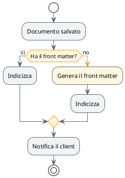
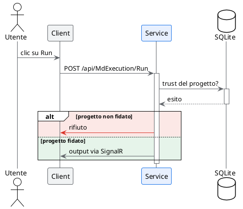
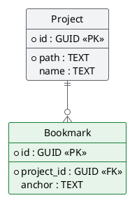
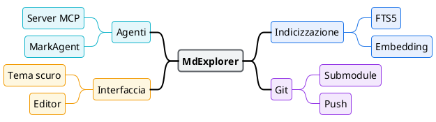

<!--
MdExplorer-managed skill.
The `mde:` block above marks this file as distributed by MdExplorer. When you
open a project, MdExplorer compares the embedded version with what is on disk
and will overwrite this file to keep it in sync with the current MdExplorer
features. To customize the skill while keeping your edits, remove the `mde:`
block (or change `origin` to something else) — MdExplorer will then leave the
file alone.
-->


# Diagrammi PlantUML in MdExplorer

Un diagramma serve a far capire **una cosa sola**. Se dopo averlo disegnato non sai dire qual è, non è pronto: non aggiungere colore, togli elementi.

## Due vincoli di MdExplorer, prima dell'estetica

### 1. Dentro un blocco plantuml non ci va nessun backtick

MdExplorer riconosce i blocchi con un'espressione regolare che cattura il corpo con una classe di caratteri **negata sul backtick**. Il blocco quindi finisce al primo backtick che incontra, non alla chiusura del fence: basta un nome di metodo scritto fra backtick dentro una nota e il diagramma smette di comparire, senza nessun messaggio di errore.

(Questa regola vale anche per un documento che *parla* di PlantUML: scrivere per esteso la riga che apre un blocco, dentro un esempio, fa partire un rendering indesiderato lì dove non te lo aspetti.)

Per evidenziare un identificatore dentro il diagramma usa il **corsivo** di PlantUML (`//testo//`) o le doppie virgolette, mai i backtick.

### 2. In tema scuro il diagramma viene ribaltato

Se il tema è scuro e il progetto non ha attivato *Mantieni i colori originali*, MdExplorer applica all'SVG:

    filter: invert(0.88) hue-rotate(180deg)

Non è un dettaglio cosmetico, cambia come si progetta. Ecco cosa succede davvero ai colori (valori calcolati, non stimati):

| colore che scrivi | diventa in tema scuro | resta leggibile? |
|---|---|---|
| `#1A73E8` blu | `#5599F2` | sì, ancora blu |
| `#D93025` rosso | `#FF867E` | sì, ancora rosso |
| `#188038` verde | `#5AA972` | sì, ancora verde |
| `#F1F3F4` grigio pallido | `#272829` | sì, riempimento discreto |
| `#FFFFFF` bianco puro | `#1F1F1F` | **no**, sparisce nello sfondo |
| `#808080` grigio medio | `#7F7F7F` | invariato |

La regola che ne discende è una sola:

> **La tinta sopravvive, la luminosità si ribalta.** Codifica il significato nel *colore*, mai nel *chiaro/scuro*.

Un diagramma con "grigio chiaro = fatto, grigio scuro = da fare" si legge al contrario in tema scuro. Gli stessi due stati distinti come verde e ambra si leggono uguali in entrambi i temi.

## Prima di consegnare: verifica

Se hai a disposizione lo strumento **`CheckPlantuml`** (server MCP di MdExplorer), chiamalo su ogni diagramma prima di scriverlo nel documento. Non renderizza niente, costa poco, e vede cose che tu non puoi vedere.

Come si legge la risposta:

- **`ok: true`** — il diagramma si vede. Se ci sono `warning`, valuta se correggerli; sono difetti che si notano solo in tema scuro.
- **`ok: false`** — c'è almeno un `error`: il diagramma **non comparirà affatto**. Per ogni problema hai `line`, la riga stessa in `source`, il `meaning` e **una** correzione in `fix`. Applicala e richiama la verifica.
- **`toolUnavailable` valorizzato** — la verifica **non è stata eseguita**: manca qualcosa sulla macchina. Il tuo diagramma non è stato giudicato, quindi **non cambiarlo**: riferisci all'utente cosa manca.

Quest'ultimo punto è il più importante da rispettare. Correggere un diagramma sano perché la verifica non è partita è il modo più veloce di peggiorarlo.

Lo strumento non sostituisce le regole che seguono: controlla la sintassi e i due difetti tipici di MdExplorer, non se il diagramma si capisce. Quello resta compito tuo.

I due avvisi di colore che `CheckPlantuml` solleva, così li eviti in partenza:

- **`#FFFFFF` ovunque compaia**, anche come colore del testo: in tema scuro diventa lo sfondo.
- **Due o più grigi puri diversi** (R, G e B identici, come `#EEEEEE` e `#999999`): è il significato affidato al chiaro/scuro. I grigi della palette qui sotto hanno una punta di blu e non contano come grigi puri.

## Colore: le regole

**Il colore è un'informazione, non una decorazione.** Se togliendo tutti i colori il diagramma dice ancora la stessa cosa, quei colori erano rumore.

- **Massimo tre colori con significato** in un diagramma. Oltre, nessuno se li ricorda mentre legge. (L'unica eccezione motivata è la mindmap colorata per ramo: vedi la sua sezione.)
- Il **percorso normale non si colora**. Si colora l'eccezione: l'errore, il ramo che costa, il punto dove serve una decisione umana.
- **Riempimenti pallidi, tratti saturi.** Il riempimento è lo sfondo di una parola, non un evidenziatore.
- **Il bordo dello stesso colore del riempimento, ma saturo**: un riempimento verde con bordo grigio sembra un errore di stampa.
- **Se il significato di un colore non è ovvio dal testo, aggiungi una `legend`.** Rosso = errore si capisce da solo; verde = "introdotto in questa versione" no.
- Non fidarti dei colori di default di PlantUML: apri con `!theme plain` e decidi tu.

### Palette di lavoro

Tutti i valori sono già calcolati contro il filtro del tema scuro: la tinta resta riconoscibile, il riempimento diventa un fondo scuro discreto.

| ruolo | riempimento | tratto | in tema scuro (riemp. / tratto) |
|---|---|---|---|
| neutro, la maggioranza degli elementi | `#F1F3F4` | `#5F6368` | `#272829` / `#93969A` |
| esito positivo, percorso felice | `#E6F4EA` | `#188038` | `#222D25` / `#5AA972` |
| attenzione, decisione, costo | `#FEF7E0` | `#F29900` | `#2A2513` / `#A46000` |
| errore, percorso di fallimento | `#FCE8E6` | `#D93025` | `#392A28` / `#FF867E` |
| elemento in evidenza, il soggetto del diagramma | `#E8F0FE` | `#1A73E8` | `#252B36` / `#5599F2` |

Due tinte in più, **solo per categorie senza giudizio** (i rami di una mindmap, i livelli di un'architettura), mai per dire bene/male:

| ruolo | riempimento | tratto | in tema scuro (riemp. / tratto) |
|---|---|---|---|
| categoria viola | `#F3E8FD` | `#9334E6` | `#332A3A` / `#CF87FF` |
| categoria ciano | `#E4F7FB` | `#12B5CB` | `#1C2A2D` / `#0D899A` |

Il testo resta sempre del colore di default (quasi nero, che in tema scuro diventa quasi bianco). Se proprio devi colorarlo, usa un **tratto** della palette, mai un riempimento: un testo `#E6F4EA` non si legge in nessuno dei due temi.

### Dove si mette il colore: tre livelli

Dal più generale al più puntuale. **Scendi di livello solo quando quello sopra non basta.**

1. **Default per tipo di elemento** — `skinparam ClassBackgroundColor #F1F3F4`. Decide l'aspetto della maggioranza: il neutro.
2. **Categoria con significato, tramite stereotipo** — dichiari una volta cosa vuol dire `<<Nuovo>>` e lo applichi a tutti gli elementi di quella categoria. È il modo giusto per colorare **con un significato**: il colore sta in un posto solo, e l'etichetta dello stereotipo fa da legenda.

        skinparam class {
          BackgroundColor<<Nuovo>> #E6F4EA
          BorderColor<<Nuovo>> #188038
        }
        class Bookmark <<Nuovo>>

   Se l'etichetta «Nuovo» sul disegno non ti serve, `hide stereotype` la nasconde e il colore resta.
3. **Il singolo elemento, in linea** — `#FCE8E6:Rifiuta il salvataggio;`. Per l'eccezione che capita una volta. Se lo stesso colore in linea compare tre volte, è una categoria: torna al livello 2.

### Sintassi del colore, per tipo di diagramma

Tutte provate sul jar distribuito con MdExplorer (1.2026.1) e sui 1.2022.x. Dove una sintassi **non** funziona, è scritto.

**Activity (workflow)**

| cosa | sintassi |
|---|---|
| tutte le azioni | `skinparam ActivityBackgroundColor #F1F3F4` + `ActivityBorderColor #5F6368` |
| i rombi delle decisioni | `skinparam ActivityDiamondBackgroundColor #FEF7E0` + `ActivityDiamondBorderColor #F29900` |
| una sola azione | `#FCE8E6:Rifiuta il salvataggio;` |
| tutte le frecce | `skinparam ArrowColor #5F6368` |
| una freccia, anche spessa, con etichetta | `-[#D93025,bold]-> errore;` |
| una corsia (swimlane) | `\|#E8F0FE\|Client\|` |
| un gruppo di azioni | `partition #E6F4EA "Pubblicazione" { ... }` |

**Sequence**

| cosa | sintassi |
|---|---|
| tutti i partecipanti | `skinparam ParticipantBackgroundColor #F1F3F4` + `ParticipantBorderColor #5F6368` |
| linee di vita | `skinparam SequenceLifeLineBorderColor #5F6368` |
| un partecipante, solo riempimento | `database "SQLite" as DB #FEF7E0` |
| un partecipante con bordo | stereotipo: `skinparam participant { BackgroundColor<<Focus>> #E8F0FE ... }` e `participant "Service" as S <<Focus>>` |
| una freccia | `S -[#D93025]> Utente : rifiuto` |
| un blocco alt/else, ramo per ramo | `alt #FCE8E6 non trusted` … `else #E6F4EA trusted` |
| un gruppo di partecipanti | `box "Backend" #F1F3F4` … `end box` |
| una nota | `note right of S #FEF7E0 : il costo sta qui` |

⚠️ **Nel sequence `#riempimento;line:colore` sul partecipante fa fallire il diagramma** ("No such color"): il bordo di un singolo partecipante si colora solo con lo stereotipo.

**Class ed ER**

| cosa | sintassi |
|---|---|
| tutte le classi / entità | `skinparam ClassBackgroundColor #F1F3F4` + `ClassBorderColor #5F6368` |
| una categoria | `skinparam class { BackgroundColor<<Nuovo>> #E6F4EA` + `BorderColor<<Nuovo>> #188038 }` |
| una classe, riempimento e bordo | `class Project #E8F0FE;line:1A73E8;line.bold` |
| una relazione, tratto, stile ed etichetta | `Project ..> OldCache #line:D93025;line.dashed;text:D93025 : da rimuovere` |

La forma `;line:` funziona su class, entity e `rectangle`; sul partecipante di un sequence invece fa fallire il diagramma. Se hai un dubbio, lo stereotipo funziona ovunque.

**Testo colorato e legenda (tutti i diagrammi)**

    legend right
      <color:#188038>verde</color> = introdotto in questa versione
      <color:#D93025>rosso</color> = deprecato
    endlegend

`<color:#...>testo</color>` funziona anche dentro le etichette di azioni, note e frecce: usalo per **una parola**, non per una frase.

## Workflow (activity diagram)

Regole:

1. **Un solo `start` e, se possibile, un solo `stop`.** Più uscite significano quasi sempre due diagrammi.
2. **Le condizioni si scrivono come domande** e i rami portano la *risposta*, non un generico sì/no fuori contesto: `if (Ha il front matter?) then (sì)`.
3. **Il ramo normale scende dritto**, quello eccezionale devia. Chi legge segue la colonna centrale.
4. **Colora solo il ramo eccezionale.** Un activity tutto colorato non ha più un percorso principale. Colora l'azione *e* la freccia che ci porta: così il ramo si segue anche a colpo d'occhio.
5. Ogni azione è un **verbo all'imperativo o all'infinito**, non un sostantivo: «Genera il front matter», non «Generazione front matter».
6. **Le corsie si colorano solo se distinguono chi agisce** (utente, client, service). Una corsia in evidenza al massimo: le altre restano neutre.



## Sequence diagram

Regole:

1. **Le barre di attivazione non sono facoltative**: `++` e `--` mostrano chi ha il controllo in quel momento, che è metà del significato del diagramma.
2. **La risposta si scrive con `return`**, non con una freccia tratteggiata a mano: si allinea da sola all'attivazione giusta.
3. **Freccia piena per la chiamata, tratteggiata per la risposta.** È l'unica convenzione che tutti leggono senza legenda.
4. **Da tre a sette partecipanti.** Oltre, il diagramma diventa un muro: spezzalo per caso d'uso.
5. **Gli alias accorciano, non nascondono**: `participant "Service .NET" as S` va bene, `participant S` no.
6. Usa `group` / `alt` solo quando il raggruppamento **cambia la lettura**; se serve solo a fare ordine, toglilo.
7. **Colora il ramo `alt`, non i partecipanti**: il rosso sul ramo che fallisce dice cosa succede; un partecipante rosso non dice niente. Un partecipante si mette in evidenza solo se è il soggetto del diagramma.



## Class diagram

Regole:

1. **`hide empty members`** sempre: senza, ogni classe si porta dietro due scomparti vuoti che allargano il diagramma per niente.
2. **Mostra solo i membri che servono al punto che stai facendo.** Un class diagram non è la documentazione della classe: quella è il codice.
3. **La cardinalità va su ogni associazione.** `"1"` e `"0..*"` sono l'informazione, la linea da sola non dice nulla.
4. **Scegli il rombo con cognizione**: pieno (`*--`) se il figlio muore col padre, vuoto (`o--`) se sopravvive. Se non sai quale, usa un'associazione semplice.
5. **Etichetta il verso della relazione** (`: contiene >`) quando il nome dell'associazione non è ovvio.
6. `skinparam classAttributeIconSize 0` toglie le icone colorate di visibilità, che rubano l'attenzione ai nomi.
7. **Colora per categoria con uno stereotipo** (nuovo, deprecato, esterno), non classe per classe: l'etichetta «Nuovo» spiega il colore senza legenda.

### Cosa colora MdExplorer da solo, al clic

Cliccando una classe, MdExplorer evidenzia le relazioni con un colore **per tipo**, letto dalla freccia che hai scritto, e la legenda sta nella barra del diagramma (🎨). Il colore non lo scegli tu: scegli la freccia giusta.

| scrivi | tipo | colore al clic |
|---|---|---|
| `<\|--`, `<\|..` | ereditarietà, realizzazione | viola |
| `*--` | composizione | arancione |
| `o--` | aggregazione | azzurro |
| `--`, `..` | associazione | verde acqua |
| `..>` **e anche `-->`** | dipendenza | magenta |

- **Scegli la freccia per quello che significa**, non per come appare: una composizione scritta `-->` si accende come dipendenza.
- ⚠️ **`-->` per PlantUML è una dipendenza**, non un'associazione con verso. Se intendi un'associazione, scrivi `--` e metti il verso nell'etichetta (`: contiene >`).
- **Aggancia ogni nota alla sua classe**: `note right of Classe : …`, oppure `note as N` più `N .. Classe`. Al clic la nota agganciata si accende in giallo; una nota senza legame resta spenta.
- **Non usare di tuo viola, arancione, azzurro, verde acqua o magenta sulle frecce** con un altro significato: la legenda direbbe il falso.

```plantuml
@startuml
!theme plain
hide empty members
skinparam classAttributeIconSize 0
skinparam ClassBackgroundColor #F1F3F4
skinparam ClassBorderColor #5F6368
skinparam ArrowColor #5F6368
skinparam class {
  BackgroundColor<<Nuovo>> #E6F4EA
  BorderColor<<Nuovo>> #188038
}

class Project {
  +Guid Id
  +string Path
  --
  +Open()
}
class Bookmark <<Nuovo>> {
  +string Anchor
}
Project "1" *-- "0..*" Bookmark : contiene >
@enduml
```



## Schema del database (ER)

Regole:

1. **`hide circle`** toglie il pallino da class diagram, che su un'entità non significa niente.
2. **`skinparam linetype ortho`**: le linee a squadra rendono leggibile un reticolo di chiavi esterne dove le diagonali si incrociano.
3. **Marca le chiavi**: `<<PK>>` e `<<FK>>` espliciti, e il `*` di PlantUML davanti alle colonne **NOT NULL**. Separa le chiavi dal resto con `--`.
4. **Il tipo va scritto** (`TEXT`, `GUID`, `INTEGER`): uno schema senza tipi non è uno schema.
5. **Cardinalità a zampa di gallina**: `||--o{` = uno-a-molti opzionale, `||--|{` = uno-a-molti obbligatorio. Sceglila, non copiarla.
6. **Un diagramma per area funzionale.** Lo schema completo di un database vero non si legge: si consulta.
7. **In uno schema si colora la modifica**: la tabella che una migrazione aggiunge o tocca, in linea sull'entità. Tutto il resto neutro.



## Mindmap

Una mindmap non mostra un flusso né una struttura: mostra **come un argomento si divide**. Si legge dal centro verso fuori, quindi la radice è il titolo e ogni livello è più specifico del precedente.

Si apre con `@startmindmap` e si chiude con `@endmindmap`, sempre dentro un blocco plantuml normale.

Regole:

1. **Una radice, breve**: il nome dell'argomento, non una frase. È l'unico nodo in evidenza.
2. **Da tre a sette rami di primo livello.** Con due, è un elenco; con dodici, sono due mappe.
3. **Al massimo tre livelli sotto la radice.** Il quarto livello è quasi sempre un dettaglio che sta meglio nel testo del documento.
4. **Nodi di poche parole, tutti della stessa natura** (tutti sostantivi, o tutti azioni). Un nodo che è una frase intera va spezzato o spostato nel documento.
5. **Bilancia i lati**: con più di quattro rami, metti metà dei rami a sinistra con `left side` (sintassi a asterischi) o con `-` al posto di `+`.
6. **Le foglie di puro dettaglio vanno senza box** (`***_ dettaglio`): pesano meno sulla pagina e lasciano spiccare i nodi che contano.
7. **Testo su più righe** con `**:prima riga` e `seconda riga;`, non allargando il nodo.

### Colore nella mindmap: scegli UNA strategia

Nella mindmap il colore può dire due cose diverse, e **non vanno mai mischiate** nella stessa mappa:

- **Per stato** — la struttura è neutra e colori solo i nodi che hanno un esito: fatto, a rischio, bloccato. Vale la regola dei tre colori, e la palette è quella con significato (verde, ambra, rosso).
- **Per ramo** — ogni ramo di primo livello ha la sua tinta, e tutti i suoi discendenti la ripetono. Qui il colore dice *"appartiene a questo ramo"* e aiuta a seguire i rami nelle mappe grandi. Si possono usare fino a cinque tinte, ma **solo quelle senza giudizio**: blu, viola, ciano, più verde e ambra se servono. Il rosso no, sembrerebbe un errore.

Se la mappa ha meno di quattro rami, non colorarla per ramo: la struttura si vede già.

### Come si imposta il colore della mindmap

La mindmap si colora con un blocco **`<style>`**, non con gli `skinparam`: `<style>` sa distinguere la radice, i livelli, le foglie e le classi che definisci tu, e tiene tutto il colore in un posto solo.

```text
<style>
mindmapDiagram {
  node      { ... }   tutti i nodi: il neutro
  arrow     { ... }   i rami che non prendono il colore da un nodo
  :depth(0) { ... }   la radice
  :depth(1) { ... }   i nodi di primo livello (e così via)
  leafNode  { ... }   le foglie che hanno un box
  boxless   { ... }   i nodi senza box (***_), solo testo
  .nome     { ... }   una classe: si applica con <<nome>> sul nodo
}
</style>
```

Proprietà utili: `BackgroundColor`, `LineColor`, `LineThickness`, `FontColor`, `FontSize`, `FontStyle bold`, `RoundCorner`, `Padding`, `Margin`.

Quattro comportamenti provati sul jar, che non si indovinano:

- **Il `LineColor` di un nodo colora anche il ramo che esce da lui**, verso i figli. Quindi la radice con tratto blu ha i rami di primo livello blu; un nodo di ramo viola ha i collegamenti verso i figli viola.
- **Una classe `<<nome>>` non passa ai figli.** Per colorare un ramo intero, metti la classe su **ogni** nodo del ramo.
- **`leafNode` non tocca i nodi senza box**: quelli si stilizzano con `boxless`, di solito col solo `FontColor`, visto che non hanno un riempimento.
- **Il colore in linea** `**[#FCE8E6] nodo` imposta il solo riempimento: il bordo resta quello di default. Usalo per un'eccezione unica; per tutto il resto, una classe.

### Esempio: colore per stato

Struttura neutra, radice in evidenza, colore solo sull'esito. Le foglie di dettaglio sono senza box.


Legenda implicita: verde fatto, ambra a rischio, rosso bloccato. Se la mappa va a qualcuno che non conosce la convenzione, aggiungi `legend` come negli altri diagrammi.

### Esempio: colore per ramo

Ogni ramo di primo livello ha una tinta senza giudizio e **ogni** suo nodo porta la classe. La radice è l'unico nodo con tratto spesso.



## Checklist

- [ ] Nessun backtick dentro il blocco plantuml.
- [ ] Il diagramma dice **una** cosa, e sai dire quale.
- [ ] Il significato sta nella tinta, non nel chiaro/scuro.
- [ ] Non più di tre colori con significato; il percorso normale non è colorato.
- [ ] Riempimenti pallidi, tratti saturi dello stesso colore; nessun `#FFFFFF`, nemmeno come testo.
- [ ] Un colore ripetuto è diventato uno stereotipo (o una classe `<<nome>>` nella mindmap), non tre colori in linea.
- [ ] Un colore dal significato non ovvio ha la sua `legend`.
- [ ] `!theme plain` in testa, così i default di PlantUML non decidono al posto tuo.
- [ ] Le regole del tipo di diagramma sono rispettate: attivazioni nei sequence, cardinalità nei class ed ER, un solo start negli activity.
- [ ] Nella mindmap: una sola strategia di colore (per stato *o* per ramo), classe su ogni nodo del ramo, `<style>` e non `skinparam`.
- [ ] Se `CheckPlantuml` è disponibile, la risposta è `ok: true` (o gli avvisi rimasti sono una scelta consapevole).
