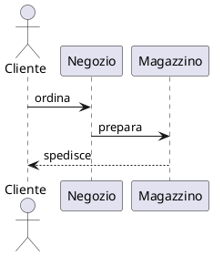

<!--
MdExplorer-managed skill.
The `mde:` block above marks this file as distributed by MdExplorer. When you
open a project, MdExplorer compares the embedded version with what is on disk
and will overwrite this file to keep it in sync with the current MdExplorer
features. To customize the skill while keeping your edits, remove the `mde:`
block (or change `origin` to something else) — MdExplorer will then leave the
file alone.
-->

# Presentazioni in MdExplorer

Una presentazione è **un file markdown**. MdExplorer lo legge con lo stesso motore dei documenti e lo mostra
come presentazione **reveal.js 6**. Il file resta leggibile e modificabile come qualunque altro `.md`, e il
pulsante **PDF** della barra lo esporta.

Tutto ciò che reveal.js sa fare si scrive in uno di **quattro livelli**. Se una cosa non compare in questa
skill, la documentazione ufficiale di reveal.js (revealjs.com) vale anche qui, con queste stesse forme:

| Livello | Dove si scrive |
|---|---|
| tutta la presentazione | `reveal.config` nel front matter: le opzioni di `Reveal.initialize`, così come sono |
| una slide | un commento `<!-- .slide: … -->` dentro la slide |
| un elemento | un commento `<!-- .element: … -->` subito dopo l'elemento |
| il resto | HTML scritto direttamente nel markdown |

## Prima di scrivere

Una slide dice **una cosa sola**. Se il titolo non basta a capire di cosa parla, dividila.

Prima di scrivere, chiarisci con l'utente, se non lo ha già detto:

- a chi è rivolta e quanto deve durare. Circa una slide al minuto è un buon punto di partenza;
- se la proietta parlando (poco testo e note del relatore) o se la manda da leggere (testo più completo,
  niente effetti);
- se serve il PDF. Gli effetti a comparsa nel PDF diventano più pagine, vedi *«Mi serve il PDF»*.

Se non puoi chiedere, decidi e dillo all'utente quando consegni:

- **tema esplicito** (`reveal.theme`), non quello che segue MdExplorer: se la presentazione usa sfondi colorati o
  diagrammi, il suo aspetto non deve cambiare con il tema dell'app. `white` è la scelta più sicura;
- **dimensioni**: reveal.js parte da 960×700. Per uno schermo 16:9 scrivi `width: 1280` e `height: 720` in
  `reveal.config`;
- **effetti a comparsa** solo se la presenta parlando; **note del relatore** sempre, se la presenta parlando.

## Lo scheletro

````markdown esempio=scheletro
---
title: Revisione trimestrale
document_type: slides
---

# Revisione trimestrale

Area vendite · settembre 2026

---

## Risultati

- Fatturato +12%
- Quaranta clienti nuovi

---

## Prossimi passi

1. Consolidare i clienti nuovi
2. Aprire il mercato tedesco
````

- `document_type: slides` nel front matter è ciò che fa del file una presentazione. Senza, è un documento.
- `title` nel front matter non compare sulle slide: è il titolo della scheda e del PDF. Il titolo visibile è
  il `#` della prima slide.
- **Una riga `---` da sola separa due slide.**
- Il titolo della prima slide con `#`, quelli delle altre con `##`.

## Tre regole del motore, da non sbagliare

1. **Una riga `---` è sempre un separatore**, anche attaccata al testo sopra. `Titolo` seguito da `---`
   nei documenti è un titolo, qui divide la slide in due. Per i titoli usa `##`, per una riga orizzontale
   `***`.
2. **Dentro un blocco di codice nulla è un separatore.** Un `---` in un blocco YAML resta codice.
3. **Una riga che comincia con `Note:` trasforma il resto della slide in note del relatore**, che il pubblico
   non vede. Il testo delle note può cominciare sulla stessa riga (`Note: dire che…`) e finisce al separatore
   successivo (`---` o `--`). Non scrivere `Note:` all'inizio di una riga quando vuoi che si veda.

## Ricette: cosa vuole l'utente → cosa scrivere

### «I punti devono comparire uno alla volta»

Un commento `.element` alla fine di ogni punto:

````markdown esempio=frammenti
## Perché cambiare

- Costi in crescita <!-- .element: class="fragment" -->
- Clienti che chiedono tempi più brevi <!-- .element: class="fragment" -->
- Un concorrente nuovo <!-- .element: class="fragment" -->
````

Il commento si applica all'elemento **prima** di lui: scritto alla fine di un punto, vale per quel punto.
Scritto sulla riga sotto l'elenco vale per l'ultimo punto; dopo una riga vuota, per l'elenco intero. Funziona
allo stesso modo negli elenchi numerati e nel markdown dentro un blocco HTML (per esempio nelle colonne).

### «Con effetti diversi, e in un ordine preciso»

`class` sostituisce la classe dell'elemento: scrivi sempre anche `fragment`. Con `data-fragment-index` gli
elementi compaiono nell'ordine indicato, anche se nel testo sono in un altro ordine.

````markdown esempio=frammenti-ordine
## Il piano

La meta <!-- .element: class="fragment fade-up" data-fragment-index="2" -->

Il punto di partenza <!-- .element: class="fragment fade-in" data-fragment-index="1" -->

Il rischio da evitare <!-- .element: class="fragment highlight-red" data-fragment-index="3" -->
````

Effetti utili: `fade-in`, `fade-up`, `fade-down`, `fade-out`, `grow`, `shrink`, `strike`,
`highlight-red`, `highlight-green`, `highlight-blue`.

### «Questa slide deve avere uno sfondo diverso»

Un commento `.slide` nella slide. Può stare in qualunque punto della slide (in cima è più leggibile) e può
portare più attributi insieme, per esempio sfondo e transizione:

````markdown esempio=sfondo
<!-- .slide: data-background-color="#1b2a3a" -->

## Una sezione nuova

---

<!-- .slide: data-background-image="img/cantiere.jpg" data-background-opacity="0.4" -->

## Il cantiere oggi
````

Il percorso dell'immagine è relativo al file, come in un documento. Esiste anche
`data-background-gradient="linear-gradient(to bottom, #283b95, #17b2c3)"`.

- Su uno sfondo scuro reveal.js schiarisce da solo il testo della slide, qualunque sia il tema.
- Uno sfondo scuro «che si nota» si nota solo su un tema chiaro: se conta, scrivi `reveal.theme: white`,
  altrimenti con MdExplorer in tema scuro la presentazione diventa scura tutta.
- Non mettere un diagramma PlantUML su una slide a sfondo scuro: il diagramma resta chiaro, un riquadro bianco.

### «Come sfondo voglio un video, anche di YouTube, che si muove»

Un video di YouTube come sfondo vivo, non un'immagine ferma: `data-background-iframe` con l'indirizzo
**embed** del video (`https://www.youtube.com/embed/<ID>`, non `watch?v=`). `<ID>` è la parte dopo `watch?v=`.

````markdown esempio=sfondo-video
<!-- .slide: data-background-iframe="https://www.youtube.com/embed/aqz-KE-bpKQ?autoplay=1&mute=1&loop=1&playlist=aqz-KE-bpKQ&controls=0&playsinline=1" data-background-interactive -->

# Il titolo sopra il video
````

- `autoplay=1&mute=1`: parte da solo. I browser lo permettono **solo senza audio**; per l'audio togli
  `mute=1` e il video lo fa partire chi presenta, con un clic.
- `loop=1&playlist=<ID>`: ricomincia alla fine. YouTube vuole l'ID ripetuto in `playlist`.
- `controls=0`: nessuna barra di comandi sopra lo sfondo.
- `data-background-interactive`: il video risponde ai clic (pausa, avvio). Senza, è solo sfondo.
- Serve la **rete**: senza, lo sfondo resta nero.
- Il video è 16:9: per non avere bande nere dai alla presentazione le stesse proporzioni, `width: 1280` e
  `height: 720` in `reveal.config`.
- Il testo va scelto per il video: su un video chiaro il tema `white`, su uno scuro `black`.
- Nel **PDF** un video non c'è: compare al più un fotogramma. Se il PDF conta, per quella slide usa
  un'immagine.

Un file video del progetto (mp4, webm) si mette con `data-background-video="video/intro.mp4"`, anche in più
formati separati da virgola (`"video/intro.mp4, video/intro.webm"`), più `data-background-video-loop` e
`data-background-video-muted`. Il percorso è relativo al file, come per le immagini, e funziona senza rete.

### «Una presentazione principale che porta alle sezioni»

Più presentazioni collegate: una **principale** con un link per sezione, e una presentazione per sezione.
Il link è un normale link markdown a un altro file `.md` (percorso relativo al file); con `#/n` dopo il nome si
arriva direttamente alla slide `n+1` (si conta da 0).

````markdown esempio=sezioni
## Le sezioni

- [Vendite](sezioni/vendite.md)
- [Acquisti](sezioni/acquisti.md)
- [Acquisti: i costi](sezioni/acquisti.md#/3)
````

Cosa fa MdExplorer, senza che serva scrivere altro:

- in una sezione compare in alto a sinistra un **breadcrumb** (`Le sezioni: principale › Vendite`); un clic
  riporta alla presentazione principale **sulla slide da cui si era partiti**. Funziona su più livelli;
- anche le frecce **← →** della barra di MdExplorer riaprono ogni presentazione sulla slide dove era stata
  lasciata;
- il breadcrumb si azzera quando una presentazione si apre dall'albero dei file, e non compare nel PDF.

Ogni sezione è una presentazione completa (front matter con `document_type: slides`), con il suo `title`: è il
nome che compare nel breadcrumb.

### «Questa slide deve entrare in un altro modo»

````markdown esempio=transizione
<!-- .slide: data-transition="zoom" -->

## Il numero dell'anno

**+12%**
````

Transizioni: `none`, `fade`, `slide`, `convex`, `concave`, `zoom`. Per cambiarle a tutta la presentazione
usa `transition` in `reveal.config`.

### «Voglio degli approfondimenti che si possono saltare»

Le slide **verticali**: `--` su una riga da sola apre una slide sotto quella corrente. Chi presenta scende con
↓ o salta alla slide successiva con →.

````markdown esempio=verticali
## Tre mercati

---

## Italia

--

## Italia: i numeri

--

## Italia: i rischi

---

## Germania
````

### «Mi servono gli appunti mentre parlo»

````markdown esempio=note
## Risultati

- Fatturato +12%

Note:
Dire subito che il dato di settembre è provvisorio.
Se chiedono dei margini: slide 7.
````

Le note le vede solo chi presenta, nella **vista relatore**: il tasto **S** sulla presentazione apre una
finestra a parte con la slide corrente, la successiva, le note e il tempo. Le note accettano il markdown.

### «Codice evidenziato un pezzo alla volta»

Dopo il linguaggio, tra parentesi quadre, i gruppi di righe separati da `|`. Ogni gruppo è un passo.

````markdown esempio=codice
## Il ciclo

```js [1-2|4|5-7]
const clienti = await carica();
const attivi = clienti.filter(c => c.attivo);

for (const c of attivi) {
  if (c.scaduto) {
    avvisa(c);
  }
}
```
````

`[1-2]` senza `|` evidenzia quelle righe e basta; `[]` mostra solo i numeri di riga; `[10: 1-2]` fa partire la
numerazione da 10.

### «Un diagramma»

Con **PlantUML**, come nei documenti. Nella slide diventa un `<svg>` dentro la pagina, non un'immagine. Per
lo stile dei diagrammi vale la skill `mde-plantuml`.

````markdown esempio=diagramma
## Come passa un ordine


````

- **Niente mermaid**: un blocco `mermaid` in una presentazione dà un errore. Usa PlantUML.
- Un diagramma troppo grande viene **rimpicciolito** per stare nella slide (in larghezza, e in altezza fino a
  tre quarti della slide); non viene mai ingrandito. Rimpicciolito troppo diventa illeggibile: oltre una
  dozzina di riquadri, o con testi lunghi nei riquadri, dividilo in due slide.
- Nei documenti in tema scuro MdExplorer ribalta i colori del diagramma (`filter: invert`), **nelle slide
  no**: il diagramma resta com'è, e su un tema scuro compare come un riquadro chiaro. Scegli un tema chiaro,
  oppure dai al diagramma colori pensati per lo sfondo scuro.

### «Una formula»

Come nei documenti: `$…$` nel testo, `$$…$$` su righe proprie. Un `$` da solo resta un `$`.

````markdown esempio=formula
## Crescita composta

Il capitale dopo $n$ anni:

$$
C_n = C_0 (1 + r)^n
$$
````

### «Un elemento che si sposta da una slide alla successiva»

L'**auto-animate**: due slide consecutive con `data-auto-animate`; gli elementi con lo stesso `data-id` si
spostano e cambiano forma da una posizione all'altra.

````markdown esempio=auto-animate
<!-- .slide: data-auto-animate -->

## Il progetto

<div data-id="barra" style="background:#2a9d8f; width:200px; height:40px; margin:auto"></div>

---

<!-- .slide: data-auto-animate -->

## Il progetto, un anno dopo

<div data-id="barra" style="background:#e76f51; width:700px; height:40px; margin:auto"></div>
````

### «Più immagini una sopra l'altra, che si alternano»

Per le cose che il markdown non sa dire si scrive HTML. Lascia una riga vuota prima e dopo il blocco HTML.

````markdown esempio=pila
## Le tre versioni

<div class="r-stack">


</div>
````

### «Due colonne»

````markdown esempio=colonne
## Prima e dopo

<div class="r-hstack">
<div style="flex:1">

**Prima**

- Tre sistemi
- Dati copiati a mano

</div>
<div style="flex:1">

**Dopo**

- Un sistema
- Dati allineati da soli

</div>
</div>
````

Il markdown dentro un `<div>` funziona se c'è una riga vuota tra il tag e il testo.

### «La presentazione deve comportarsi in un certo modo»

Le opzioni di reveal.js vanno sotto `reveal.config`, scritte come le scrive reveal.js:

````markdown esempio=config
---
title: Kick-off
document_type: slides
reveal:
  config:
    transition: fade
    slideNumber: c/t
    controls: false
    autoSlide: 8000
    loop: true
    pdfSeparateFragments: false
---

# Kick-off
````

- `true`/`false` e i numeri **senza virgolette**: `'false'` fra virgolette è una scritta, e per reveal.js vale
  come vero.
- Due impostazioni le decide MdExplorer e il file non le può cambiare: i `plugins` e il percorso di KaTeX
  (`katex.local`). Scriverle dà un errore.
- `pdfSeparateFragments` cambia solo il PDF: presentando, gli effetti a comparsa restano.
- MdExplorer parte da `hash: true`, così la presentazione resta sulla slide corrente quando il file cambia, e
  da `scrollActivationWidth: null`, così resta a slide anche in un pannello stretto. Tutte e due si possono
  cambiare.

### «Un altro aspetto»

````markdown esempio=tema
---
title: Kick-off
document_type: slides
reveal:
  theme: dracula
  highlight_theme: zenburn
---

# Kick-off
````

- `theme`: `black`, `white`, `black-contrast`, `white-contrast`, `dracula`, `serif`, `beige`, `blood`,
  `league`, `moon`, `night`, `simple`, `sky`, `solarized`. **Senza rete** funzionano del tutto solo i primi
  sei; gli altri scaricano i caratteri da Google Fonts e altrimenti usano quelli di sistema.
- Senza `theme` la presentazione segue il tema di MdExplorer: `white` se è chiaro, `black` se è scuro.
- `highlight_theme` (colori del codice): `monokai` o `zenburn`.
- `theme` e `highlight_theme` stanno sotto `reveal:`, **non** sotto `config`.

### «Mi serve il PDF»

Il pulsante **PDF** della barra, visibile solo sulle presentazioni, chiede dove salvare (propone il nome del
file markdown) e produce una pagina per slide, con gli sfondi. Le slide verticali seguono la loro slide madre;
il titolo del PDF è il `title` del front matter. Un'AI non può premere il pulsante: prepara la configurazione
qui sotto e di' all'utente di premere **PDF**. Due cose da sapere:

- ogni passo degli effetti a comparsa diventa una pagina: una slide con tre punti a comparsa diventa quattro
  pagine. Per una pagina sola per slide: `pdfSeparateFragments: false` in `reveal.config`;
- le note del relatore nel PDF: `showNotes: separate-page` in `reveal.config`.

## Errori che MdExplorer segnala

Quando il file non si può mostrare così com'è, al posto della presentazione compare un messaggio, in inglese,
che dice cosa correggere. I più comuni:

````markdown esempio=errore-opzione-fuori-posto
---
title: Sbagliato
document_type: slides
reveal:
  transition: fade
---

# Sbagliato
````

→ `Unknown key 'reveal.transition'`: le opzioni di reveal.js vanno sotto `reveal.config`.

````markdown esempio=errore-mermaid
## Il flusso


````

→ `Mermaid diagrams are not shown in slides`: usa PlantUML.

Anche un tema che non esiste, uno YAML non valido (il messaggio dice la riga) o `plugins` in `reveal.config`
danno un messaggio di questo tipo.

## Checklist

- [ ] Il front matter ha `document_type: slides`.
- [ ] Ogni slide ha un titolo e dice una cosa sola.
- [ ] Le slide sono separate da `---` su una riga da sola, e nessun `---` di testo divide una slide per sbaglio.
- [ ] Le opzioni di reveal.js stanno sotto `reveal.config`; `theme` e `highlight_theme` sotto `reveal:`.
- [ ] Booleani e numeri in `reveal.config` sono senza virgolette.
- [ ] I diagrammi sono PlantUML, senza backtick dentro il blocco.
- [ ] Chi presenta parlando ha le sue note (`Note:`); chi manda la presentazione da leggere non usa effetti a
      comparsa, o mette `pdfSeparateFragments: false`.
