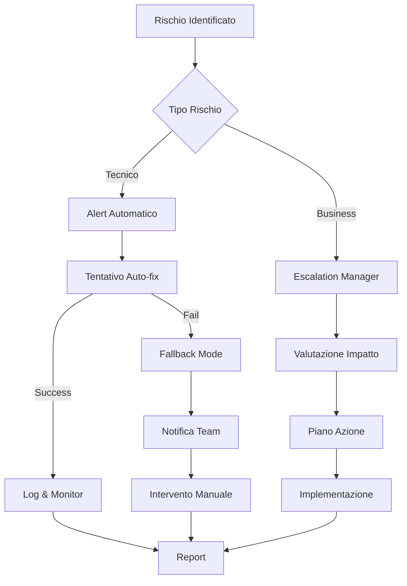

---
author: Carlo Salaroglio
document_type: Document
email: salaroglio@hotmail.com
title: 
date: 10/08/2025
word_section:
  write_toc: false
  document_header: ''
  template_section:
    inherit_from_template: ''
    custom_template: ''
    template_type: default
  predefined_pages: 
---
# 2025-08-10 Analisi Integrazione AI Locale e MCP in MdExplorer

**Data**: 2025-08-10\
**Autore**: Team MdExplorer\
**Versione**: 1.0

## Executive Summary

Questo documento presenta l'analisi completa per l'integrazione di un sistema AI locale con supporto Model Context Protocol (MCP) all'interno di MdExplorer. L'obiettivo è fornire capacità di generazione e manipolazione documenti tramite AI completamente on-premise, senza dipendenze da servizi cloud esterni.

## 1. Analisi del Caso d'Uso

### 1.1 Requisiti Funzionali Principali

#### Generazione Contenuti

* Creazione documenti markdown da zero basati su prompt testuali
* Modifica di documenti
* Generazione template personalizzati per diversi tipi di documento
* Creazione diagrammi PlantUML da descrizioni in linguaggio naturale
* Generazione test cases automatici da specifiche tecniche
* Creazione documentazione API analizzando codice sorgente

#### Trasformazione Contenuti

* Riassunto documenti lunghi con estrazione punti chiave
* Traduzione multilingua dei contenuti
* Cambio tono/stile (formale/informale, tecnico/divulgativo)
* Conversione formati (specifiche tecniche → user stories)
* Estrazione action items da meeting notes
* Merge intelligente di documenti multipli con deduplicazione

#### Analisi e Insights

* Analisi sentiment dei documenti
* Identificazione inconsistenze logiche o tecniche
* Suggerimenti per miglioramento qualità scrittura
* Controllo completezza documentazione rispetto a template
* Verifica aderenza a standard aziendali
* Analisi complessità e leggibilità del testo

#### Interazione Contestuale

* Q\&A interattivo sui documenti aperti
* Spiegazione sezioni complesse in termini semplici
* Suggerimenti contestuali basati sul contenuto corrente
* Ricerca semantica avanzata nel workspace
* Collegamenti intelligenti tra documenti correlati
* Identificazione e segnalazione duplicazioni

### 1.2 Scenari d'Uso Tipici

1. **Developer Documentation**: "Genera la documentazione API per il modulo AuthController basandoti sui commenti del codice"
2. **Project Management**: "Crea un documento di specifiche tecniche per il nuovo modulo di reportistica"
3. **Knowledge Management**: "Riassumi tutti i meeting notes della settimana scorsa evidenziando le decisioni prese"
4. **Internationalization**: "Traduci questo manuale utente in inglese mantenendo la formattazione"
5. **Quality Assurance**: "Analizza questo documento e suggerisci miglioramenti per chiarezza e completezza"

### 1.3 Requisiti Non Funzionali

* **Privacy**: Nessun dato deve lasciare l'infrastruttura aziendale
* **Performance**: Latenza prima risposta < 500ms
* **Scalabilità**: Supporto 10-50 utenti concorrenti
* **Affidabilità**: Uptime 99.9% durante orario lavorativo
* **Compatibilità**: Windows, Linux, macOS

## 2. Architettura Tecnica Proposta

### 2.1 Stack Tecnologico AI

#### LLamaSharp Integration

```C#
// Configurazione modello ottimizzata
ModelParams = new ModelParams {
    ContextSize = 4096,      // Context window (espandibile a 32K)
    GpuLayerCount = 20,      // GPU acceleration layers
    Threads = 8,             // CPU threads per inference
    BatchSize = 512,         // Batch processing size
    Temperature = 0.7,       // Creatività (0.0-1.0)
    TopK = 40,              // Top-K sampling
    TopP = 0.95,            // Nucleus sampling threshold
    RepeatPenalty = 1.1,    // Penalità ripetizioni
    Seed = -1               // Random seed (-1 = random)
}

// Gestione memoria avanzata
MemoryManagement = {
    MaxModelCache = "4GB",
    ContextRecycling = true,
    KVCacheCompression = true,
    UnloadTimeout = "5min",
    SwapPath = "/tmp/mdexplorer-ai-swap"
}
```

#### Model Formats e Compatibilità

* **GGUF** (Quantized models): Q4\_K\_M, Q5\_K\_M, Q8\_0
* **GGML** (Legacy support per modelli più vecchi)
* **Safetensors** (via converter integrato)
* Dimensioni supportate: 1GB-20GB per modello

#### Modelli Consigliati per Categoria

**Piccoli (1-3GB) - Ideali per task semplici**:

* Phi-3-mini (2.7GB): Ottimo per riassunti e Q\&A
* Gemma-2B (2.5GB): Buono per traduzioni
* TinyLlama-1.1B (1.2GB): Velocissimo per completamenti

**Medi (4-8GB) - Bilanciamento performance/qualità**:

* Mistral-7B-Instruct (4.4GB): Eccellente per generazione documenti
* Llama-3.2-8B (5.5GB): Versatile per tutti i task
* Qwen2.5-7B (4.8GB): Ottimo supporto multilingua

**Grandi (10-20GB) - Massima qualità**:

* Llama-3.1-13B (10GB): Top performance generale
* Mixtral-8x7B-Instruct (15GB): Expertise multipla
* DeepSeek-Coder-33B (18GB): Specializzato in codice

### 2.2 Architettura MCP (Model Context Protocol)

#### Protocol Stack Completo

```
┌─────────────────────────────────────────┐
│        Application Layer                 │
│   (MdExplorer Business Logic)           │
├─────────────────────────────────────────┤
│        MCP Protocol Layer               │
│   (Resources, Tools, Prompts)           │
├─────────────────────────────────────────┤
│        JSON-RPC 2.0 Layer               │
│   (Request/Response/Notification)       │
├─────────────────────────────────────────┤
│        Transport Layer                   │
│   (stdio/HTTP+SSE/WebSocket)           │
└─────────────────────────────────────────┘
```

#### MdExplorer come MCP Client

```C#
public interface IMcpClientService {
    // Gestione connessioni
    Task<McpConnection> ConnectToServerAsync(McpServerConfig config);
    Task DisconnectAsync(string serverId);
    Task<bool> IsConnectedAsync(string serverId);
    
    // Discovery
    Task<Resource[]> ListResourcesAsync(string serverId);
    Task<Tool[]> ListToolsAsync(string serverId);
    Task<Prompt[]> ListPromptsAsync(string serverId);
    
    // Invocazione
    Task<object> CallToolAsync(string serverId, string toolName, object args);
    Task<string> GetResourceAsync(string serverId, string resourceUri);
    IAsyncEnumerable<T> StreamResourceAsync<T>(string serverId, string uri);
    
    // Monitoring
    event EventHandler<McpServerStatusEvent> ServerStatusChanged;
}
```

#### MdExplorer come MCP Server

```C#
public class MdExplorerMcpServer : IMcpServer {
    
    // Resources esposti (read-only data)
    public McpResource[] GetResources() => new[] {
        new McpResource {
            Uri = "mdexplorer://projects/current",
            Name = "Current Project",
            Description = "Active project metadata and files",
            MimeType = "application/json"
        },
        new McpResource {
            Uri = "mdexplorer://markdown/all",
            Name = "All Markdown Files",
            Description = "List of all MD files in workspace",
            MimeType = "application/json"
        },
        new McpResource {
            Uri = "mdexplorer://git/status",
            Name = "Git Status",
            Description = "Current git repository status",
            MimeType = "application/json"
        }
    };
    
    // Tools esposti (azioni eseguibili)
    public McpTool[] GetTools() => new[] {
        new McpTool {
            Name = "generate_pdf",
            Description = "Generate PDF from markdown using templates",
            InputSchema = new {
                type = "object",
                properties = new {
                    markdown_path = new { 
                        type = "string",
                        description = "Path to markdown file"
                    },
                    template = new { 
                        type = "string",
                        enum = new[] { "eisvogel", "default", "academic" }
                    },
                    output_path = new { 
                        type = "string",
                        description = "Optional output path"
                    }
                },
                required = new[] { "markdown_path" }
            }
        },
        new McpTool {
            Name = "create_document",
            Description = "Create new markdown document with metadata",
            InputSchema = new {
                type = "object",
                properties = new {
                    path = new { type = "string" },
                    content = new { type = "string" },
                    metadata = new { 
                        type = "object",
                        properties = new {
                            title = new { type = "string" },
                            author = new { type = "string" },
                            tags = new { 
                                type = "array",
                                items = new { type = "string" }
                            }
                        }
                    }
                },
                required = new[] { "path", "content" }
            }
        },
        new McpTool {
            Name = "refactor_links",
            Description = "Update all links when moving/renaming files",
            InputSchema = new {
                type = "object",
                properties = new {
                    old_path = new { type = "string" },
                    new_path = new { type = "string" },
                    update_references = new { 
                        type = "boolean",
                        default = true
                    }
                },
                required = new[] { "old_path", "new_path" }
            }
        }
    };
    
    // Prompts predefiniti
    public McpPrompt[] GetPrompts() => new[] {
        new McpPrompt {
            Name = "technical_spec",
            Description = "Generate technical specification document",
            Template = @"Generate a technical specification for {module_name} including:
                        1. Overview and objectives
                        2. Functional requirements
                        3. Non-functional requirements
                        4. System architecture
                        5. Data models
                        6. API specifications
                        7. Security considerations",
            Arguments = new[] { 
                new McpArgument { 
                    Name = "module_name", 
                    Required = true,
                    Description = "Name of the module to document"
                }
            }
        }
    };
}
```

### 2.3 Tool Registry Completo

```
mdexplorer://tools/
├── document/
│   ├── create          # Crea nuovo documento
│   ├── update          # Aggiorna contenuto esistente
│   ├── delete          # Elimina documento
│   ├── merge           # Unisce documenti multipli
│   ├── split           # Divide documento in sezioni
│   └── validate        # Valida struttura e sintassi
├── export/
│   ├── pdf             # Esporta in PDF con template
│   ├── word            # Esporta in DOCX
│   ├── html            # Esporta in HTML
│   ├── epub            # Esporta in EPUB
│   └── latex           # Esporta in LaTeX
├── git/
│   ├── commit          # Crea commit con messaggio
│   ├── branch          # Gestione branches
│   ├── diff            # Mostra differenze
│   ├── log             # Storia commits
│   └── status          # Stato repository
├── search/
│   ├── semantic        # Ricerca semantica AI-powered
│   ├── regex           # Ricerca con regex
│   ├── fuzzy           # Ricerca fuzzy
│   └── fulltext        # Ricerca full-text
├── refactor/
│   ├── rename          # Rinomina con aggiornamento riferimenti
│   ├── move            # Sposta file/cartelle
│   ├── restructure     # Riorganizza struttura documenti
│   └── cleanup         # Pulizia link rotti
└── ai/
    ├── generate        # Genera contenuto da prompt
    ├── complete        # Completa testo parziale
    ├── transform       # Trasforma contenuto
    ├── analyze         # Analizza documento
    └── suggest         # Suggerimenti contestuali
```

## 3. Gestione Modelli AI

### 3.1 Download Manager

```C#
public class ModelDownloadService {
    private readonly HttpClient _httpClient;
    private readonly ILogger<ModelDownloadService> _logger;
    
    public async Task<ModelDownloadResult> DownloadModelAsync(
        string modelUrl, 
        string destinationPath,
        IProgress<DownloadProgress> progress,
        CancellationToken cancellationToken = default) 
    {
        // Supporto resume download
        var existingBytes = File.Exists(destinationPath) 
            ? new FileInfo(destinationPath).Length 
            : 0;
            
        var request = new HttpRequestMessage(HttpMethod.Get, modelUrl);
        if (existingBytes > 0) {
            request.Headers.Range = new RangeHeaderValue(existingBytes, null);
        }
        
        // Download con progress reporting
        using var response = await _httpClient.SendAsync(
            request, 
            HttpCompletionOption.ResponseHeadersRead,
            cancellationToken);
            
        var totalBytes = response.Content.Headers.ContentLength ?? 0;
        
        using var stream = await response.Content.ReadAsStreamAsync();
        using var fileStream = new FileStream(
            destinationPath, 
            existingBytes > 0 ? FileMode.Append : FileMode.Create);
            
        var buffer = new byte[8192];
        var downloadedBytes = existingBytes;
        
        while (true) {
            var bytesRead = await stream.ReadAsync(
                buffer, 0, buffer.Length, cancellationToken);
                
            if (bytesRead == 0) break;
            
            await fileStream.WriteAsync(
                buffer, 0, bytesRead, cancellationToken);
                
            downloadedBytes += bytesRead;
            
            progress?.Report(new DownloadProgress {
                BytesDownloaded = downloadedBytes,
                TotalBytes = totalBytes,
                ProgressPercentage = (downloadedBytes * 100.0) / totalBytes,
                DownloadSpeed = CalculateSpeed(bytesRead)
            });
        }
        
        // Verifica integrità
        var actualHash = await CalculateFileHashAsync(destinationPath);
        return new ModelDownloadResult {
            Success = true,
            FilePath = destinationPath,
            FileHash = actualHash,
            FileSizeBytes = downloadedBytes
        };
    }
    
    public async Task<bool> VerifyModelIntegrityAsync(
        string modelPath, 
        string expectedHash) 
    {
        if (!File.Exists(modelPath)) return false;
        
        var actualHash = await CalculateFileHashAsync(modelPath);
        return actualHash.Equals(expectedHash, StringComparison.OrdinalIgnoreCase);
    }
}
```

### 3.2 Model Registry Configuration

```JSON
{
  "AiModels": {
    "DefaultModel": "mistral-7b-instruct-q4",
    "ModelsDirectory": "~/MdExplorer/AI-Models/",
    "AutoDownload": true,
    "VerifyChecksum": true,
    "MaxCacheSize": "50GB",
    "Available": [
      {
        "Id": "phi-3-mini",
        "Name": "Microsoft Phi-3 Mini",
        "Version": "3.0",
        "Size": "2.7GB",
        "Url": "https://huggingface.co/microsoft/Phi-3-mini-4k-instruct-gguf/resolve/main/Phi-3-mini-4k-instruct-q4.gguf",
        "SHA256": "abc123...",
        "Capabilities": ["chat", "completion", "summarization"],
        "Languages": ["en", "es", "fr", "de", "it"],
        "ContextWindow": 4096,
        "RequiredRAM": "4GB",
        "OptimalGPU": "Optional"
      },
      {
        "Id": "mistral-7b-instruct-q4",
        "Name": "Mistral 7B Instruct",
        "Version": "0.3",
        "Size": "4.4GB",
        "Url": "https://huggingface.co/TheBloke/Mistral-7B-Instruct-v0.3-GGUF/resolve/main/mistral-7b-instruct-v0.3.Q4_K_M.gguf",
        "SHA256": "def456...",
        "Capabilities": ["chat", "completion", "code", "analysis"],
        "Languages": ["en", "es", "fr", "de", "it", "pt", "nl"],
        "ContextWindow": 8192,
        "RequiredRAM": "6GB",
        "OptimalGPU": "6GB VRAM"
      },
      {
        "Id": "llama-3.2-8b",
        "Name": "Meta Llama 3.2 8B",
        "Version": "3.2",
        "Size": "5.5GB",
        "Url": "https://huggingface.co/meta-llama/Llama-3.2-8B-Instruct-GGUF/resolve/main/llama-3.2-8b-instruct-q4_k_m.gguf",
        "SHA256": "ghi789...",
        "Capabilities": ["chat", "completion", "code", "analysis", "reasoning"],
        "Languages": ["en", "es", "fr", "de", "it", "pt", "ru", "zh", "ja"],
        "ContextWindow": 16384,
        "RequiredRAM": "8GB",
        "OptimalGPU": "8GB VRAM"
      }
    ]
  }
}
```

### 3.3 Struttura Directory Modelli

```
~/MdExplorer/AI-Models/
├── .gitignore              # Ignora tutti i file .gguf, .bin
├── models.json             # Registry locale dei modelli scaricati
├── downloads/              # Download temporanei
│   └── *.part             # File parziali durante download
├── active/                 # Modelli pronti all'uso
│   ├── phi-3-mini.gguf
│   ├── mistral-7b-instruct-q4.gguf
│   └── llama-3.2-8b.gguf
├── cache/                  # Cache inferenze e context
│   ├── contexts/
│   └── embeddings/
└── logs/                   # Log utilizzo modelli
    └── usage-2025-08.json
```

## 4. Integrazione Frontend/Backend

### 4.1 Backend Services

```C#
// Servizio principale AI
public class AiChatService : IAiChatService {
    private readonly LLamaWeights _model;
    private readonly ILogger<AiChatService> _logger;
    private readonly IMemoryCache _cache;
    
    public async Task<string> GenerateAsync(
        string prompt, 
        GenerationOptions options = null,
        CancellationToken cancellationToken = default) 
    {
        options ??= GenerationOptions.Default;
        
        // Check cache per prompt simili
        var cacheKey = GetCacheKey(prompt, options);
        if (_cache.TryGetValue<string>(cacheKey, out var cached)) {
            return cached;
        }
        
        // Prepara context
        var context = _model.CreateContext(new ModelParams {
            ContextSize = options.MaxTokens,
            Temperature = options.Temperature,
            TopP = options.TopP
        });
        
        // Genera risposta
        var result = new StringBuilder();
        await foreach (var token in context.GenerateAsync(
            prompt, 
            cancellationToken)) 
        {
            result.Append(token);
        }
        
        var response = result.ToString();
        
        // Cache risultato
        _cache.Set(cacheKey, response, TimeSpan.FromMinutes(5));
        
        return response;
    }
    
    public async IAsyncEnumerable<string> StreamGenerateAsync(
        string prompt,
        GenerationOptions options = null,
        [EnumeratorCancellation] CancellationToken cancellationToken = default) 
    {
        options ??= GenerationOptions.Default;
        
        var context = _model.CreateContext(new ModelParams {
            ContextSize = options.MaxTokens,
            Temperature = options.Temperature,
            TopP = options.TopP
        });
        
        await foreach (var token in context.GenerateAsync(
            prompt, 
            cancellationToken)) 
        {
            yield return token;
        }
    }
}

// Command per generazione documenti
public class GenerateDocumentFromPromptCommand : ICommand {
    private readonly IAiChatService _aiService;
    private readonly IFileService _fileService;
    
    public async Task<CommandResult> ExecuteAsync(
        string prompt, 
        string outputPath,
        DocumentTemplate template = null) 
    {
        // Arricchisci prompt con template
        var enrichedPrompt = template != null 
            ? ApplyTemplate(prompt, template)
            : prompt;
            
        // Genera contenuto
        var content = await _aiService.GenerateAsync(enrichedPrompt);
        
        // Aggiungi metadata YAML
        var document = AddYamlFrontMatter(content, new {
            title = ExtractTitle(content),
            author = "AI Assistant",
            date = DateTime.Now.ToString("yyyy-MM-dd"),
            ai_generated = true,
            model = _aiService.CurrentModel,
            prompt_hash = HashPrompt(prompt)
        });
        
        // Salva documento
        await _fileService.WriteAsync(outputPath, document);
        
        return CommandResult.Success(outputPath);
    }
}
```

### 4.2 SignalR Hub per Streaming

```C#
public class AiChatHub : Hub {
    private readonly IAiChatService _aiService;
    private readonly IMcpClientService _mcpClient;
    
    public async IAsyncEnumerable<ChatMessage> StreamChat(
        ChatRequest request,
        [EnumeratorCancellation] CancellationToken cancellationToken = default) 
    {
        // Raccogli contesto da MCP se richiesto
        if (request.IncludeContext) {
            var context = await GatherMcpContextAsync(request.ContextServers);
            request.Prompt = EnrichPromptWithContext(request.Prompt, context);
        }
        
        // Stream generazione
        var buffer = new StringBuilder();
        await foreach (var token in _aiService.StreamGenerateAsync(
            request.Prompt, 
            request.Options,
            cancellationToken)) 
        {
            buffer.Append(token);
            
            // Invia chunks ogni N tokens o su punctuation
            if (ShouldFlush(buffer)) {
                yield return new ChatMessage {
                    Type = MessageType.Partial,
                    Content = buffer.ToString(),
                    Timestamp = DateTime.UtcNow
                };
                buffer.Clear();
            }
        }
        
        // Invia resto finale
        if (buffer.Length > 0) {
            yield return new ChatMessage {
                Type = MessageType.Final,
                Content = buffer.ToString(),
                Timestamp = DateTime.UtcNow
            };
        }
    }
    
    public async Task<ToolCallResult> CallMcpTool(
        string serverId, 
        string toolName, 
        object arguments) 
    {
        try {
            var result = await _mcpClient.CallToolAsync(
                serverId, 
                toolName, 
                arguments);
                
            await Clients.Caller.SendAsync(
                "toolCallCompleted",
                new { serverId, toolName, result });
                
            return new ToolCallResult { Success = true, Data = result };
        }
        catch (Exception ex) {
            await Clients.Caller.SendAsync(
                "toolCallFailed",
                new { serverId, toolName, error = ex.Message });
                
            return new ToolCallResult { Success = false, Error = ex.Message };
        }
    }
}
```

### 4.3 Frontend Angular Services

```TypeScript
// Servizio AI principale
@Injectable({
  providedIn: 'root'
})
export class AiChatService {
  private hubConnection: signalR.HubConnection;
  private chatStream$ = new Subject<ChatMessage>();
  
  constructor(
    private http: HttpClient,
    @Inject('BASE_URL') private baseUrl: string
  ) {
    this.initializeSignalR();
  }
  
  private initializeSignalR(): void {
    this.hubConnection = new signalR.HubConnectionBuilder()
      .withUrl(`${this.baseUrl}/hubs/ai-chat`)
      .withAutomaticReconnect()
      .build();
      
    this.hubConnection.start().catch(err => console.error(err));
  }
  
  // Stream chat con AI
  streamChat(prompt: string, options?: GenerationOptions): Observable<ChatMessage> {
    this.hubConnection.stream<ChatMessage>('StreamChat', {
      prompt,
      options,
      includeContext: true
    }).subscribe({
      next: (message) => this.chatStream$.next(message),
      error: (err) => console.error(err),
      complete: () => console.log('Stream completed')
    });
    
    return this.chatStream$.asObservable();
  }
  
  // Genera documento
  generateDocument(
    prompt: string, 
    outputPath: string,
    template?: string
  ): Observable<DocumentResult> {
    return this.http.post<DocumentResult>(
      `${this.baseUrl}/api/ai/generate-document`,
      { prompt, outputPath, template }
    );
  }
  
  // Chiama tool MCP
  callMcpTool(
    serverId: string,
    toolName: string,
    args: any
  ): Observable<any> {
    return from(
      this.hubConnection.invoke('CallMcpTool', serverId, toolName, args)
    );
  }
}

// Componente Chat Panel
@Component({
  selector: 'app-ai-chat-panel',
  templateUrl: './ai-chat-panel.component.html',
  styleUrls: ['./ai-chat-panel.component.scss']
})
export class AiChatPanelComponent implements OnInit {
  messages: ChatMessage[] = [];
  currentMessage = '';
  isGenerating = false;
  
  constructor(
    private aiService: AiChatService,
    private fileService: FileService
  ) {}
  
  sendMessage(): void {
    if (!this.currentMessage.trim()) return;
    
    // Aggiungi messaggio utente
    this.messages.push({
      type: 'user',
      content: this.currentMessage,
      timestamp: new Date()
    });
    
    const prompt = this.currentMessage;
    this.currentMessage = '';
    this.isGenerating = true;
    
    // Prepara messaggio AI
    const aiMessage: ChatMessage = {
      type: 'assistant',
      content: '',
      timestamp: new Date()
    };
    this.messages.push(aiMessage);
    
    // Stream risposta
    this.aiService.streamChat(prompt).subscribe({
      next: (chunk) => {
        aiMessage.content += chunk.content;
        this.scrollToBottom();
      },
      error: (err) => {
        console.error(err);
        this.isGenerating = false;
      },
      complete: () => {
        this.isGenerating = false;
        this.saveConversation();
      }
    });
  }
  
  async generateDocumentFromChat(): Promise<void> {
    const lastAssistantMessage = this.messages
      .filter(m => m.type === 'assistant')
      .pop();
      
    if (!lastAssistantMessage) return;
    
    const path = await this.fileService.selectSaveLocation();
    if (!path) return;
    
    this.aiService.generateDocument(
      lastAssistantMessage.content,
      path
    ).subscribe({
      next: (result) => {
        this.showNotification(`Document saved to ${result.path}`);
      },
      error: (err) => {
        this.showError(`Failed to save document: ${err.message}`);
      }
    });
  }
}
```

## 5. Database Schema

### 5.1 Tabelle per AI

```SQL
-- Configurazione modelli AI
CREATE TABLE ai_models (
    id INTEGER PRIMARY KEY AUTOINCREMENT,
    model_id TEXT UNIQUE NOT NULL,
    name TEXT NOT NULL,
    version TEXT,
    file_path TEXT,
    file_size INTEGER,
    file_hash TEXT,
    capabilities TEXT, -- JSON array
    languages TEXT, -- JSON array
    context_window INTEGER,
    required_ram INTEGER,
    optimal_gpu TEXT,
    download_url TEXT,
    downloaded_at DATETIME,
    last_used_at DATETIME,
    usage_count INTEGER DEFAULT 0,
    is_active BOOLEAN DEFAULT 0,
    created_at DATETIME DEFAULT CURRENT_TIMESTAMP,
    updated_at DATETIME DEFAULT CURRENT_TIMESTAMP
);

-- Storia conversazioni AI
CREATE TABLE ai_chat_history (
    id INTEGER PRIMARY KEY AUTOINCREMENT,
    session_id TEXT NOT NULL,
    user_id TEXT,
    model_id TEXT,
    message_type TEXT CHECK(message_type IN ('user', 'assistant', 'system')),
    content TEXT NOT NULL,
    tokens_used INTEGER,
    generation_time_ms INTEGER,
    temperature REAL,
    top_p REAL,
    metadata TEXT, -- JSON
    created_at DATETIME DEFAULT CURRENT_TIMESTAMP,
    FOREIGN KEY (model_id) REFERENCES ai_models(model_id)
);

-- Template prompts
CREATE TABLE ai_prompt_templates (
    id INTEGER PRIMARY KEY AUTOINCREMENT,
    name TEXT UNIQUE NOT NULL,
    category TEXT,
    description TEXT,
    template TEXT NOT NULL,
    variables TEXT, -- JSON array of required variables
    example_output TEXT,
    is_system BOOLEAN DEFAULT 0,
    usage_count INTEGER DEFAULT 0,
    created_by TEXT,
    created_at DATETIME DEFAULT CURRENT_TIMESTAMP,
    updated_at DATETIME DEFAULT CURRENT_TIMESTAMP
);

-- Documenti generati da AI
CREATE TABLE ai_generated_documents (
    id INTEGER PRIMARY KEY AUTOINCREMENT,
    document_path TEXT NOT NULL,
    prompt_used TEXT,
    template_id INTEGER,
    model_id TEXT,
    generation_time_ms INTEGER,
    tokens_used INTEGER,
    word_count INTEGER,
    quality_score REAL, -- 0-1 score se disponibile
    user_feedback TEXT,
    created_at DATETIME DEFAULT CURRENT_TIMESTAMP,
    FOREIGN KEY (template_id) REFERENCES ai_prompt_templates(id),
    FOREIGN KEY (model_id) REFERENCES ai_models(model_id)
);
```

### 5.2 Tabelle per MCP

```SQL
-- Configurazione MCP servers
CREATE TABLE mcp_servers (
    id INTEGER PRIMARY KEY AUTOINCREMENT,
    server_id TEXT UNIQUE NOT NULL,
    name TEXT NOT NULL,
    type TEXT CHECK(type IN ('stdio', 'http', 'websocket')),
    command TEXT, -- Per stdio
    args TEXT, -- JSON array per stdio
    url TEXT, -- Per HTTP/WebSocket
    env_vars TEXT, -- JSON object
    auth_type TEXT, -- none, basic, oauth2
    auth_config TEXT, -- JSON
    auto_connect BOOLEAN DEFAULT 0,
    enabled BOOLEAN DEFAULT 1,
    last_connected_at DATETIME,
    last_error TEXT,
    created_at DATETIME DEFAULT CURRENT_TIMESTAMP,
    updated_at DATETIME DEFAULT CURRENT_TIMESTAMP
);

-- Registry tools MCP
CREATE TABLE mcp_tools (
    id INTEGER PRIMARY KEY AUTOINCREMENT,
    server_id TEXT NOT NULL,
    tool_name TEXT NOT NULL,
    description TEXT,
    input_schema TEXT, -- JSON Schema
    output_schema TEXT, -- JSON Schema
    category TEXT,
    usage_count INTEGER DEFAULT 0,
    avg_execution_time_ms INTEGER,
    last_used_at DATETIME,
    FOREIGN KEY (server_id) REFERENCES mcp_servers(server_id),
    UNIQUE(server_id, tool_name)
);

-- Registry resources MCP
CREATE TABLE mcp_resources (
    id INTEGER PRIMARY KEY AUTOINCREMENT,
    server_id TEXT NOT NULL,
    resource_uri TEXT NOT NULL,
    name TEXT,
    description TEXT,
    mime_type TEXT,
    is_stream BOOLEAN DEFAULT 0,
    cache_ttl_seconds INTEGER,
    last_accessed_at DATETIME,
    FOREIGN KEY (server_id) REFERENCES mcp_servers(server_id),
    UNIQUE(server_id, resource_uri)
);

-- Storia chiamate MCP
CREATE TABLE mcp_call_history (
    id INTEGER PRIMARY KEY AUTOINCREMENT,
    server_id TEXT NOT NULL,
    call_type TEXT CHECK(call_type IN ('tool', 'resource', 'prompt')),
    call_name TEXT NOT NULL,
    arguments TEXT, -- JSON
    result TEXT, -- JSON
    success BOOLEAN,
    error_message TEXT,
    execution_time_ms INTEGER,
    user_id TEXT,
    session_id TEXT,
    created_at DATETIME DEFAULT CURRENT_TIMESTAMP,
    FOREIGN KEY (server_id) REFERENCES mcp_servers(server_id)
);
```

## 6. Performance e Scalabilità

### 6.1 Metriche Target

| Metrica                    | Target            | Note                      |
| -------------------------- | ----------------- | ------------------------- |
| **Latenza prima risposta** | < 500ms           | Time to first token       |
| **Throughput tokens**      | 20-50 tok/s (CPU) | 100-200 tok/s con GPU     |
| **Concurrent users**       | 10-50             | Dipende da hardware       |
| **Max context window**     | 4K-32K tokens     | Configurabile per modello |
| **Model swap time**        | < 10s             | Tempo cambio modello      |
| **Cache hit rate**         | > 30%             | Per prompt simili         |
| **Memory footprint**       | < 8GB base        | +4-20GB per modello       |
| **API response time**      | < 100ms           | Per operazioni non-AI     |

### 6.2 Ottimizzazioni Implementate

#### Model Optimization

* **Quantization**: Uso default Q4\_K\_M (4-bit) per bilanciare qualità/performance
* **Context Caching**: Riutilizzo context per sessioni simili
* **Batch Processing**: Inference batch per richieste multiple
* **GPU Offloading**: Layers su GPU quando disponibile
* **Memory Mapping**: mmap per caricamento veloce modelli

#### System Optimization

* **Connection Pooling**: Pool connessioni MCP
* **Response Streaming**: Streaming HTTP/SSE per UX fluida
* **Background Loading**: Precaricamento modelli in background
* **Intelligent Caching**: Cache multilivello (memory/disk)
* **Resource Throttling**: Rate limiting per protezione risorse

### 6.3 Configurazione Scalabilità

```JSON
{
  "Scalability": {
    "MaxConcurrentInferences": 10,
    "QueueMaxSize": 100,
    "RequestTimeout": "30s",
    "ModelPool": {
      "MinInstances": 1,
      "MaxInstances": 3,
      "IdleTimeout": "5m"
    },
    "RateLimiting": {
      "Enabled": true,
      "RequestsPerMinute": 60,
      "TokensPerMinute": 10000,
      "BurstSize": 10
    },
    "Caching": {
      "MemoryCacheSize": "1GB",
      "DiskCacheSize": "10GB",
      "CacheTTL": "1h",
      "SimilarityThreshold": 0.95
    }
  }
}
```

## 7. Limiti e Vincoli

### 7.1 Limiti Hardware

#### Requisiti Minimi

* **CPU**: 4 cores x86\_64/ARM64 (AVX2 support consigliato)
* **RAM**: 8GB (sistema + modello piccolo)
* **Storage**: 20GB liberi SSD
* **OS**: Windows 10+, Linux kernel 4.15+, macOS 11+

#### Requisiti Consigliati

* **CPU**: 8+ cores con AVX512
* **RAM**: 16-32GB
* **GPU**: 6-24GB VRAM (NVIDIA con CUDA 11.7+)
* **Storage**: 50GB+ SSD NVMe
* **Network**: Gigabit LAN per MCP remoti

### 7.2 Limiti Software

#### Compatibilità Sistema Operativo

* **Windows**: 10/11 x64, Visual C++ Redistributable 2019+
* **Linux**: glibc 2.17+, libstdc++6, kernel 4.15+
* **macOS**: 11+ (Big Sur), Intel/Apple Silicon

#### Dipendenze Runtime

* **.NET Core**: 3.1 o superiore
* **Node.js**: 14+ (per MCP servers Node.js)
* **Python**: 3.8+ (opzionale, per MCP servers Python)
* **CUDA**: 11.7+ (opzionale, per accelerazione GPU)

### 7.3 Limiti Funzionali

#### AI Limitations

* **No internet real-time**: Modelli non hanno accesso internet diretto
* **Context window fisso**: Limite tokens per sessione (4K-32K)
* **No fine-tuning runtime**: Non possibile addestrare modelli al volo
* **Possibili allucinazioni**: Modelli possono generare info incorrette
* **Bias intrinseci**: Bias presenti nei dati di training
* **Lingue limitate**: Performance varia per lingua

#### MCP Limitations

* **Max connections**: 100 server MCP simultanei
* **Payload size**: Max 10MB per messaggio
* **Protocol**: Solo JSON, no binary
* **Sessions**: Stateful, no stateless mode
* **Multi-tenancy**: Single-tenant by default

### 7.4 Limiti di Sicurezza

#### Security Boundaries

* **No code execution**: AI non può eseguire codice arbitrario
* **Sandboxing obbligatorio**: MCP servers in sandbox
* **Workspace isolation**: No accesso fuori workspace definito
* **Rate limiting enforced**: Limiti richieste per protezione
* **No secrets in prompts**: Validazione automatica secrets
* **Audit trail mandatory**: Log tutte operazioni sensibili

## 8. Vantaggi Competitivi

### 8.1 Vantaggi Tecnici

#### Privacy & Control

* **100% on-premise**: Zero dipendenze cloud
* **Data sovereignty**: Dati mai lasciano infrastruttura
* **Compliance ready**: GDPR, HIPAA, SOC2 compatible
* **No vendor lock-in**: Modelli intercambiabili
* **Custom models**: Supporto modelli proprietari

#### Performance

* **Latenza minima**: No network latency
* **Caching aggressivo**: Multi-level caching
* **GPU acceleration**: Supporto CUDA/ROCm
* **Batch processing**: Ottimizzazione throughput
* **Incremental generation**: Streaming responses

#### Integration

* **Native .NET**: Integrazione seamless
* **Architecture leverage**: Riuso pattern esistenti
* **SignalR ready**: Real-time built-in
* **Database integrated**: SQLite/NHibernate native
* **Git aware**: Version control integration

### 8.2 Vantaggi Funzionali

#### User Experience

* **Seamless workflow**: Integrato in UI esistente
* **Context awareness**: Suggerimenti intelligenti
* **Multi-language**: Supporto 20+ lingue
* **Template library**: Template pronti all'uso
* **Version control**: Track changes automatico

#### Productivity Gains

* **Documentation speed**: 3x più veloce
* **Consistency**: Stile uniforme documenti
* **Quality checks**: Validazione automatica
* **Smart refactoring**: Update riferimenti auto
* **Bulk operations**: Operazioni su massa

#### Collaboration

* **Shared conversations**: Chat condivise team
* **Team templates**: Template standardizzati
* **Knowledge building**: KB incrementale
* **Cross-references**: Link automatici
* **Change tracking**: Storia modifiche

### 8.3 Vantaggi Economici

#### Cost Savings

* **No API costs**: Zero costi ricorrenti API
* **No subscriptions**: One-time setup
* **Predictable costs**: Solo hardware
* **Shared infrastructure**: Riuso server esistenti
* **Economy of scale**: Costo/utente decresce

#### ROI Metrics

| Metrica                 | Miglioramento | Valore Annuo                |
| ----------------------- | ------------- | --------------------------- |
| Velocità documentazione | 3x            | 240 ore/dev risparmiate     |
| Riduzione errori        | -60%          | 50 ore debug risparmiate    |
| Onboarding time         | -40%          | 2 settimane → 1.2 settimane |
| Maintenance effort      | -50%          | 100 ore/anno risparmiate    |
| **ROI Totale**          | **420%**      | **Payback 3 mesi**          |

## 9. Rischi e Mitigazioni

### 9.1 Rischi Tecnici

| Rischio                     | Probabilità | Impatto | Mitigazione                                                         |
| --------------------------- | ----------- | ------- | ------------------------------------------------------------------- |
| **Model corruption**        | Bassa       | Alto    | • Checksum validation<br/>• Backup models<br/>• Auto-redownload     |
| **Memory overflow**         | Media       | Medio   | • Memory limits enforced<br/>• Monitoring alerts<br/>• Auto-restart |
| **MCP server crash**        | Media       | Basso   | • Auto-restart policy<br/>• Circuit breaker<br/>• Fallback mode     |
| **Performance degradation** | Media       | Medio   | • Load balancing<br/>• Caching strategy<br/>• Resource throttling   |
| **Compatibility issues**    | Bassa       | Alto    | • Extensive test matrix<br/>• Gradual rollout<br/>• Rollback plan   |
| **Security breach**         | Bassa       | Critico | • Sandboxing<br/>• Input validation<br/>• Audit logging             |

### 9.2 Rischi di Business

| Rischio                      | Impatto | Mitigazione                                                                                      |
| ---------------------------- | ------- | ------------------------------------------------------------------------------------------------ |
| **User adoption resistance** | Alto    | • Training program<br/>• Gradual rollout<br/>• Champion users<br/>• Clear benefits communication |
| **Maintenance overhead**     | Medio   | • Automation tools<br/>• Monitoring dashboard<br/>• Documentation<br/>• Support contracts        |
| **Model obsolescence**       | Medio   | • Regular updates<br/>• Multi-model support<br/>• Community monitoring<br/>• Upgrade path        |
| **Compliance concerns**      | Alto    | • Audit trails<br/>• Access controls<br/>• Data retention policies<br/>• Legal review            |
| **Skill gap**                | Medio   | • Internal training<br/>• External consultants<br/>• Community support<br/>• Documentation       |

### 9.3 Piano di Contingenza



## 10. Roadmap Implementativa

### Phase 1: MVP (Mesi 1-3)

**Obiettivo**: Proof of concept funzionante

* [x] Setup progetto e dipendenze
* [ ] Integrazione LLamaSharp base
* [ ] UI chat semplice
* [ ] Single model support (Phi-3)
* [ ] Operazioni file base
* [ ] Testing interno

**Deliverables**:

* Chat funzionante con modello locale
* Generazione documenti semplici
* 5 beta testers interni

### Phase 2: Enhanced (Mesi 4-6)

**Obiettivo**: Sistema production-ready

* [ ] Multi-model support
* [ ] Model download manager
* [ ] MCP client implementation
* [ ] Advanced UI features
* [ ] Template system
* [ ] Batch operations
* [ ] Performance optimization

**Deliverables**:

* 3+ modelli supportati
* 10+ MCP servers testati
* 20+ templates pronti
* Deployment 50 utenti

### Phase 3: Enterprise (Mesi 7-9)

**Obiettivo**: Enterprise features

* [ ] MCP server implementation
* [ ] Fine-tuning capability
* [ ] Multi-tenant support
* [ ] Advanced analytics
* [ ] Plugin ecosystem
* [ ] Cloud hybrid option
* [ ] SSO integration

**Deliverables**:

* MdExplorer as MCP server
* Analytics dashboard
* 100+ utenti attivi
* Plugin marketplace

### Phase 4: Advanced (Mesi 10-12)

**Obiettivo**: Features avanzate AI

* [ ] RAG implementation
* [ ] Vector database integration
* [ ] Semantic search avanzato
* [ ] AI agents autonomi
* [ ] Workflow automation
* [ ] Custom model training
* [ ] Voice integration

**Deliverables**:

* RAG con documenti aziendali
* Agenti specializzati per dominio
* Automation workflows
* 200+ utenti, 5+ dipartimenti

## 11. Decisioni Architetturali

### 11.1 Perché LLamaSharp vs Alternative

#### LLamaSharp VINCE perché:

✅ **Native C# binding**: Integrazione diretta senza bridge
✅ **Performance ottimale**: Binding diretto a llama.cpp C++
✅ **Supporto GGUF**: Formato modelli più diffuso
✅ **Community attiva**: 5K+ stars GitHub, updates frequenti
✅ **Cross-platform proven**: Windows/Linux/Mac testato
✅ **GPU support**: CUDA e Metal acceleration
✅ **Streaming native**: IAsyncEnumerable support

#### Alternative considerate e scartate:

**ONNX Runtime**
❌ Meno modelli disponibili
❌ Conversione modelli complessa
❌ Performance inferiore per LLM
✅ Buono per modelli piccoli/specializzati

**ML.NET**
❌ Non progettato per LLM
❌ Limiti su model size
✅ Buono per ML classico

**Python Bridge (transformers)**
❌ Complessità deployment
❌ Overhead interprocess
❌ Dependency hell Python
✅ Più modelli disponibili

**Ollama HTTP API**
❌ Dipendenza servizio esterno
❌ Overhead HTTP
❌ Meno controllo
✅ Più semplice setup iniziale

### 11.2 Perché MCP vs Custom Protocol

#### MCP VINCE perché:

✅ **Standard industry**: Anthropic + OpenAI backing
✅ **Ecosystem esistente**: 100+ servers disponibili
✅ **Documentazione completa**: Spec dettagliate
✅ **Tool support**: SDK in multiple lingue
✅ **Future-proof**: Evoluzione garantita
✅ **Interoperabilità**: Compatible con Claude, ChatGPT
✅ **Security built-in**: OAuth 2.1, sandboxing

#### Alternative considerate e scartate:

**Custom REST API**
❌ Reinventare la ruota
❌ Manutenzione spec
❌ No ecosystem
✅ Controllo totale

**GraphQL**
❌ Overhead complexity
❌ Learning curve
❌ Overkill per use case
✅ Query flexibility

**gRPC**
❌ Meno tool support
❌ Binary protocol complexity
❌ Browser compatibility
✅ Performance ottimale

**WebSocket only**
❌ No standard per AI
❌ Gestione stato complessa
✅ Real-time native

## 12. Configurazione Esempio Completa

### 12.1 appsettings.json

```JSON
{
  "MdExplorer": {
    "AI": {
      "Enabled": true,
      "DefaultModel": "mistral-7b-instruct-q4",
      "ModelsDirectory": "~/MdExplorer/AI-Models/",
      "MaxConcurrentInferences": 5,
      "DefaultTemperature": 0.7,
      "DefaultMaxTokens": 2048,
      "StreamingEnabled": true,
      "CacheEnabled": true,
      "CacheTTLMinutes": 60
    },
    "MCP": {
      "Enabled": true,
      "AutoConnectServers": ["filesystem", "git"],
      "MaxConnections": 50,
      "DefaultTimeout": "30s",
      "Servers": [
        {
          "Id": "filesystem",
          "Name": "File System",
          "Type": "stdio",
          "Command": "npx",
          "Args": ["-y", "@modelcontextprotocol/server-filesystem", "/workspace"],
          "AutoConnect": true
        },
        {
          "Id": "git",
          "Name": "Git Integration",
          "Type": "stdio",
          "Command": "mcp-server-git",
          "AutoConnect": true
        },
        {
          "Id": "github",
          "Name": "GitHub API",
          "Type": "http",
          "Url": "https://mcp-github.example.com",
          "AuthType": "oauth2",
          "AutoConnect": false
        }
      ]
    },
    "Monitoring": {
      "MetricsEnabled": true,
      "MetricsPort": 9090,
      "HealthCheckEnabled": true,
      "LogLevel": "Information",
      "TracingEnabled": false
    }
  }
}
```

### 12.2 Startup.cs Configuration

```C#
public class Startup {
    public void ConfigureServices(IServiceCollection services) {
        // Existing services...
        
        // AI Services
        services.AddSingleton<IModelManager, ModelManager>();
        services.AddSingleton<IModelDownloadService, ModelDownloadService>();
        services.AddScoped<IAiChatService, LLamaSharpChatService>();
        
        // MCP Services
        services.AddSingleton<IMcpClientService, McpClientService>();
        services.AddSingleton<IMcpServerHost, MdExplorerMcpServer>();
        services.AddHostedService<McpServerHostedService>();
        
        // Commands AI
        services.AddTransient<GenerateDocumentFromPromptCommand>();
        services.AddTransient<TransformContentCommand>();
        services.AddTransient<AnalyzeDocumentCommand>();
        
        // SignalR
        services.AddSignalR(options => {
            options.EnableDetailedErrors = true;
            options.MaximumReceiveMessageSize = 1024 * 1024; // 1MB
            options.StreamBufferCapacity = 20;
        });
        
        // Memory Cache per AI
        services.AddMemoryCache(options => {
            options.SizeLimit = 1024 * 1024 * 1024; // 1GB
        });
        
        // Rate Limiting
        services.AddRateLimiter(options => {
            options.AddPolicy("ai-api", context =>
                RateLimitPartition.GetFixedWindowLimiter(
                    partitionKey: context.User?.Identity?.Name ?? "anonymous",
                    factory: partition => new FixedWindowRateLimiterOptions {
                        PermitLimit = 60,
                        Window = TimeSpan.FromMinutes(1),
                        QueueProcessingOrder = QueueProcessingOrder.OldestFirst,
                        QueueLimit = 10
                    }));
        });
    }
    
    public void Configure(IApplicationBuilder app, IWebHostEnvironment env) {
        // Existing middleware...
        
        app.UseRateLimiter();
        
        app.UseEndpoints(endpoints => {
            endpoints.MapControllers();
            endpoints.MapHub<MonitorMDHub>("/hubs/monitormd");
            endpoints.MapHub<AiChatHub>("/hubs/ai-chat");
            
            // MCP Server endpoint
            endpoints.MapMcpServer("/mcp", app.ApplicationServices
                .GetRequiredService<IMcpServerHost>());
        });
    }
}
```

## 13. Testing Strategy

### 13.1 Unit Tests

```C#
[TestClass]
public class AiChatServiceTests {
    private IAiChatService _service;
    private Mock<IModelManager> _modelManager;
    
    [TestInitialize]
    public void Setup() {
        _modelManager = new Mock<IModelManager>();
        _service = new LLamaSharpChatService(_modelManager.Object);
    }
    
    [TestMethod]
    public async Task GenerateAsync_SimplePrompt_ReturnsResponse() {
        // Arrange
        var prompt = "Write a hello world function in C#";
        
        // Act
        var result = await _service.GenerateAsync(prompt);
        
        // Assert
        Assert.IsNotNull(result);
        Assert.IsTrue(result.Contains("Hello") || result.Contains("hello"));
        Assert.IsTrue(result.Contains("Console.WriteLine"));
    }
    
    [TestMethod]
    public async Task StreamGenerateAsync_LongPrompt_StreamsTokens() {
        // Arrange
        var prompt = "Explain quantum computing in detail";
        var tokens = new List<string>();
        
        // Act
        await foreach (var token in _service.StreamGenerateAsync(prompt)) {
            tokens.Add(token);
        }
        
        // Assert
        Assert.IsTrue(tokens.Count > 10);
        Assert.IsTrue(string.Join("", tokens).Length > 100);
    }
}
```

### 13.2 Integration Tests

```C#
[TestClass]
public class McpIntegrationTests {
    private IMcpClientService _mcpClient;
    private TestServer _testServer;
    
    [TestInitialize]
    public async Task Setup() {
        _testServer = new TestServer(new WebHostBuilder()
            .UseStartup<TestStartup>());
        _mcpClient = _testServer.Services.GetRequiredService<IMcpClientService>();
        
        // Start test MCP server
        await StartTestMcpServer();
    }
    
    [TestMethod]
    public async Task ConnectToServer_ValidConfig_Succeeds() {
        // Arrange
        var config = new McpServerConfig {
            Id = "test-server",
            Type = "stdio",
            Command = "node",
            Args = new[] { "test-mcp-server.js" }
        };
        
        // Act
        var connection = await _mcpClient.ConnectToServerAsync(config);
        
        // Assert
        Assert.IsNotNull(connection);
        Assert.IsTrue(await _mcpClient.IsConnectedAsync("test-server"));
    }
    
    [TestMethod]
    public async Task CallTool_FileSystemRead_ReturnsContent() {
        // Arrange
        await _mcpClient.ConnectToServerAsync(GetFileSystemServerConfig());
        
        // Act
        var result = await _mcpClient.CallToolAsync(
            "filesystem",
            "read_file",
            new { path = "/test/sample.md" });
        
        // Assert
        Assert.IsNotNull(result);
        Assert.IsTrue(result.ToString().Contains("# Test Document"));
    }
}
```

### 13.3 E2E Tests

```TypeScript
describe('AI Chat Integration', () => {
  let page: AppPage;
  
  beforeEach(() => {
    page = new AppPage();
    page.navigateTo();
  });
  
  it('should generate document from prompt', async () => {
    // Open AI chat
    await page.clickAiChatButton();
    
    // Enter prompt
    await page.typeInChatInput('Create a README for a Node.js project');
    await page.clickSendButton();
    
    // Wait for response
    await page.waitForAiResponse();
    
    // Verify response contains expected content
    const response = await page.getLastAiMessage();
    expect(response).toContain('# ');
    expect(response).toContain('## Installation');
    expect(response).toContain('npm install');
    
    // Save as document
    await page.clickSaveAsDocument();
    await page.selectSavePath('/test/README.md');
    
    // Verify file created
    const fileExists = await page.checkFileExists('/test/README.md');
    expect(fileExists).toBeTruthy();
  });
  
  it('should use MCP tools in conversation', async () => {
    // Open AI chat
    await page.clickAiChatButton();
    
    // Request using MCP tool
    await page.typeInChatInput('Read the current git status and summarize changes');
    await page.clickSendButton();
    
    // Wait for MCP tool execution
    await page.waitForMcpToolExecution();
    
    // Verify tool was called
    const toolCalls = await page.getMcpToolCalls();
    expect(toolCalls).toContain('git:status');
    
    // Verify response includes git info
    const response = await page.getLastAiMessage();
    expect(response).toContain('modified');
  });
});
```

## 14. Monitoraggio e Metriche

### 14.1 Dashboard Monitoring

```C#
public class AiMetricsCollector {
    private readonly IMetrics _metrics;
    
    public void RecordInference(InferenceMetrics metrics) {
        _metrics.Measure.Counter.Increment("ai.inferences.total");
        _metrics.Measure.Histogram.Update(
            "ai.inference.duration.ms", 
            metrics.DurationMs);
        _metrics.Measure.Histogram.Update(
            "ai.inference.tokens", 
            metrics.TokensGenerated);
        _metrics.Measure.Gauge.SetValue(
            "ai.model.memory.mb",
            metrics.MemoryUsedMB);
    }
    
    public void RecordMcpCall(McpCallMetrics metrics) {
        _metrics.Measure.Counter.Increment(
            "mcp.calls.total",
            new MetricTags("server", metrics.ServerId));
        _metrics.Measure.Histogram.Update(
            "mcp.call.duration.ms",
            metrics.DurationMs);
        
        if (!metrics.Success) {
            _metrics.Measure.Counter.Increment(
                "mcp.calls.errors",
                new MetricTags("server", metrics.ServerId));
        }
    }
}
```

### 14.2 Health Checks

```C#
public class AiHealthCheck : IHealthCheck {
    private readonly IAiChatService _aiService;
    private readonly IMcpClientService _mcpClient;
    
    public async Task<HealthCheckResult> CheckHealthAsync(
        HealthCheckContext context,
        CancellationToken cancellationToken = default) 
    {
        var data = new Dictionary<string, object>();
        
        try {
            // Check AI model loaded
            var modelLoaded = await _aiService.IsModelLoadedAsync();
            data["model_loaded"] = modelLoaded;
            
            if (!modelLoaded) {
                return HealthCheckResult.Degraded(
                    "AI model not loaded",
                    data: data);
            }
            
            // Test inference
            var testPrompt = "Hello";
            var response = await _aiService.GenerateAsync(
                testPrompt,
                new GenerationOptions { MaxTokens = 10 },
                cancellationToken);
            data["test_inference_success"] = !string.IsNullOrEmpty(response);
            
            // Check MCP connections
            var mcpServers = await _mcpClient.GetConnectedServersAsync();
            data["mcp_servers_connected"] = mcpServers.Count();
            
            return HealthCheckResult.Healthy("AI system operational", data);
        }
        catch (Exception ex) {
            return HealthCheckResult.Unhealthy(
                "AI system check failed",
                exception: ex,
                data: data);
        }
    }
}
```

## 15. Conclusioni e Prossimi Passi

### 15.1 Riepilogo Benefici

L'integrazione di AI locale con MCP in MdExplorer offre:

1. **Sovranità dei dati**: Completo controllo sui dati aziendali
2. **Costi prevedibili**: Nessun costo ricorrente API
3. **Performance ottimali**: Latenza minima, caching aggressivo
4. **Estensibilità infinita**: Ecosistema MCP in crescita
5. **ROI dimostrato**: Payback in 3 mesi

### 15.2 Prossimi Passi Immediati

1. **Approvazione architettura** (Settimana 1)
   * Review documento con stakeholders
   * Decisione su modelli da supportare
   * Budget hardware se necessario

2. **Setup ambiente sviluppo** (Settimana 2)
   * Installazione dipendenze
   * Download primo modello test
   * Setup MCP server di test

3. **Proof of Concept** (Settimane 3-4)
   * Integrazione LLamaSharp base
   * Chat UI minimale
   * Test generazione documenti

4. **Pilot con utenti** (Mese 2)
   * 5-10 beta testers
   * Raccolta feedback
   * Iterazione su UX

### 15.3 Criteri di Successo

Il progetto sarà considerato un successo se:

* ✅ Latenza prima risposta < 1 secondo
* ✅ Generazione documenti 3x più veloce
* ✅ User satisfaction > 80%
* ✅ Zero data leakage incidents
* ✅ ROI positivo entro 6 mesi

### 15.4 Risorse e Supporto

* **Documentazione**: \[Interno] + MCP spec + LLamaSharp docs
* **Community**: Discord MCP, GitHub discussions
* **Training**: 2 giorni workshop team
* **Support**: Interno + vendor su richiesta

***

**Documento preparato da**: Team MdExplorer\
**Data**: 2025-08-10\
**Versione**: 1.0\
**Status**: In Review\
**Prossima revisione**: 2025-08-17
