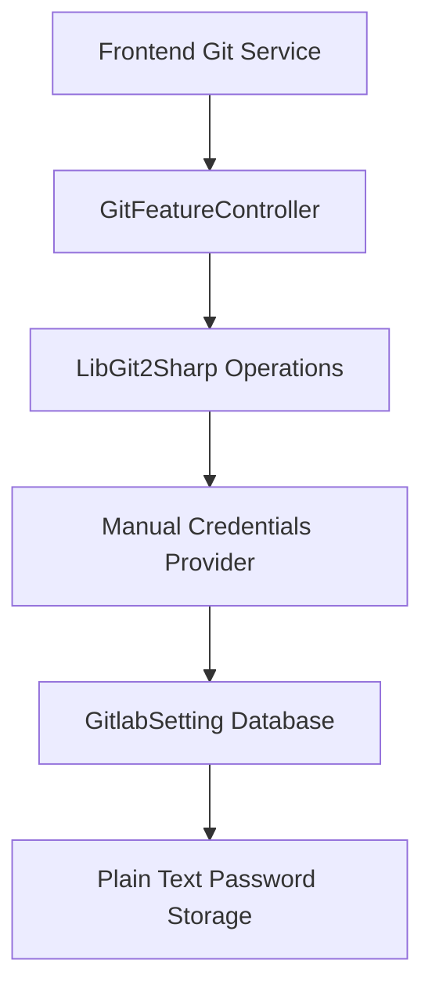
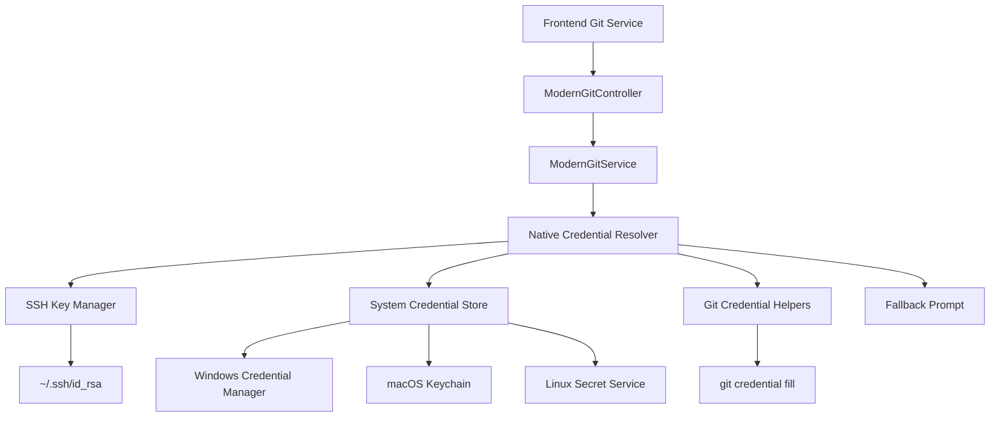

# 🔄 Git Authentication Refactoring Specifications

## 📋 **Document Information**

| **Field** | **Value** |
|-----------|-----------|
| **Document Title** | Git Authentication Refactoring Specifications |
| **Version** | 1.0 |
| **Date** | December 6, 2025 |
| **Author** | Claude Code Analysis |
| **Project** | MdExplorer |
| **Status** | Draft |

---

## 🎯 **Executive Summary**

This document outlines the complete refactoring of MdExplorer's Git authentication system to eliminate manual username/password entry and implement native Git credential management, bringing the user experience in line with modern editors like VS Code, IntelliJ IDEA, and Sublime Text.

### **Current State Problems**
- Manual username/password entry required for every Git operation
- Plain text password storage in SQLite database
- No support for modern authentication methods (SSH keys, tokens, OAuth)
- Security vulnerabilities and poor user experience

### **Proposed Solution**
- Implement native Git credential management
- Support SSH keys, system credential stores, and Git credential helpers
- Eliminate manual credential entry
- Maintain backward compatibility during migration

---

## 🔍 **Current Implementation Analysis**

### **Existing Architecture**



### **Current Code Structure**

**Backend Controllers:**
- `GitFeatureController.cs` - Main Git operations endpoint
- `BranchesController.cs` - Branch management
- `TagsController.cs` - Tag operations

**Current Authentication Flow:**
```csharp
// Problem: Hardcoded credential provider
options.CredentialsProvider = (_url, _user, _cred) => 
    new UsernamePasswordCredentials { 
        Username = currentGitlab.UserName, 
        Password = currentGitlab.Password  // Plain text from database!
    };
```

**Database Schema:**
```csharp
public class GitlabSetting
{
    public virtual Guid Id { get; set; }
    public virtual string UserName { get; set; }
    public virtual string Password { get; set; }  // ❌ Security risk
    public virtual string GitlabLink { get; set; }
    public virtual string LocalPath { get; set; }
    public virtual string Email { get; set; }
}
```

### **Issues Identified**

1. **Security Vulnerabilities**
   - Plain text password storage
   - No encryption or secure storage
   - Database accessible passwords

2. **Poor User Experience**
   - Manual credential entry for each repository
   - No integration with existing Git configuration
   - Repeated authentication prompts

3. **Limited Authentication Support**
   - Only username/password authentication
   - No SSH key support
   - No token-based authentication
   - No OAuth integration

4. **Non-Standard Implementation**
   - Doesn't follow Git best practices
   - Incompatible with corporate security policies
   - Different from industry-standard editors

---

## 🏗️ **Proposed Architecture**

### **New Architecture Overview**



### **Authentication Priority Chain**

```csharp
public enum AuthenticationMethod
{
    SSHKey = 1,           // Highest priority
    SystemCredentialStore = 2,
    GitCredentialHelper = 3,
    UserPrompt = 4        // Lowest priority (fallback only)
}
```

---

## 📋 **Technical Specifications**

### **Phase 1: Core Authentication System**

#### **1.1 ModernGitService Interface**

```csharp
public interface IModernGitService
{
    Task<GitOperationResult> PullAsync(string repositoryPath);
    Task<GitOperationResult> PushAsync(string repositoryPath);
    Task<GitOperationResult> CommitAsync(string repositoryPath, string message, string author, string email);
    Task<GitOperationResult> CommitAndPushAsync(string repositoryPath, string message, string author, string email);
    Task<GitOperationResult> CloneAsync(string url, string localPath);
    Task<GitBranchInfo> GetCurrentBranchAsync(string repositoryPath);
    Task<IEnumerable<GitBranchInfo>> GetBranchesAsync(string repositoryPath);
    Task<GitOperationResult> CheckoutBranchAsync(string repositoryPath, string branchName);
}
```

#### **1.2 Credential Resolution System**

```csharp
public interface ICredentialResolver
{
    Task<Credentials> ResolveCredentialsAsync(string url, string usernameFromUrl, SupportedCredentialTypes types);
    bool CanResolveCredentials(string url, SupportedCredentialTypes types);
    AuthenticationMethod GetAuthenticationMethod();
}

public class SSHKeyCredentialResolver : ICredentialResolver
{
    private readonly ISSHKeyManager _sshKeyManager;
    
    public async Task<Credentials> ResolveCredentialsAsync(string url, string usernameFromUrl, SupportedCredentialTypes types)
    {
        if (!url.StartsWith("git@") && !types.HasFlag(SupportedCredentialTypes.UsernamePassword))
            return null;
            
        var keyPath = await _sshKeyManager.FindSSHKeyAsync();
        if (keyPath == null) return null;
        
        return new SshUserKeyCredentials
        {
            Username = "git",
            PublicKey = keyPath + ".pub",
            PrivateKey = keyPath,
            Passphrase = await _sshKeyManager.GetPassphraseAsync(keyPath)
        };
    }
}

public class SystemCredentialStoreResolver : ICredentialResolver
{
    public async Task<Credentials> ResolveCredentialsAsync(string url, string usernameFromUrl, SupportedCredentialTypes types)
    {
        if (RuntimeInformation.IsOSPlatform(OSPlatform.Windows))
            return await ResolveWindowsCredentialsAsync(url);
            
        if (RuntimeInformation.IsOSPlatform(OSPlatform.OSX))
            return await ResolveMacOSCredentialsAsync(url);
            
        if (RuntimeInformation.IsOSPlatform(OSPlatform.Linux))
            return await ResolveLinuxCredentialsAsync(url);
            
        return null;
    }
}

public class GitCredentialHelperResolver : ICredentialResolver
{
    public async Task<Credentials> ResolveCredentialsAsync(string url, string usernameFromUrl, SupportedCredentialTypes types)
    {
        try
        {
            var result = await ExecuteGitCredentialFillAsync(url);
            return ParseCredentialHelperOutput(result);
        }
        catch (Exception ex)
        {
            _logger.LogWarning("Git credential helper failed: {Error}", ex.Message);
            return null;
        }
    }
    
    private async Task<string> ExecuteGitCredentialFillAsync(string url)
    {
        var uri = new Uri(url);
        var process = new Process
        {
            StartInfo = new ProcessStartInfo
            {
                FileName = "git",
                Arguments = "credential fill",
                UseShellExecute = false,
                RedirectStandardInput = true,
                RedirectStandardOutput = true,
                CreateNoWindow = true
            }
        };
        
        process.Start();
        
        await process.StandardInput.WriteLineAsync($"protocol={uri.Scheme}");
        await process.StandardInput.WriteLineAsync($"host={uri.Host}");
        if (!string.IsNullOrEmpty(uri.AbsolutePath) && uri.AbsolutePath != "/")
            await process.StandardInput.WriteLineAsync($"path={uri.AbsolutePath}");
        await process.StandardInput.WriteLineAsync();
        
        process.StandardInput.Close();
        
        var output = await process.StandardOutput.ReadToEndAsync();
        await process.WaitForExitAsync();
        
        return process.ExitCode == 0 ? output : null;
    }
}
```

#### **1.3 SSH Key Management**

```csharp
public interface ISSHKeyManager
{
    Task<string> FindSSHKeyAsync();
    Task<string> GetPassphraseAsync(string keyPath);
    Task<bool> IsSSHKeyValidAsync(string keyPath);
    Task<IEnumerable<string>> GetAvailableSSHKeysAsync();
}

public class SSHKeyManager : ISSHKeyManager
{
    private readonly string[] _defaultKeyPaths = 
    {
        "id_ed25519",    // Modern, preferred
        "id_ecdsa",      // Good alternative
        "id_rsa"         // Traditional, still widely used
    };
    
    public async Task<string> FindSSHKeyAsync()
    {
        var sshDir = Path.Combine(Environment.GetFolderPath(Environment.SpecialFolder.UserProfile), ".ssh");
        
        foreach (var keyName in _defaultKeyPaths)
        {
            var keyPath = Path.Combine(sshDir, keyName);
            var publicKeyPath = keyPath + ".pub";
            
            if (File.Exists(keyPath) && File.Exists(publicKeyPath))
            {
                if (await IsSSHKeyValidAsync(keyPath))
                    return keyPath;
            }
        }
        
        return null;
    }
    
    public async Task<bool> IsSSHKeyValidAsync(string keyPath)
    {
        try
        {
            // Basic validation - check if file exists and has proper permissions
            var fileInfo = new FileInfo(keyPath);
            if (!fileInfo.Exists) return false;
            
            // On Unix systems, check permissions (should be 600)
            if (!RuntimeInformation.IsOSPlatform(OSPlatform.Windows))
            {
                var permissions = fileInfo.UnixFileMode;
                var expectedPermissions = UnixFileMode.UserRead | UnixFileMode.UserWrite;
                if (permissions != expectedPermissions)
                {
                    _logger.LogWarning("SSH key {KeyPath} has incorrect permissions: {Permissions}", keyPath, permissions);
                }
            }
            
            return true;
        }
        catch
        {
            return false;
        }
    }
}
```

### **Phase 2: Platform-Specific Credential Stores**

#### **2.1 Windows Credential Manager Integration**

```csharp
public class WindowsCredentialManager : ISystemCredentialStore
{
    [DllImport("advapi32.dll", SetLastError = true, CharSet = CharSet.Unicode)]
    private static extern bool CredRead(string target, CredentialType type, int flags, out IntPtr credential);
    
    [DllImport("advapi32.dll", SetLastError = true)]
    private static extern bool CredFree(IntPtr credential);
    
    public async Task<UsernamePasswordCredentials> GetCredentialsAsync(string url)
    {
        var uri = new Uri(url);
        var target = $"git:{uri.Host}";
        
        if (CredRead(target, CredentialType.Generic, 0, out IntPtr credPtr))
        {
            try
            {
                var cred = Marshal.PtrToStructure<CREDENTIAL>(credPtr);
                var username = Marshal.PtrToStringUni(cred.UserName);
                var password = Marshal.PtrToStringUni(cred.CredentialBlob, (int)cred.CredentialBlobSize / 2);
                
                return new UsernamePasswordCredentials
                {
                    Username = username,
                    Password = password
                };
            }
            finally
            {
                CredFree(credPtr);
            }
        }
        
        return null;
    }
}
```

#### **2.2 macOS Keychain Integration**

```csharp
public class MacOSKeychainManager : ISystemCredentialStore
{
    public async Task<UsernamePasswordCredentials> GetCredentialsAsync(string url)
    {
        var uri = new Uri(url);
        
        var process = new Process
        {
            StartInfo = new ProcessStartInfo
            {
                FileName = "security",
                Arguments = $"find-internet-password -g -s {uri.Host}",
                UseShellExecute = false,
                RedirectStandardOutput = true,
                RedirectStandardError = true,
                CreateNoWindow = true
            }
        };
        
        process.Start();
        var output = await process.StandardOutput.ReadToEndAsync();
        var error = await process.StandardError.ReadToEndAsync();
        await process.WaitForExitAsync();
        
        if (process.ExitCode == 0)
        {
            return ParseKeychainOutput(output, error);
        }
        
        return null;
    }
    
    private UsernamePasswordCredentials ParseKeychainOutput(string output, string error)
    {
        // Parse keychain output format
        var usernameMatch = Regex.Match(output, @"""acct""<blob>=""([^""]+)""");
        var passwordMatch = Regex.Match(error, @"password: ""([^""]+)""");
        
        if (usernameMatch.Success && passwordMatch.Success)
        {
            return new UsernamePasswordCredentials
            {
                Username = usernameMatch.Groups[1].Value,
                Password = passwordMatch.Groups[1].Value
            };
        }
        
        return null;
    }
}
```

#### **2.3 Linux Secret Service Integration**

```csharp
public class LinuxSecretServiceManager : ISystemCredentialStore
{
    public async Task<UsernamePasswordCredentials> GetCredentialsAsync(string url)
    {
        try
        {
            // Use libsecret via P/Invoke or subprocess
            var process = new Process
            {
                StartInfo = new ProcessStartInfo
                {
                    FileName = "secret-tool",
                    Arguments = $"lookup protocol https server {new Uri(url).Host}",
                    UseShellExecute = false,
                    RedirectStandardOutput = true,
                    CreateNoWindow = true
                }
            };
            
            process.Start();
            var password = await process.StandardOutput.ReadToEndAsync();
            await process.WaitForExitAsync();
            
            if (process.ExitCode == 0 && !string.IsNullOrEmpty(password))
            {
                // Get username from a separate lookup or use the URL
                var username = await GetUsernameFromSecretService(url);
                
                return new UsernamePasswordCredentials
                {
                    Username = username,
                    Password = password.Trim()
                };
            }
        }
        catch (Exception ex)
        {
            _logger.LogWarning("Failed to retrieve credentials from Linux Secret Service: {Error}", ex.Message);
        }
        
        return null;
    }
}
```

### **Phase 3: Controller Refactoring**

#### **3.1 New Git Controller**

```csharp
[ApiController]
[Route("api/[controller]")]
public class ModernGitController : ControllerBase
{
    private readonly IModernGitService _gitService;
    private readonly ILogger<ModernGitController> _logger;
    
    public ModernGitController(IModernGitService gitService, ILogger<ModernGitController> logger)
    {
        _gitService = gitService;
        _logger = logger;
    }
    
    [HttpPost("pull")]
    public async Task<IActionResult> Pull([FromBody] GitOperationRequest request)
    {
        try
        {
            var result = await _gitService.PullAsync(request.RepositoryPath);
            
            if (result.Success)
            {
                return Ok(new { message = result.Message, changes = result.Changes });
            }
            
            return BadRequest(new { error = result.ErrorMessage });
        }
        catch (Exception ex)
        {
            _logger.LogError(ex, "Error during pull operation");
            return StatusCode(500, new { error = "Internal server error during pull operation" });
        }
    }
    
    [HttpPost("push")]
    public async Task<IActionResult> Push([FromBody] GitOperationRequest request)
    {
        try
        {
            var result = await _gitService.PushAsync(request.RepositoryPath);
            
            if (result.Success)
            {
                return Ok(new { message = result.Message });
            }
            
            return BadRequest(new { error = result.ErrorMessage });
        }
        catch (Exception ex)
        {
            _logger.LogError(ex, "Error during push operation");
            return StatusCode(500, new { error = "Internal server error during push operation" });
        }
    }
    
    [HttpPost("commit-and-push")]
    public async Task<IActionResult> CommitAndPush([FromBody] CommitAndPushRequest request)
    {
        try
        {
            // First commit
            var commitResult = await _gitService.CommitAsync(
                request.RepositoryPath, 
                request.CommitMessage, 
                request.AuthorName, 
                request.AuthorEmail);
            
            if (!commitResult.Success)
            {
                return BadRequest(new { error = commitResult.ErrorMessage });
            }
            
            // Then push
            var pushResult = await _gitService.PushAsync(request.RepositoryPath);
            
            if (pushResult.Success)
            {
                return Ok(new { 
                    message = "Commit and push completed successfully",
                    commitHash = commitResult.CommitHash
                });
            }
            
            return BadRequest(new { error = pushResult.ErrorMessage });
        }
        catch (Exception ex)
        {
            _logger.LogError(ex, "Error during commit and push operation");
            return StatusCode(500, new { error = "Internal server error during commit and push operation" });
        }
    }
}

public class GitOperationRequest
{
    public string RepositoryPath { get; set; }
}

public class CommitAndPushRequest : GitOperationRequest
{
    public string CommitMessage { get; set; }
    public string AuthorName { get; set; }
    public string AuthorEmail { get; set; }
}
```

#### **3.2 Result Models**

```csharp
public class GitOperationResult
{
    public bool Success { get; set; }
    public string Message { get; set; }
    public string ErrorMessage { get; set; }
    public string CommitHash { get; set; }
    public IEnumerable<string> Changes { get; set; }
    public AuthenticationMethod AuthenticationMethodUsed { get; set; }
}

public class GitBranchInfo
{
    public string Name { get; set; }
    public bool IsRemote { get; set; }
    public bool IsCurrent { get; set; }
    public string CommitHash { get; set; }
    public DateTime LastCommitDate { get; set; }
    public string LastCommitMessage { get; set; }
    public int CommitsAhead { get; set; }
    public int CommitsBehind { get; set; }
}
```

### **Phase 4: Frontend Updates**

#### **4.1 Updated TypeScript Service**

```typescript
export interface GitOperationResult {
  success: boolean;
  message?: string;
  error?: string;
  commitHash?: string;
  changes?: string[];
  authenticationMethodUsed?: string;
}

export interface CommitAndPushRequest {
  repositoryPath: string;
  commitMessage: string;
  authorName: string;
  authorEmail: string;
}

@Injectable({
  providedIn: 'root'
})
export class ModernGitService {
  private readonly apiBaseUrl = '../api/moderngit';
  
  constructor(private http: HttpClient) {}
  
  pull(): Observable<GitOperationResult> {
    return this.http.post<GitOperationResult>(`${this.apiBaseUrl}/pull`, {
      repositoryPath: this.getCurrentRepositoryPath()
    });
  }
  
  push(): Observable<GitOperationResult> {
    return this.http.post<GitOperationResult>(`${this.apiBaseUrl}/push`, {
      repositoryPath: this.getCurrentRepositoryPath()
    });
  }
  
  commitAndPush(commitMessage: string, authorName: string, authorEmail: string): Observable<GitOperationResult> {
    const request: CommitAndPushRequest = {
      repositoryPath: this.getCurrentRepositoryPath(),
      commitMessage,
      authorName,
      authorEmail
    };
    
    return this.http.post<GitOperationResult>(`${this.apiBaseUrl}/commit-and-push`, request);
  }
  
  private getCurrentRepositoryPath(): string {
    // Get current repository path from application state
    return this.projectService.getCurrentProjectPath();
  }
}
```

#### **4.2 Updated UI Components**

```typescript
// Remove username/password prompts from UI
@Component({
  selector: 'app-git-operations',
  template: `
    <div class="git-operations">
      <button (click)="pull()" [disabled]="isOperationInProgress">
        <mat-icon>cloud_download</mat-icon>
        Pull
      </button>
      
      <button (click)="push()" [disabled]="isOperationInProgress">
        <mat-icon>cloud_upload</mat-icon>
        Push
      </button>
      
      <div class="commit-section">
        <mat-form-field>
          <input matInput placeholder="Commit message" [(ngModel)]="commitMessage">
        </mat-form-field>
        
        <button (click)="commitAndPush()" [disabled]="!commitMessage || isOperationInProgress">
          <mat-icon>send</mat-icon>
          Commit & Push
        </button>
      </div>
      
      <div *ngIf="lastOperationResult" class="operation-result">
        <div [ngClass]="lastOperationResult.success ? 'success' : 'error'">
          {{ lastOperationResult.message || lastOperationResult.error }}
        </div>
        <div *ngIf="lastOperationResult.authenticationMethodUsed" class="auth-method">
          Authentication: {{ lastOperationResult.authenticationMethodUsed }}
        </div>
      </div>
    </div>
  `
})
export class GitOperationsComponent {
  commitMessage = '';
  isOperationInProgress = false;
  lastOperationResult: GitOperationResult | null = null;
  
  constructor(
    private gitService: ModernGitService,
    private snackBar: MatSnackBar
  ) {}
  
  async pull(): Promise<void> {
    this.isOperationInProgress = true;
    
    try {
      this.lastOperationResult = await this.gitService.pull().toPromise();
      
      if (this.lastOperationResult.success) {
        this.snackBar.open('Pull completed successfully', 'OK', { duration: 3000 });
      } else {
        this.snackBar.open(`Pull failed: ${this.lastOperationResult.error}`, 'OK', { duration: 5000 });
      }
    } catch (error) {
      this.snackBar.open('Pull operation failed', 'OK', { duration: 5000 });
    } finally {
      this.isOperationInProgress = false;
    }
  }
  
  async push(): Promise<void> {
    this.isOperationInProgress = true;
    
    try {
      this.lastOperationResult = await this.gitService.push().toPromise();
      
      if (this.lastOperationResult.success) {
        this.snackBar.open('Push completed successfully', 'OK', { duration: 3000 });
      } else {
        this.snackBar.open(`Push failed: ${this.lastOperationResult.error}`, 'OK', { duration: 5000 });
      }
    } catch (error) {
      this.snackBar.open('Push operation failed', 'OK', { duration: 5000 });
    } finally {
      this.isOperationInProgress = false;
    }
  }
  
  async commitAndPush(): Promise<void> {
    if (!this.commitMessage.trim()) {
      this.snackBar.open('Please enter a commit message', 'OK', { duration: 3000 });
      return;
    }
    
    this.isOperationInProgress = true;
    
    try {
      const authorName = this.getUserName(); // Get from user settings
      const authorEmail = this.getUserEmail(); // Get from user settings
      
      this.lastOperationResult = await this.gitService.commitAndPush(
        this.commitMessage,
        authorName,
        authorEmail
      ).toPromise();
      
      if (this.lastOperationResult.success) {
        this.snackBar.open('Commit and push completed successfully', 'OK', { duration: 3000 });
        this.commitMessage = ''; // Clear the message
      } else {
        this.snackBar.open(`Operation failed: ${this.lastOperationResult.error}`, 'OK', { duration: 5000 });
      }
    } catch (error) {
      this.snackBar.open('Commit and push operation failed', 'OK', { duration: 5000 });
    } finally {
      this.isOperationInProgress = false;
    }
  }
}
```

---

## 🔧 **Configuration**

### **Application Settings**

```json
{
  "Git": {
    "Authentication": {
      "PreferredMethods": ["SSH", "SystemCredentialStore", "GitCredentialHelper"],
      "AllowUserPrompt": false,
      "SSHKeySearchPaths": [
        "~/.ssh/id_ed25519",
        "~/.ssh/id_ecdsa", 
        "~/.ssh/id_rsa"
      ],
      "CredentialHelperTimeout": 30,
      "CacheCredentials": true,
      "CacheTimeoutMinutes": 15
    },
    "Operations": {
      "DefaultAuthor": {
        "UseGitConfig": true,
        "FallbackName": "MdExplorer User",
        "FallbackEmail": "user@mdexplorer.local"
      },
      "PullStrategy": "Merge",
      "PushStrategy": "Simple"
    },
    "Logging": {
      "LogAuthenticationAttempts": true,
      "LogCredentialSources": false,
      "LogGitCommands": false
    }
  }
}
```

### **Dependency Injection Setup**

```csharp
public static class ServiceCollectionExtensions
{
    public static IServiceCollection AddModernGitServices(this IServiceCollection services, IConfiguration configuration)
    {
        // Register core services
        services.AddScoped<IModernGitService, ModernGitService>();
        services.AddScoped<ISSHKeyManager, SSHKeyManager>();
        
        // Register credential resolvers
        services.AddScoped<ICredentialResolver, SSHKeyCredentialResolver>();
        services.AddScoped<ICredentialResolver, SystemCredentialStoreResolver>();
        services.AddScoped<ICredentialResolver, GitCredentialHelperResolver>();
        
        // Register platform-specific services
        if (RuntimeInformation.IsOSPlatform(OSPlatform.Windows))
        {
            services.AddScoped<ISystemCredentialStore, WindowsCredentialManager>();
        }
        else if (RuntimeInformation.IsOSPlatform(OSPlatform.OSX))
        {
            services.AddScoped<ISystemCredentialStore, MacOSKeychainManager>();
        }
        else if (RuntimeInformation.IsOSPlatform(OSPlatform.Linux))
        {
            services.AddScoped<ISystemCredentialStore, LinuxSecretServiceManager>();
        }
        
        // Configure options
        services.Configure<GitAuthenticationOptions>(configuration.GetSection("Git:Authentication"));
        services.Configure<GitOperationOptions>(configuration.GetSection("Git:Operations"));
        
        return services;
    }
}
```

---

## 📋 **Migration Plan**

### **Phase 1: Infrastructure (Week 1-2)**
- [ ] Implement `ICredentialResolver` interfaces
- [ ] Create `ModernGitService` base implementation
- [ ] Add SSH key detection and management
- [ ] Implement Git credential helper integration
- [ ] Add comprehensive unit tests

### **Phase 2: Platform Integration (Week 3-4)**
- [ ] Windows Credential Manager integration
- [ ] macOS Keychain integration
- [ ] Linux Secret Service integration
- [ ] Cross-platform testing
- [ ] Integration tests with real Git repositories

### **Phase 3: Controller Refactoring (Week 5)**
- [ ] Create `ModernGitController`
- [ ] Update API endpoints
- [ ] Implement error handling and logging
- [ ] Add API documentation
- [ ] Backward compatibility layer

### **Phase 4: Frontend Updates (Week 6)**
- [ ] Update TypeScript service interfaces
- [ ] Remove credential input UI components
- [ ] Update Git operation workflows
- [ ] Add authentication method feedback
- [ ] End-to-end testing

### **Phase 5: Migration & Cleanup (Week 7-8)**
- [ ] Data migration utilities
- [ ] Backward compatibility testing
- [ ] Remove legacy credential storage
- [ ] Update documentation
- [ ] Performance testing and optimization

### **Phase 6: Deployment & Monitoring (Week 9)**
- [ ] Deployment scripts
- [ ] Monitoring and alerting
- [ ] User migration guides
- [ ] Rollback procedures
- [ ] Production validation

---

## 🧪 **Testing Strategy**

### **Unit Tests**

```csharp
[TestClass]
public class SSHKeyCredentialResolverTests
{
    [TestMethod]
    public async Task ResolveCredentialsAsync_WithValidSSHKey_ReturnsCredentials()
    {
        // Arrange
        var mockSSHKeyManager = new Mock<ISSHKeyManager>();
        mockSSHKeyManager.Setup(x => x.FindSSHKeyAsync())
            .ReturnsAsync("/home/user/.ssh/id_ed25519");
        
        var resolver = new SSHKeyCredentialResolver(mockSSHKeyManager.Object);
        
        // Act
        var result = await resolver.ResolveCredentialsAsync("git@github.com:user/repo.git", "git", SupportedCredentialTypes.UsernamePassword);
        
        // Assert
        Assert.IsNotNull(result);
        Assert.IsInstanceOfType(result, typeof(SshUserKeyCredentials));
    }
    
    [TestMethod]
    public async Task ResolveCredentialsAsync_WithNoSSHKey_ReturnsNull()
    {
        // Arrange
        var mockSSHKeyManager = new Mock<ISSHKeyManager>();
        mockSSHKeyManager.Setup(x => x.FindSSHKeyAsync())
            .ReturnsAsync((string)null);
        
        var resolver = new SSHKeyCredentialResolver(mockSSHKeyManager.Object);
        
        // Act
        var result = await resolver.ResolveCredentialsAsync("https://github.com/user/repo.git", "user", SupportedCredentialTypes.UsernamePassword);
        
        // Assert
        Assert.IsNull(result);
    }
}
```

### **Integration Tests**

```csharp
[TestClass]
public class ModernGitServiceIntegrationTests
{
    private string _testRepositoryPath;
    private IModernGitService _gitService;
    
    [TestInitialize]
    public void Setup()
    {
        _testRepositoryPath = CreateTestRepository();
        _gitService = CreateGitService();
    }
    
    [TestMethod]
    public async Task PullAsync_WithValidRepository_SucceedsWithoutCredentialPrompt()
    {
        // Act
        var result = await _gitService.PullAsync(_testRepositoryPath);
        
        // Assert
        Assert.IsTrue(result.Success);
        Assert.IsNotNull(result.AuthenticationMethodUsed);
        Assert.AreNotEqual(AuthenticationMethod.UserPrompt, result.AuthenticationMethodUsed);
    }
}
```

### **End-to-End Tests**

```typescript
describe('Git Operations E2E', () => {
  beforeEach(() => {
    cy.visit('/git-operations');
  });
  
  it('should perform pull operation without credential prompt', () => {
    cy.get('[data-cy=pull-button]').click();
    
    // Should not show credential input dialog
    cy.get('[data-cy=credential-dialog]').should('not.exist');
    
    // Should show success message
    cy.get('[data-cy=operation-result]').should('contain', 'Pull completed successfully');
  });
  
  it('should perform commit and push without credential prompt', () => {
    cy.get('[data-cy=commit-message]').type('Test commit message');
    cy.get('[data-cy=commit-push-button]').click();
    
    // Should not show credential input dialog
    cy.get('[data-cy=credential-dialog]').should('not.exist');
    
    // Should show success message
    cy.get('[data-cy=operation-result]').should('contain', 'Commit and push completed successfully');
  });
});
```

---

## 🔒 **Security Considerations**

### **Credential Handling**
- Never store credentials in plain text
- Use secure memory for credential processing
- Implement credential caching with timeout
- Clear sensitive data from memory after use

### **SSH Key Security**
- Validate SSH key permissions (600 on Unix systems)
- Support encrypted SSH keys with passphrase
- Integrate with SSH agent when available
- Warn users about insecure key configurations

### **Network Security**
- Always use HTTPS for Git operations where possible
- Validate SSL certificates
- Support corporate proxy configurations
- Implement timeout for network operations

### **Audit and Logging**
- Log authentication attempts (success/failure)
- Track which authentication method was used
- Monitor for suspicious activity
- Comply with corporate security policies

---

## 📊 **Performance Considerations**

### **Credential Resolution Performance**
- Cache successful credential resolution results
- Implement timeout for credential helper execution
- Use async/await throughout for non-blocking operations
- Provide progress feedback for long-running operations

### **Git Operation Performance**
- Use LibGit2Sharp native performance optimizations
- Implement operation cancellation support
- Provide progress callbacks for clone/fetch operations
- Optimize for large repositories

### **Memory Management**
- Dispose of Git repository objects properly
- Use `using` statements for resource management
- Clear sensitive data from memory
- Monitor memory usage in production

---

## 📈 **Success Metrics**

### **User Experience Metrics**
- **Credential Prompt Frequency**: Target 0 prompts for 95% of Git operations
- **Authentication Success Rate**: Target 99% success rate with native authentication
- **Operation Completion Time**: Target <5 seconds for pull/push operations
- **User Satisfaction**: Target >90% positive feedback on Git experience

### **Security Metrics**
- **Credential Storage**: 0 plain text credentials stored
- **Authentication Method Distribution**: >80% using SSH keys or system stores
- **Security Incident Rate**: Target 0 credential-related security incidents
- **Audit Compliance**: 100% compliance with security audit requirements

### **Performance Metrics**
- **API Response Time**: Target <500ms for Git status operations
- **Memory Usage**: Target <50MB additional memory usage
- **CPU Usage**: Target <5% CPU usage during Git operations
- **Error Rate**: Target <1% error rate for Git operations

---

## 🚀 **Future Enhancements**

### **Enhanced Authentication**
- OAuth integration with GitHub/GitLab/Bitbucket
- Multi-factor authentication support
- Hardware security key integration
- Enterprise SSO integration

### **Advanced Git Features**
- Git LFS support with native authentication
- Submodule authentication management
- Multiple remote support
- Advanced merge conflict resolution

### **User Experience Improvements**
- Visual Git graph integration
- Credential setup wizard
- Authentication troubleshooting guide
- Performance monitoring dashboard

### **Enterprise Features**
- Centralized credential management
- Policy enforcement
- Audit trail integration
- Role-based access control

---

## 📚 **References**

### **Technical Documentation**
- [Git Credential Management](https://git-scm.com/docs/gitcredentials)
- [LibGit2Sharp Documentation](https://github.com/libgit2/libgit2sharp)
- [SSH Key Management Best Practices](https://docs.github.com/en/authentication/connecting-to-github-with-ssh)

### **Security Standards**
- [OWASP Credential Management Guidelines](https://owasp.org/www-project-cheat-sheets/cheatsheets/Credential_Storage_Cheat_Sheet.html)
- [NIST Cybersecurity Framework](https://www.nist.gov/cyberframework)

### **Platform-Specific References**
- [Windows Credential Manager API](https://docs.microsoft.com/en-us/windows/win32/secauthn/credential-management)
- [macOS Keychain Services](https://developer.apple.com/documentation/security/keychain_services)
- [Linux Secret Service API](https://specifications.freedesktop.org/secret-service/latest/)

---

**Document Status**: Draft v1.0  
**Next Review**: December 13, 2025  
**Implementation Start**: To be determined