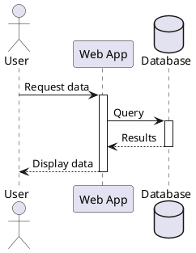
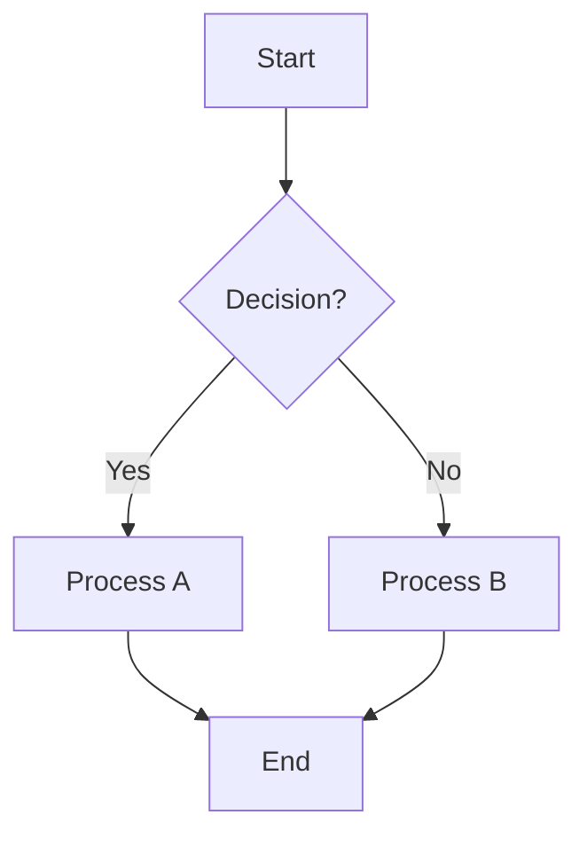

<div class="reveal">
  <div class="slides">

    <section>
      <h1>Reveal.js Slide Examples</h1>
      <p>MdExplorer AI</p>
      <p><small>2025-10-26</small></p>
    </section>

    <section data-markdown>
      <textarea data-template>
## What is Reveal.js?

- Open-source HTML presentation framework
- Create beautiful, interactive presentations
- Navigate with keyboard arrows
- Support for code highlighting
- Built-in themes and transitions
      </textarea>
    </section>

    <section data-markdown>
      <textarea data-template>
## Key Features

- **Responsive**: Works on any device <!-- .element: class="fragment" -->
- **Markdown Support**: Write slides in markdown <!-- .element: class="fragment" -->
- **Code Highlighting**: Syntax highlighting for code <!-- .element: class="fragment" -->
- **Fragments**: Reveal content progressively <!-- .element: class="fragment" -->
- **Themes**: Multiple built-in themes <!-- .element: class="fragment" -->
      </textarea>
    </section>

    <section data-markdown>
      <textarea data-template>
## Code Example: JavaScript

```javascript
// Hello World in JavaScript
function greet(name) {
  console.log(`Hello, ${name}!`);
  return `Welcome to Reveal.js`;
}

greet('Developer');
```
      </textarea>
    </section>

    <section data-markdown>
      <textarea data-template>
## Code Example: Python

```python
# Data processing with Python
def process_data(items):
    """Process and filter data"""
    return [item for item in items if item > 0]

# Example usage
numbers = [-1, 2, -3, 4, 5]
result = process_data(numbers)
print(result)  # Output: [2, 4, 5]
```
      </textarea>
    </section>

    <section data-markdown>
      <textarea data-template>
## PlantUML Diagram


      </textarea>
    </section>

    <section data-markdown>
      <textarea data-template>
## Mermaid Diagram


      </textarea>
    </section>

    <section data-markdown>
      <textarea data-template>
## Tables Support

| Feature | Status | Priority |
|---------|--------|----------|
| Markdown | ✅ Done | High |
| Diagrams | ✅ Done | High |
| Themes | ✅ Done | Medium |
| Export | 🔄 WIP | Low |
      </textarea>
    </section>

    <section>
      <section data-markdown>
        <textarea data-template>
## Vertical Slides

This is the main slide.

Press ↓ to see nested content.
        </textarea>
      </section>
      <section data-markdown>
        <textarea data-template>
### Nested Slide 1

Vertical slides are great for:
- Detailed explanations
- Step-by-step guides
- Additional context
        </textarea>
      </section>
      <section data-markdown>
        <textarea data-template>
### Nested Slide 2

Use → and ← for horizontal navigation

Use ↑ and ↓ for vertical navigation
        </textarea>
      </section>
    </section>

    <section data-markdown>
      <textarea data-template>
## Available Themes

MdExplorer supports these reveal.js themes:

- **black** (default) - Dark background
- **white** - Light background
- **league** - Professional grey
- **beige** - Warm beige tones
- **sky** - Blue gradient
- **night** - Dark with orange accents
- **serif** - Serif fonts
- **simple** - Minimal design
- **solarized** - Solarized colors
      </textarea>
    </section>

    <section data-markdown>
      <textarea data-template>
## Navigation Tips

| Key | Action |
|-----|--------|
| → | Next slide |
| ← | Previous slide |
| ↓ | Down (vertical) |
| ↑ | Up (vertical) |
| Space | Next slide |
| Esc | Overview mode |
| F | Fullscreen |
| S | Speaker notes |
      </textarea>
    </section>

    <section data-markdown>
      <textarea data-template>
## Creating Slides with AI

With MdExplorer AI, you can create slides by simply saying:

```
"Create slides about Docker"
"Make a presentation on microservices"
"Generate slideshow for Kubernetes"
```

The AI will:
1. Generate structured content
2. Add proper formatting
3. Include code examples
4. Create reveal.js compatible markdown
      </textarea>
    </section>

    <section data-markdown>
      <textarea data-template>
## Best Practices

**Keep it Simple** <!-- .element: class="fragment fade-up" -->
- One idea per slide
- Limit text to 3-5 bullets
- Use visuals when possible

**Engage Your Audience** <!-- .element: class="fragment fade-up" -->
- Use fragments for suspense
- Include code examples
- Add diagrams for clarity

**Test Your Presentation** <!-- .element: class="fragment fade-up" -->
- Check on different devices
- Practice navigation
- Verify code highlighting
      </textarea>
    </section>

    <section>
      <h2>Thank You!</h2>
      <p>Questions?</p>
      <p><small>Created with MdExplorer & Reveal.js</small></p>
    </section>

  </div>
</div>
